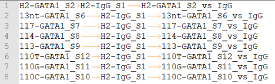

NGS pipelines
=============

.. toctree::
   :maxdepth: 1
   :glob:

   *

.. image:: ../../images/Pipelines_steps.png

Typical Usage
^^^^^^^^^^^^^

Go to your data directory and type the following.

**Step 0: Load python version 2.7.13.**

.. code:: bash

    $ module load python/2.7.13

**Step 1: Prepare input files, generate fastq.tsv and peakcall.tsv.**

.. note:: peakcall.tsv is not generated for atac_seq subcmd, since no control is needed for ATAC-seq. `--guess_input` option is not available for crispr_seq subcmd.

.. code:: bash

    $ HemTools [subcmd] --guess_input

	Input fastq files preparation complete! ALL GOOD!
	Please check if you like the computer-generated labels in : fastq.tsv
	Input peakcall file preparation complete! File name: peakcall.tsv

.. note:: If you are preparing fastq.tsv and peakcall.tsv yourself, please make sure ``no space anywhere`` in the file. Note that the seperator is tab. Spaces in file name will cause errors.

**Step 2: Check the computer-generated input list (manually), make sure they are correct.**

.. code:: bash

    $ less fastq.tsv

    $ less peakcall.tsv

.. note:: a random string will be added to the generated files (e.g., fastq.94c049cbff1f.tsv) if they exist before running step 1.

**Step 3: Submit your job.**

.. code:: bash

    $ HemTools [subcmd] -f fastq.tsv -d peakcall.tsv

You can always see all available sub-commands by:

.. code:: bash

    $ HemTools -h

Sample input format
^^^^^^^^^^^^^^^^^^^

**fastq.tsv**

This is a tab-seperated-value format file. The 3 columns are: Read 1, Read 2, sample ID.

.. image:: ../../images/fastq.tsv.png

**peakcall.tsv**

This is also a tab-seperated-value format file. The 3 columns are: treatment sample ID, control/input sample ID, peakcall ID.

Report bug
^^^^^^^^^^   

Once the job is finished, you will be notified by email with some attachments.  If no attachment can be found, it might be caused by an error. In such case, please go to the result directory (where the log_files folder is located) and type: 

.. code:: bash

    $ HemTools report_bug

Output
^^^^^^

A QC report will be sent to you by email when the job is done.

For .bw .bam and peak files, we provide the following types:

1. all (all reads are kept)

2. rmdup (PCR duplicates are removed, note that these are just reads with the same 5' end position)

3. rmdup.uq (i.e., disticnt reads, PCR duplicates and multi-mapped reads are removed)

4. markdup.uq (only multi-mapped reads are removed)

Multi-mapped reads are removed using ``samtools view -q 1``; this typically removes almost 99% multi-mapped reads, but some will be still there.

For common usage, use rmdup.uq. When you focus on dulicated regions, e.g., HBG1/HBG2, you might want to use rmdup or all. 

For RNA-seq, use markdup.uq.

For short length single-end chip-seq, use markdup.uq.

Reference
^^^^^^^^^

https://ngschool.eu/node/51

https://github.com/ENCODE-DCC/chip-seq-pipeline2

Comments
^^^^^^^^

.. disqus::
    :disqus_identifier: NGS_pipelines

