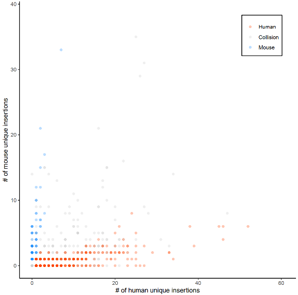
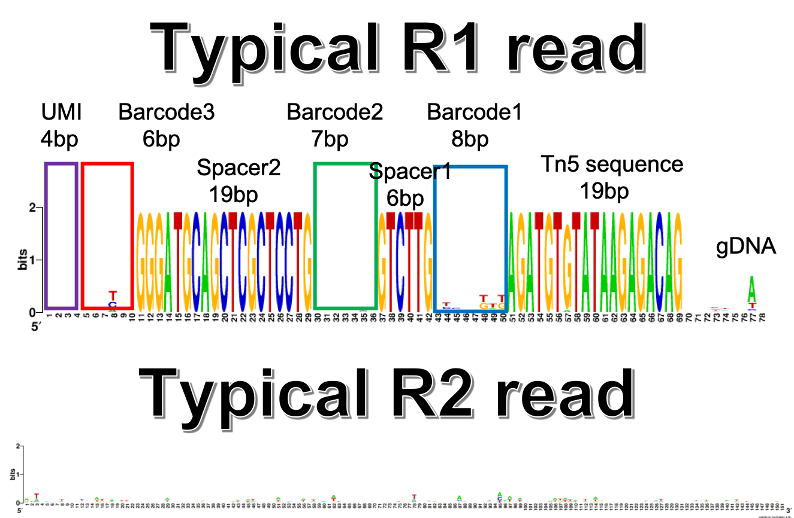

Analysis of Sci-L3-seq data
==========================

::

	usage: sci_l3_seq.py [-h] [-j JID] -f INPUT_LIST -b1 BARCODE_1_LIST -b2
	                     BARCODE_2_LIST -b3 BARCODE_3_LIST [--RT_PRIMER RT_PRIMER]
	                     [--TN5_fwd TN5_FWD] [--TN5_rev TN5_REV]
	                     [--UMI_length UMI_LENGTH] [--bc3_length BC3_LENGTH]
	                     [--sp2_length SP2_LENGTH] [--bc2_length BC2_LENGTH]
	                     [--sp1_length SP1_LENGTH] [--bc1_length BC1_LENGTH]

	optional arguments:
	  -h, --help            show this help message and exit
	  -j JID, --jid JID     enter a job ID, which is used to make a new directory.
	                        Every output will be moved into this folder. (default:
	                        sci_l3_seq_yli11_2020-04-22)
	  -f INPUT_LIST, --input_list INPUT_LIST
	                        3 column bed file, additional columns are OK, but will
	                        be ignored (default: None)
	  -b1 BARCODE_1_LIST, --barcode_1_list BARCODE_1_LIST
	                        list of barcode 1 sequences (default: None)
	  -b2 BARCODE_2_LIST, --barcode_2_list BARCODE_2_LIST
	                        list of barcode 2 sequences (default: None)
	  -b3 BARCODE_3_LIST, --barcode_3_list BARCODE_3_LIST
	                        list of barcode 3 sequences (default: None)
	  --RT_PRIMER RT_PRIMER
	                        RT_PRIMER seq (default: GGGATGCAGCTCGCTCCTG)
	  --TN5_fwd TN5_FWD     TN5_fwd seq (default: AGATGTGTATAAGAGACAG)
	  --TN5_rev TN5_REV     TN5_rev seq (default: CTGTCTCTTATACACATCT)
	  --UMI_length UMI_LENGTH
	                        UMI_length (default: 4)
	  --bc3_length BC3_LENGTH
	                        barcode 3 length (default: 6)
	  --sp2_length SP2_LENGTH
	                        spacer 2 length (default: 19)
	  --bc2_length BC2_LENGTH
	                        barcode 2 length (default: 7)
	  --sp1_length SP1_LENGTH
	                        spacer 1 seq length (default: 6)
	  --bc1_length BC1_LENGTH
	                        barcode 1 length (default: 8)

Summary
^^^^^^^

Demultiplexing, read mapping, QC for sci-L3-seq

Code is available at: https://github.com/YichaoOU/Sci-L3-seq

Input
^^^^^

1. fastq.tsv

Copy (or use ``ln -s``) your fastq files to your working directory, prepare fastq.tsv using ``run_lsf.py --guess_input``.

The input file ``fastq.tsv`` looks like below:

	Banana.R1.fastq.gz	Banana.R2.fastq.gz	Banana
	Orange.R1.fastq.gz	Orange.R2.fastq.gz	Orange

2. barcode list

You need to have 3 lists of barcodes: ``barcode_1.list``, ``barcode_2.list``, ``barcode_3.list``. 

::

	==> barcode_1.list <==
	TGATATTG
	GATCCCGT

	==> barcode_2.list <==
	AGGTGGC
	TAATAGC

	==> barcode_3.list <==
	ACGCGA
	CGCTTG

Usage
^^^^^

.. code:: bash

	hpcf_interactive

	export PATH=$PATH:"/home/yli11/HemTools/bin"

	cd your_working_dir

	## copy (or ln -s) your data here

	module load python/2.7.13

	run_lsf.py --guess_input

	sci_l3_seq.py -f fastq.tsv -b1 barcode_1.list -b2 barcode_2.list -b3 barcode_3.list

Output
^^^^^^

Sample QC (e.g., number of reads contains all the barcodes, collision rate) summary is provided in ``jid/sample_QC.tsv``

An example of collision plot:

BigWiggle files for genome tracks:

::

	[yli11@nodecn204 sci_l3_seq_yli11_2020-04-22]$ find . -name "*.bw"
	{{jid}}/KOK675_S2/KOK675_S2_barcode_demultiplexing/human/KOK675_S2.filter.bw
	{{jid}}/KOK675_S2/KOK675_S2_barcode_demultiplexing/human/KOK675_S2.all.bw
	{{jid}}/KOK675_S2/KOK675_S2_barcode_demultiplexing/mouse/KOK675_S2.filter.bw
	{{jid}}/KOK675_S2/KOK675_S2_barcode_demultiplexing/mouse/KOK675_S2.all.bw
	{{jid}}/KOK674_S1/KOK674_S1_barcode_demultiplexing/human/KOK674_S1.filter.bw
	{{jid}}/KOK674_S1/KOK674_S1_barcode_demultiplexing/human/KOK674_S1.all.bw
	{{jid}}/KOK674_S1/KOK674_S1_barcode_demultiplexing/mouse/KOK674_S1.filter.bw
	{{jid}}/KOK674_S1/KOK674_S1_barcode_demultiplexing/mouse/KOK674_S1.all.bw
	{{jid}}/KOK677_S4/KOK677_S4_barcode_demultiplexing/human/KOK677_S4.filter.bw
	{{jid}}/KOK677_S4/KOK677_S4_barcode_demultiplexing/human/KOK677_S4.all.bw
	{{jid}}/KOK677_S4/KOK677_S4_barcode_demultiplexing/mouse/KOK677_S4.filter.bw
	{{jid}}/KOK677_S4/KOK677_S4_barcode_demultiplexing/mouse/KOK677_S4.all.bw
	{{jid}}/KOK676_S3/KOK676_S3_barcode_demultiplexing/human/KOK676_S3.all.bw
	{{jid}}/KOK676_S3/KOK676_S3_barcode_demultiplexing/human/KOK676_S3.filter.bw
	{{jid}}/KOK676_S3/KOK676_S3_barcode_demultiplexing/mouse/KOK676_S3.all.bw
	{{jid}}/KOK676_S3/KOK676_S3_barcode_demultiplexing/mouse/KOK676_S3.filter.bw

Notes
^^^^^

1. P5 or P7 sequencing primer are equally possible to be added at the UMI end or gRNA end. So de-multiplexing should look at both R1 and R2 reads. 

2. The reads that we can used to do demultiplexing (R1 or R2) should have this format: UMI (4nt) + SSS_barcode (6nt) + GGGATGCAGCTCGCTCCTG (20nt, RT_primer) + barcode_2 (7nt) + spacer_sequence (6nt, GTCTTG) + barcode_1 (8nt) + Tn5 (19nt, AGATGTGTATAAGAGACAG) + gRNA

3. By default, barcode 3 allows no mismatch, barcode 2 and barcode 1 each allows 1 mismatch, RT primer allows 3 mismatch.

Fastq read example
^^^^^^^^^^^^^^^

The read structure helps to follow the pipeline described below.

Pipeline
^^^^^^

step1:

	1. given RT_primer, assign PE reads to junk (noRT.fastq.gz) and not_junk

	2. swap R2 R1 if R1 doesn't have RT_primer

	3. match barcode_3, not matched reads will be discarded (noBC3.fastq.gz)

	4. output barcode_3-RT PE reads to R1.ordered.fastq.gz and R2.ordered.fastq.gz

step2:

	5. given barcode_1, barcode_2, barcode_3, parse files from step 4 to matched or junk, renamed read name if matched
	
step3:

	6. cutadapt trim using Tn5 sequence 
	
step4:

	7. bwa mapping, 
	
step5:

	8. bedtools bamtobed
	
step 6:

	9. summerize results to table and figure, provided step3_QC_summary.py  step4_calculate_collision_rate.py

Reference
^^^^^^^

https://github.com/Yue-Jiang/sciliantifig

