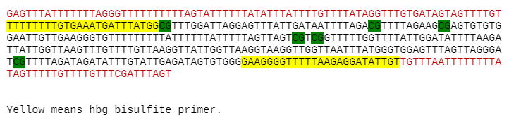

Targeted methyl-seq amplicon analysis
===================================

Summary
^^^^^^^

This pipeline calculates DNA methylation % using crispresso.

Rationale: Bisulfite treatment converts all C into T, except methylated C, which usually occurs at CpG sites. Then the %C at CpG in the sequenced reads is the DNA methylation % at this site.

Input
^^^^^

fastq.tsv
-------

Use ``run_lsf.py --guess_input`` to automatically generate this.

::

	Banana_R1.fastq.gz	Banana_R2.fastq.gz	Banana_lovers
	Orange_R1.fastq.gz	Orange_R2.fastq.gz	Orange_lovers

Converted amplicon sequence
----------------------

Four requirements:

1. The amplicon sequence is the sequence from forward primer to reverse primer (yellow sequence below). 

2. All C should be coverted to T except for CpG (dark green). 

3. The amplicon should be the forward-strand sequence. Otherwise the resulted bw file maybe incorrect.

4. You need to provide the chromosome and start position (0-based) of your amplicon sequence in order to generate bw file.

Read length
---------

Need read length in order to estimate FLASH min,max overlap length, to remove some low quality reads.

Methyl percentage by indel reads types
^^^^^^^^^^^^^^^^^^^^^^^^^^^^

To output Methylation frequency for each CpG sites, stratified by each indel type.

Output file is a table named ``{label}.Indel_reads_and_Methy_percent.csv`` for each sample.

First column is indel type, e.g., -13, -4, 1. If it is 0, then it is WT. second column is total reads for that indel. The rest column is CpG sites. Values are Mehtylation percentages.

Usage
^^^^^

::

	hpcf_interactive # login to compute node

	module load python/2.7.13

	methyl_amplicon.py -f fastq.tsv -a amp.fa --read_length 250 --genomic_chr chr11 --genomic_start 5271011

	# to calculate Methyl percentage by indel reads types, you must give the correct gRNA sequence --guide_seq. Here C is all converted into T.

	methyl_amplicon.py -f fastq.tsv -a /home/yli11/HemTools/share/misc/HBG1_methy.fa --read_length 250 --genomic_chr chr11 --genomic_start 5271011 --guide_seq TTTGTTAAGGTTATTGGTTAAGG5271011

HBG1 amplicon run
------

First, go to your working dir: ``cd /research/dept/hem/common/sequencing/chenggrp/UHRF1_Yong_Weiss_collaboration/HUDEP2_data/Amplicon_BS/weissgrp_820508_Tagged_Amplicon-1``

Everytime you run the same amplicon, you can safely copy and paste the following.

::

	hpcf_interactive # login to compute node

	module load python/2.7.13

	run_lsf.py --guess_input 

	methyl_amplicon.py -f fastq.tsv -a /home/yli11/HemTools/share/misc/HBG1_methy.fa --read_length 250 --genomic_chr chr11 --genomic_start 5271011

Output
^^^^^^

Email notification will be sent once it is finished, which contains ``QC.stats.csv and Methylation_percentage.csv``

