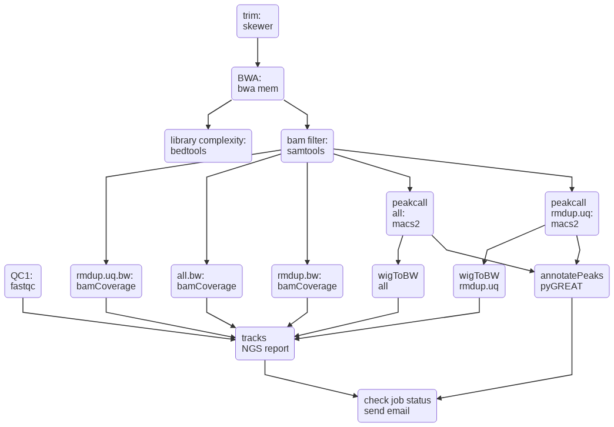
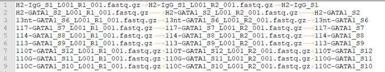
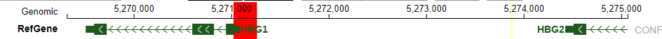
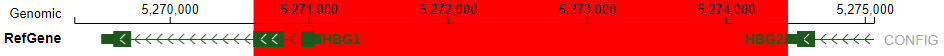

ATAC-seq
========

.. contents::
    :local:

Flowchart
^^^^^^^^^

Parameters
^^^^^^^^^^

.. argparse::
   :filename: ../bin/HemTools
   :func: main_parser
   :prog: HemTools
   :path: atac_seq

Usage
^^^^^

Go to your data directory and type the following.

**Step 0: Load python version 2.7.13.**

.. code:: bash

    $ module load python/2.7.13

**Step 1: Prepare input files, generate fastq.tsv.**

.. code:: bash

    $ HemTools atac_seq --guess_input

	Input fastq files preparation complete! ALL GOOD!
	Please check if you like the computer-generated labels in : fastq.tsv

.. note:: If you are preparing fastq.tsv yourself, please make sure ``no space anywhere`` in the file. Note that the seperator is tab. Spaces in file name will cause errors.

**Step 2: Check the computer-generated input list (manually), make sure they are correct.**

.. code:: bash

    $ less fastq.tsv

.. note:: a random string will be added to the generated files (e.g., fastq.94c049cbff1f.tsv) if they exist before running step 1.

**Step 3: Submit your job.**

.. code:: bash

    $ HemTools atac_seq -f fastq.tsv

Sample input format
^^^^^^^^^^^^^^^^^^^

**fastq.tsv**

This is a tab-seperated-value format file. The 3 columns are: Read 1, Read 2, sample ID.

Quality Control
^^^^^^^^^^^^^^^

The quality metrics are provided in the html report. For ChIP-seq data, we also provide strand cross-correlation metrics (i.e., those attached pdf files). 

+---------+-----------+
| Metrics | Threshold |
+---------+-----------+
| NRF     | >0.9      |
+---------+-----------+
| PBC1    | >0.9      |
+---------+-----------+
| PBC2    | >3        |
+---------+-----------+
| Num peaks | >100k     |
+---------+-----------+

https://www.encodeproject.org/atac-seq/

https://www.encodeproject.org/chip-seq/transcription_factor/
https://www.encodeproject.org/chip-seq/histone/

https://github.com/crazyhottommy/ChIP-seq-analysis/blob/master/part0_quality_control.md

Report bug
^^^^^^^^^^

Once the job is finished, you will be notified by email with some attachments.  If no attachment can be found, it might be caused by an error. In such case, please go to the result directory (where the log_files folder is located) and type: 

.. code:: bash

    $ HemTools report_bug

Use different genome index
^^^^^^^^^^^^^^^^^^^^^^^^^^

.. code:: bash

    $ HemTools atac_seq -f fastq.tsv -i YOUR_GENOME_INDEX

Example of using different genome index
^^^^^^^^^^^^^^^^^^^^^^^^^^^^^^^^^^^^^^^

**Ruopeng masked index**

.. code:: bash

    HemTools atac_seq -f fastq.tsv -i /home/yli11/Data/Human/hg19/index/masked_genome/ruopeng_hbg1_promoter/ruopeng_hbg1_promoter.mask.fa

**Li masked index**

.. code:: bash

    HemTools atac_seq -f fastq.tsv -i /home/yli11/Data/Human/hg19/index/masked_genome/li_hgb1_promoter/li_hgb1_promoter.mask.fa

Comments
^^^^^^^^

.. disqus::
    :disqus_identifier: NGS_pipelines

