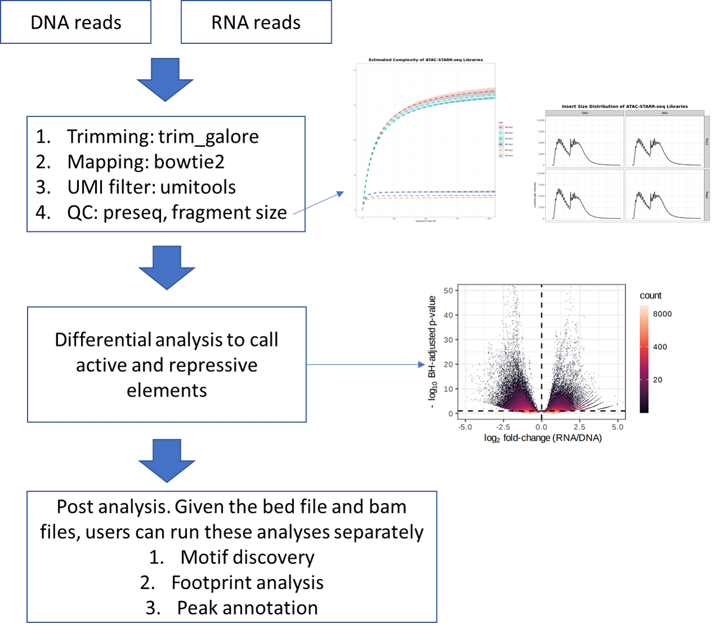

STARR-seq analysis pipeline
===================================

Summary
^^^^^^^

ATAC-STARR-seq is an assay to profile self-transcribed active regions (e.g., enhancer). This pipeline is adopted from Tyler J Hansen 2022, Genome Research paper with minor modifications.

This pipeline assumes both DNA and RNA have UMI.

This pipeline assumes the DNA group and RNA group have equal number of replicates.

(Previous Note) To generate fastq for starr-seq from bcl file
^^^^^^^^^^^^^^^^^^^^^^

If you already have fastq files, please skip this step. 

The UMI should be added to the read name as ``@oldReadName_UMI``.

1. One DNA barcodes and One RNA barcode + DNA UMI and RNA UMI
------------------------------------

::

	# login to compute node
	hpcf_interactive.sh

	module load bcl2fastq
	
	bcl2fastq --no-lane-splitting -o starr_seq_fastq --sample-sheet /home/yli11/HemTools/share/misc/starr_seq_SampleSheet2.csv --create-fastq-for-index-reads

	cd starr_seq_fastq
	module load conda3/202011
	source activate /home/yli11/.conda/envs/captureC
	starr_seq_demultiplex2.py AGGCTATA AGGATAGG 1
	# DNA barcode, RNA barcode, mismatch cutoff. Please replace barcode sequence with your barcode sequence.

Input
^^^^^

fastq.tsv
---------

Use ``run_lsf.py --guess_input`` to automatically generate this. Then you have to manually add a 4th column, with keywords of ``DNA`` or ``RNA``.

::

	myDNA1_R1.fastq.gz	myDNA1_R2.fastq.gz	myDNA1 	DNA
	myDNA2_R1.fastq.gz	myDNA2_R2.fastq.gz	myDNA2 	DNA
	myRNA1_R1.fastq.gz	myRNA1_R2.fastq.gz	myRNA1 	RNA
	myRNA2_R1.fastq.gz	myRNA2_R2.fastq.gz	myRNA2 	RNA

.. note:: This pipeline assumes you have equal number of replicates for the DNA group and the RNA group.

Usage
^^^^^

.. code:: bash

	hpcf_interactive

	module load python/2.7.13

	run_lsf.py --guess_input # to generate fastq.tsv

	run_lsf.py -f fastq.tsv -p atac_starr_seq --MAPQ 0 --macs_genome hs -g hg19

For strand separated results, run:

.. code:: bash

	run_lsf.py -f fastq.tsv -p atac_starr_seq_forward --MAPQ 0 --macs_genome hs -g hg19

	run_lsf.py -f fastq.tsv -p atac_starr_seq_reverse --MAPQ 0 --macs_genome hs -g hg19

Output
^^^^^^

QC html
-----------

A QC report will be emailed to you when the job is done.

1. General mapping stats. Some important QC are shown below.

There are many blanks in the table because the QC program extracts text directly from file and usually each file only contain one stat.

2. insertion size/ fragment size.

3. library complexity

Differential analysis
------------------

This is the main result.

Take a look at the ``diff_analysis_plots.html`` file inside the ``Differential_analysis``.

This html provides a ``volcano plot`` (the file is ``volcano.pdf``), correlation plots (``corr_R1-R2.pdf``), number and size disitribution of active/silent elements ``bins_donut.pdf`` / ``regulatory-regions_size_distribution.pdf``, and number of active/silent peaks ``peaks_donut.pdf``.

Active and Silent regions
----------------

Use ``silent_regions.bed`` and ``active_regions.bed``. The program create 50bp overlapping bins to define region. So these regions are merged from those bins.

Use ``*peak.bed`` for peak level annotation.

fold change bw files
----

DESEQ outputs can also be viewed as bw files. Please go to the ``bdg_to_bw*`` folder inside the ``Differential_analysis``.

