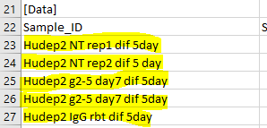

Convert BCL basecall files to FASTQ files
=========================================

.. tip:: For demultiplexing, you must provide ``SampleSheet.csv``; otherwise, all fastq.gz files will be named as ``Undetermined``.

.. note:: Please note that there should be no spaces in sample_ID (e.g., see some incorrect examples below). A unique sample_ID is also preferred. 

	
**Step 1**

.. highlight:: none

:: 

	bsub -R 'rusage[mem=32000]' -Is -q interactive -P Genomics /bin/bash

**Step 2**

.. code:: bash

	module load bcl2fastq

**Step 3**

.. code:: bash

	bcl2fastq --no-lane-splitting -o fastq_files

Once finished, you should be able to see the fastq files in folder `fastq_files`.

.. tip:: By default, one mismatch is allowed for demultiplexing. If you want to allow for two mismatches, type the command below:

.. code:: bash

	bcl2fastq --no-lane-splitting -o fastq_files --barcode-mismatches 2

Comments
^^^^^^^^

.. disqus::
    :disqus_identifier: NGS_pipelines

