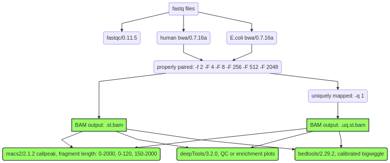
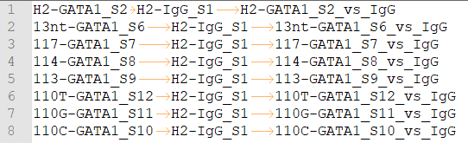

CUT & RUN calibration pipeline
==================

::

  usage: cut_run_calibration.py [-h] [-j JID] -f FASTQ_TSV -d PEAKCALL_TSV
                                [--scale_multiplier SCALE_MULTIPLIER]
                                [--Ecoli_index_file ECOLI_INDEX_FILE]
                                [-g GENOME] [--genome_fasta GENOME_FASTA]
                                [-b BLACK_LIST] [-s CHROM_SIZE] [-i INDEX_FILE]

  optional arguments:
    -h, --help            show this help message and exit
    -j JID, --jid JID     enter a job ID, which is used to make a new directory.
                          Every output will be moved into this folder. (default:
                          cut_run_calibration_yli11_2021-06-23)
    -f FASTQ_TSV, --fastq_tsv FASTQ_TSV
                          TSV file, 3 columns, peak, bam, output, need absolute
                          path to file (default: None)
    -d PEAKCALL_TSV, --peakcall_tsv PEAKCALL_TSV
                          TSV file, 3 columns, peak, bam, output, need absolute
                          path to file (default: None)
    --scale_multiplier SCALE_MULTIPLIER
    --Ecoli_index_file ECOLI_INDEX_FILE

  Genome Info:
    -g GENOME, --genome GENOME
                          genome version: hg19, mm10, mm9 (default: hg19)
    --genome_fasta GENOME_FASTA
                          genome version: hs, mm (default:
                          /home/yli11/Data/Human/hg19/fasta/hg19.fa)
    -b BLACK_LIST, --black_list BLACK_LIST
                          Blacklist file (default: /home/yli11/Data/Human/hg19/a
                          nnotations/hg19.blacklist.bed)
    -s CHROM_SIZE, --chrom_size CHROM_SIZE
                          chrome size (default: /home/yli11/Data/Human/hg19/anno
                          tations/hg19.chrom.sizes)
    -i INDEX_FILE, --index_file INDEX_FILE
                          chrome size (default: /home/yli11/Data/Human/hg19/inde
                          x/bwa_16a_index/hg19.fa)

Summary
^^^^^^

CUN-RUN pipeline with calibrated bw files based on E.coli reads, see https://github.com/Henikoff/Cut-and-Run/blob/master/spike_in_calibration.csh.

Duplicated reads were not removed. Multi-mapped reads can be removed, so two mapped bam files were generated, ``st.bam`` is all properly paired reads. ``.uq.st.bam`` is all properly paired and uniquely mapped reads.

Bw files, peak files, and motif discovery for top200 peaks were generated for both  ``st.bam`` and ``.uq.st.bam`` files. 

Usage
^^^^^

**Step 0:  LOGIN to a compute node**

::

  hpcf_interactive

Go to your data directory and type the following.

**Step 1: Prepare input files, generate fastq.tsv.**

.. code:: bash

    module load python/2.7.13

    HemTools cut_run --guess_input

	Input fastq files preparation complete! ALL GOOD!
	Please check if you like the computer-generated labels in : fastq.tsv
	Input peakcall file preparation complete! File name: peakcall.tsv

.. note:: If you are preparing fastq.tsv and peakcall.tsv yourself, please make sure ``no space anywhere`` in the file. Note that the seperator is tab. Spaces in file name will cause errors.

**Step 2: Check the computer-generated input list (manually), make sure they are correct.**

.. code:: bash

    more fastq.tsv

    more peakcall.tsv

.. note:: a random string will be added to the generated files (e.g., fastq.94c049cbff1f.tsv) if they exist before running step 1.

**Step 3: Submit your job.**

.. code:: bash

    cut_run_calibration.py -f fastq.tsv -d peakcall.tsv

Sample input format
^^^^^^^^^^^^^^^^^^^

**fastq.tsv**

This is a tab-seperated-value format file. The 3 columns are: Read 1, Read 2, sample ID.

.. image:: ../../images/fastq.tsv.png

**peakcall.tsv**

This is also a tab-seperated-value format file. The 3 columns are: treatment sample ID, control/input sample ID, peakcall ID.

Output
^^^^^^

See each folder in the ``{jid}`` folder for results. For example, calibrated bw files are located in ``bw_files``.

Report bug
^^^^^^^^^^

Once the job is finished, you will be notified by email with some attachments.  If no attachment can be found, it might be caused by an error. In such case, please go to the result directory (where the log_files folder is located) and type: 

.. code:: bash

    $ HemTools report_bug

Comments
^^^^^^^^

.. disqus::
    :disqus_identifier: NGS_pipelines

