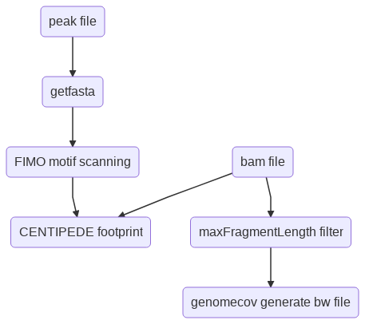

Cut & RUN footprinting
======================

::

	usage: cut_run_footprint.py [-h] [-j JID] -f INPUT_TSV [-q MINMAPPINGQUALITY]
	                            [--maxFragmentLength MAXFRAGMENTLENGTH]
	                            [--Liu_Nan_pipeline_path_atactk LIU_NAN_PIPELINE_PATH_ATACTK]
	                            [--Liu_Nan_pipeline_path_root LIU_NAN_PIPELINE_PATH_ROOT]
	                            [-g GENOME] [--genome_fasta GENOME_FASTA]
	                            [-b BLACK_LIST] [-s CHROM_SIZE] [-m MOTIF_FILE]
	                            [-l MOTIF_LIST]

	optional arguments:
	  -h, --help            show this help message and exit
	  -j JID, --jid JID     enter a job ID, which is used to make a new directory.
	                        Every output will be moved into this folder. (default:
	                        cut_run_footprint_yli11_2019-07-23)
	  -f INPUT_TSV, --input_tsv INPUT_TSV
	                        TSV file, 3 columns, peak, bam, output, need absolute
	                        path to file (default: None)
	  -q MINMAPPINGQUALITY, --minMappingQuality MINMAPPINGQUALITY
	  --maxFragmentLength MAXFRAGMENTLENGTH
	  --Liu_Nan_pipeline_path_atactk LIU_NAN_PIPELINE_PATH_ATACTK
	                        not for end-user (default: /home/yli11/Programs/cut_ru
	                        n_pipeline_Nan_Liu/git/atactk/scripts)
	  --Liu_Nan_pipeline_path_root LIU_NAN_PIPELINE_PATH_ROOT
	                        not for end-user (default:
	                        /home/yli11/Programs/cut_run_pipeline_Nan_Liu)

	Genome Info:
	  -g GENOME, --genome GENOME
	                        genome version: hg19, mm10, mm9 (default: hg19)
	  --genome_fasta GENOME_FASTA
	                        genome version: hs, mm (default:
	                        /home/yli11/Data/Human/hg19/fasta/hg19.fa)
	  -b BLACK_LIST, --black_list BLACK_LIST
	                        Blacklist file (default: /home/yli11/Data/Human/hg19/a
	                        nnotations/hg19.blacklist.bed)
	  -s CHROM_SIZE, --chrom_size CHROM_SIZE
	                        chrome size (default: /home/yli11/Data/Human/hg19/anno
	                        tations/hg19.chrom.sizes)

	Motif Info:
	  -m MOTIF_FILE, --motif_file MOTIF_FILE
	                        genome version: hg19, mm10, mm9 (default:
	                        /home/yli11/Data/Motif_database/Human/human.meme)
	  -l MOTIF_LIST, --motif_list MOTIF_LIST
	                        genome version: hg19, mm10, mm9 (default:
	                        /home/yli11/Data/Motif_database/Human/jaspar_motif.list)

Summary
^^^^^^^

This pipeline uses the footprint.sh code from https://bitbucket.org/qzhudfci/cutruntools/src/6e399d20e051ee950c3c17d8d5cf8092c3c2a558/USAGE.md. 

This pipeline is also deposited at: https://github.com/YichaoOU/cut_run_footprinting

This pipeline takes in a bam file and a narrowPeak file (or any bed file), generate footprint figures for all motifs identified by Homer, including known motifs.

Only properly-paired reads are used. Users can control maximal fragment size, default is 150bp. For CUT & RUN, some people also use 120bp. You can also use a big number, like 9999, in that case, all sizes of fragment will be used. ``I haven't tested differences between fragment sizes.``

Interpreting results
^^^^^^^^^^^^^^^^^^^^

Unlike ATAC-seq or DNase-seq where enzymes cut/digest all naked DNA (i.e., unbound by TFs or nucleosome-free), CUT&RUN uses an antibody to specifically target a TF, therefore, the cutting only occurs nearby the TF binding sites. Therefore, we can be confident about targeted TF footprints if we see valleys on cut-probability figures, however, we should be cautious about its co-factors' results. We can see if footprint results are similar in different replicates. Also, we can look at the ``cut_sites.bw`` generated by this pipeline and see if we can see the valleys on our regions of interest.

By default, we only use paired-reads where fragment size <= 150bp. Not all co-factors can interact with the target TF in this short region. You can relax this parameter ``--maxFragmentLength`` if you are really interested in some TFs that don't show strong footprints using the default 150bp.

Flowchart
^^^^^^^^^

	
Example
^^^^^^^

motif footprint HTML report (Main)
"""""""""""""""""""""""""""""""""

The html file is for quickly scanning through the results. For high-quality motif-occuring position density figures, go to ``homer_motifs_result/homer_all_motifs/*png``. For high-quality motif footprint figures, go to ``motif_mapping/``, here each motif has a folder, inside each folder, you will see ``footprint.lambda.strand_combined.png`` (this one is the figure in the html file). You can also find the ``footprint.png``, which shows two strands cut-probability. Sometimes we can see strand differences, we are not sure how to explain this right now.

.. image:: ../../images/cut_run_footprint_html_result.png
	:align: center

motif footprint HTML report (not good ones)
"""""""""""""""""""""""""""""""""

.. image:: ../../images/cut_run_footprint_bed_result.png
	:align: center

cut sites count (Main)
""""""""""""""""""""""

motif footprint - cut probability
"""""""""""""""""""""""""""""""""

You can also find ``footprint.png`` inside the ``motif_mapping`` folder, which shows two strands cut-probability.

More footprint figures for reference:

https://academic.oup.com/view-large/figure/84773029/btw209f1p.gif

https://www.biorxiv.org/content/biorxiv/early/2019/01/22/525808.full.pdf

https://www.regulatory-genomics.org/hint/tutorial/

Input
^^^^^

A tsv file specifying path_to_peak_file, path_to_bam_file, and output_file_prefix

.. note:: Please use absolute path. 

An example is shown below:

::

	/home/yli11/myPATH/test.narrowPeak	/home/yli11/myPATH/test.bam	test_out_name
	/home/yli11/myPATH/banana.narrowPeak	/home/yli11/myPATH/banana.bam	banana_name

Usage
^^^^^

Go to your data directory and type the following.

**Step 0: Load python version 2.7.13.**

.. code:: bash

    module load python/2.7.13

**Step 1: Submit your job.**

.. code:: bash

    cut_run_footprint.py -f input.tsv

Output
^^^^^^

You will receive a notification email when everything is finished.

An example of the output structure (inside job ID folder) is shown below, files that you might need are commented ##.

::

	├── Banana
	│   ├── bam_file
	│   ├── cut_sites ## cut sites bw is here ##
	│   ├── homer_motifs_result ## take a look at the homer results, e.g., p-values ##
	│   ├── motif_mapping ## footprint figures are here ##
	│   ├── output.html ## this report has been emailed to you ##
	├── test_out_name
	│   ├── bam_file
	│   ├── cut_sites
	│   ├── homer_motifs_result
	│   └── motif_mapping

motif footprint - cut probability
"""""""""""""""""""""""""""""""""

Motif footprinting figure is shown inside the ``motif_mapping`` folder. One folder per motif name. You can look at the ``fimo.png`` file.

cut sites count 
"""""""""""""""

Cut sites bw file is in ``cut_sites`` folder.

Report bug
^^^^^^^^^^

Go to your Job ID folder and do the following:

.. code:: bash

	module load python/2.7.13

	HemTools report_bug

Reference
^^^^^^^^^

https://bedtools.readthedocs.io/en/latest/content/tools/genomecov.html
https://www.ncbi.nlm.nih.gov/pubmed/21106904
Pipeline script
^^^^^^^^^^^^^^^

.. code:: bash

	=cut FT 1

	inputFile=input_tsv

	ncore=1
	mem=16000

	module load conda3/5.1.0
	source activate /home/yli11/.conda/envs/cutruntools/
	module load R/3.5.1
	module load trimmomatic/0.36
	module load java/1.8.0_60
	module load meme/4.11.2
	module load bedtools/2.25.0
	module load bowtie2/2.2.9
	module load picard/2.9.4
	module load bedops/2.4.35
	module load hdf5/1.10.4
	module load perl/5.20.1
	module load samtools/1.3.1
	module load gcc/4.8.5
	module load java/1.8.0_66

	# Please give absolute path to file
	peak_file=${COL1} #a narrowPeak file
	bam_file=${COL2}
	base=${COL3}
	jid={{jid}}

	pythonbin=/home/yli11/.conda/envs/cutruntools/bin
	memebin=/hpcf/apps/meme/install/4.11.2/bin
	bedopsbin=/hpcf/authorized_apps/rhel7_apps/bedops/install/2.4.35/bin
	bedtoolsbin=/hpcf/apps/bedtools/install/2.25.0/bin
	# genome_sequence=/home/yli11/Data/Human/hg19/fasta/hg19.fa
	# samtoolsbin=/hpcf/apps/samtools/install/1.3.1/bin
	# makecutmatrixbin=/home/yli11/Programs/cut_run_pipeline_Nan_Liu/git/atactk/scripts
	# Rscriptbin=/hpcf/authorized_apps/rhel7_apps/R/install/3.5.1/bin
	# extrasettings=/home/yli11/Programs/cut_run_pipeline_Nan_Liu
	# motif_file=/home/yli11/Data/Motif_database/Human/human.meme

	genome_sequence={{genome_fasta}}
	samtoolsbin=/hpcf/apps/samtools/install/1.3.1/bin
	makecutmatrixbin={{Liu_Nan_pipeline_path_atactk}}
	Rscriptbin=/hpcf/authorized_apps/rhel7_apps/R/install/3.5.1/bin
	extrasettings={{Liu_Nan_pipeline_path_root}}
	motif_file={{motif_file}}

	## not sure what this is for, but will keep it
	pythonldlibrary=/home/yli11/.conda/envs/cutruntools/lib
	ldlibrary=`echo $LD_LIBRARY_PATH | tr : "\n" | grep -v $pythonldlibrary | paste -s -d:`
	unset LD_LIBRARY_PATH
	export LD_LIBRARY_PATH=$pythonldlibrary:$ldlibrary

	p=0.00050

	echo "remove blacklist"
	# blacklist=$extrasettings/hg19.blacklist.bed
	blacklist={{black_list}}
	cat $peak_file | grep -v -e "chrM" | $bedopsbin/sort-bed - | $bedopsbin/bedops -n 1 - $blacklist > $jid/"$base".filtered.narrowPeak

	# cp $peak_file $jid/"$base".filtered.narrowPeak

	$bedtoolsbin/bedtools getfasta -fi $genome_sequence -bed $jid/"$base".filtered.narrowPeak -fo $jid/"$base".fa
	$pythonbin/python $extrasettings/macs2.narrow.aug18/fix_sequence.py $jid/"$base".fa

	cd $jid
	mkdir $base
	cd $base
	fimo_dir=motif_mapping
	mkdir $fimo_dir
	cd $fimo_dir
	for m in `cat {{motif_list}}`; do
	mkdir $m
	echo $m
	$memebin/fimo --verbosity 1 --motif $m --thresh $p --parse-genomic-coord -oc $m $motif_file ../../"$base".fa
	$bedopsbin/gff2bed < $m/fimo.gff | awk 'BEGIN {IFS="	"; OFS="	";} {print $1,$2,$3,$4,$5,$6}' > $m/fimo.bed
	done

	cd ..
	dest=filtered.bam
	mkdir centipede
	outbam=centipede/$dest
	#note that 1024 means read is PCR or optical duplicate
	$samtoolsbin/samtools view -b -h -f 3 -F 4 -F 8 -F 1024 -o $outbam $bam_file #previous version
	$samtoolsbin/samtools sort $outbam -o ${outbam}.sorted
	mv ${outbam}.sorted $outbam
	$samtoolsbin/samtools index $outbam
	echo "finish samtools"

	echo "plot footprint figures"
	echo `pwd`
	for i in `ls -1 $fimo_dir`; do #shows a list of motifs
	echo "Doing $i..."
	fimo_d=$fimo_dir/$i
	tmp=`echo $i|cut -d "." -f3|wc -c`
	mlen=$(( tmp - 1 ))
	$makecutmatrixbin/make_cut_matrix -v -b '(25-150 1)' -d -o 0 -r 100 -p 1 -f 3 -F 4 -F 8 -q {{minMappingQuality}} $outbam $fimo_d/fimo.bed > $fimo_d/fimo.cuts.freq.txt
	$Rscriptbin/Rscript $extrasettings/macs2.narrow.aug18/run_centipede_parker.R $fimo_d/fimo.cuts.freq.txt $fimo_d/fimo.bed $fimo_d/fimo.png $mlen
	done

	echo "generating bw file"
	mkdir cut_sites
	cd cut_sites
	outbam=tcut_sites.bam
	outbed=tcut_sites.bed
	outbdg=tcut_sites.bdg
	outbw=${COL3}.bw
	chrom_size={{chrom_size}}

	alignmentSieve --minMappingQuality {{minMappingQuality}} -b $bam_file -o  $outbam --filterMetrics metrics.txt --maxFragmentLength {{maxFragmentLength}} --shift 0 0
	bedtools genomecov -ibam $outbam -g $chrom_size -bga -5 > $outbdg
	bedGraphToBigWig $outbdg $chrom_size $outbw
	rm $outbam
	rm $outbed
	rm $outbdg

	=cut email 3 FT

	module load python/2.7.13

	cd {{jid}}

	send_email_v1.py -m "{{jid}} is finished" -j {{jid}}

Comments
^^^^^^^^

.. disqus::
    :disqus_identifier: NGS_pipelines

