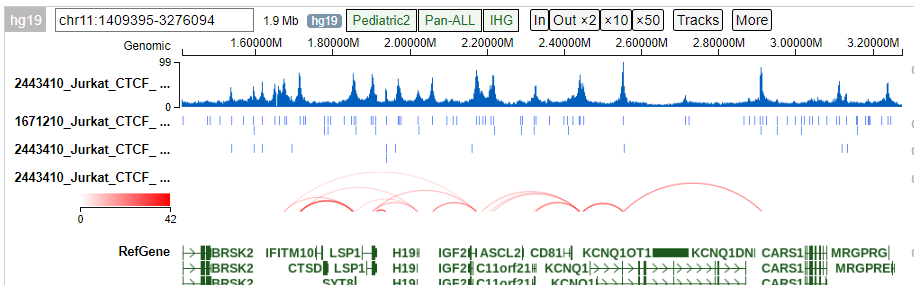

MNase-based HiCHIP data analysis
==========================

::

	usage: hichip.py [-h] [-j JID] -f FASTQ_TSV -p PEAK_BED [-IntType INTTYPE]
	                 [-BINSIZE BINSIZE] [-mapq_cutoff MAPQ_CUTOFF]
	                 [-LowDistThr LOWDISTTHR] [-UppDistThr UPPDISTTHR]
	                 [-UseP2PBackgrnd USEP2PBACKGRND] [-BiasType BIASTYPE]
	                 [-MergeInt MERGEINT] [-QVALUE QVALUE] [-g GENOME]
	                 [--bwa_index BWA_INDEX] [-s CHROM_SIZE]

	RGT_HINT atac-seq footprint with bias correction

	optional arguments:
	  -h, --help            show this help message and exit
	  -j JID, --jid JID     enter a job ID, which is used to make a new directory.
	                        Every output will be moved into this folder. (default:
	                        hichip_yli11_2022-08-01)
	  -f FASTQ_TSV, --fastq_tsv FASTQ_TSV
	                        3-col tsv, R1, R2, sample_ID (default: None)
	  -p PEAK_BED, --peak_bed PEAK_BED
	                        narrowpeak file (default: None)
	  -IntType INTTYPE      #Interaction type - 1: peak to peak (CTCF) 2: peak to
	                        non peak 3: peak to all (default, h3k27ac) 4: all to
	                        all 5: everything from 1 to 4. (default: 3)
	  -BINSIZE BINSIZE      # Size of the bins, in bases, for detecting the
	                        interactions. (default: 2500)
	  -mapq_cutoff MAPQ_CUTOFF
	                        mapq_cutoff (default: 0)
	  -LowDistThr LOWDISTTHR
	                        Lower distance threshold of interaction between two
	                        segments (default: 10000)
	  -UppDistThr UPPDISTTHR
	                        Upper distance threshold of interaction between two
	                        segments (default: 2000000)
	  -UseP2PBackgrnd USEP2PBACKGRND
	                        # Applicable only for peak to all output interactions
	                        - values: 0 / 1 # if 1, uses only peak to peak loops
	                        for background modeling - corresponds to FitHiChIP(S)
	                        # if 0, uses both peak to peak and peak to nonpeak
	                        loops for background modeling - corresponds to
	                        FitHiChIP(L) (default: 1)
	  -BiasType BIASTYPE    # parameter signifying the type of bias vector -
	                        values: 1 / 2 # 1: coverage bias regression 2: ICE
	                        bias regression (default: 1)
	  -MergeInt MERGEINT    # following parameter, if 1, means that merge
	                        filtering (corresponding to either FitHiChIP(L+M) or
	                        FitHiChIP(S+M)) # depending on the background model,
	                        would be employed. Otherwise (if 0), no merge
	                        filtering is employed. (default: 1)
	  -QVALUE QVALUE        FDR (q-value) threshold for loop significance
	                        (default: 0.05)

	Genome Info:
	  -g GENOME, --genome GENOME
	                        genome version: hg19, hg38, mm9, mm10. By default,
	                        specifying a genome version will automatically update
	                        index file, black list, chrom size and
	                        effectiveGenomeSize, unless a user explicitly sets
	                        those options. (default: hg19)
	  --bwa_index BWA_INDEX
	                        bwa index file (default: /home/yli11/Data/Human/hg19/i
	                        ndex/bwa_16a_index/hg19.fa)
	  -s CHROM_SIZE, --chrom_size CHROM_SIZE
	                        chrome size (default: /home/yli11/Data/Human/hg19/anno
	                        tations/hg19.chrom.sizes)

Summary
^^^^^^^

Pipeline is adopted from: https://hichip.readthedocs.io/en/latest/index.html

Input
^^^^^

Requires paired-end fastq files and a peak (narrowPeak format) file. If we are doing a CTCF HiChIP, then we should have done a CTCF ChIP-seq in order to have the CTCF narrowPeak file.

Usage
^^^^^

Go to your fastq files folder and do the following:

.. code:: bash
	
	hpcf_interactive

	module load python/2.7.13

	run_lsf.py --guess_input

	hichip.py -f fastq.tsv -p CTCF.bed -g hg19 -IntType 1

	hichip.py -f fastq.tsv -p H3k27ac.bed -g hg19 -IntType 3

1 means peak-to-peak interaction
3 means peak-to-all interaction (see help message for other types 1-5)

Output
^^^^^^

1. Library QC
-------------

See ``hichip_qc_summary.html``. QC standards are:

+----------------------------------------------+----------------------+------------------------+
|Metric                                        |Shallow Seq (20M)     |Deep Seq (100-200M)     |
+==============================================+======================+========================+
|No-Dup Read Pairs                             |>75%                  |>50%                    |
+----------------------------------------------+----------------------+------------------------+
|No-dup cis read pairs ≥ 1kb                   |>20%                  |>20%                    |
+----------------------------------------------+----------------------+------------------------+
|Total reads in 1000 bp around center of peaks |>2%                   |>2%                     |
+----------------------------------------------+----------------------+------------------------+

2. Called interactions
---------------------

``*fithic.merged.counts.bedpe`` and ``*fithic.merged.pvalue.bedpe``

FitHiChIP detailed results are provided in ``fihichip_results``. It also provides a result summary html file.

3. Tracks visualization
--------------------

In the ``upload`` folder, users can find:

- mapped.PT.bw: read pairs bw files

- macs2_peaks.narrowPeak: de-novo called peaks from HiCHIP data

- fithic.merged.counts.bedpe: FitHiChIP called interactions

- user-provided peak file

Users can run ``create_tracks.py --current_dir -g $genome`` to upload these files to protein paint.

