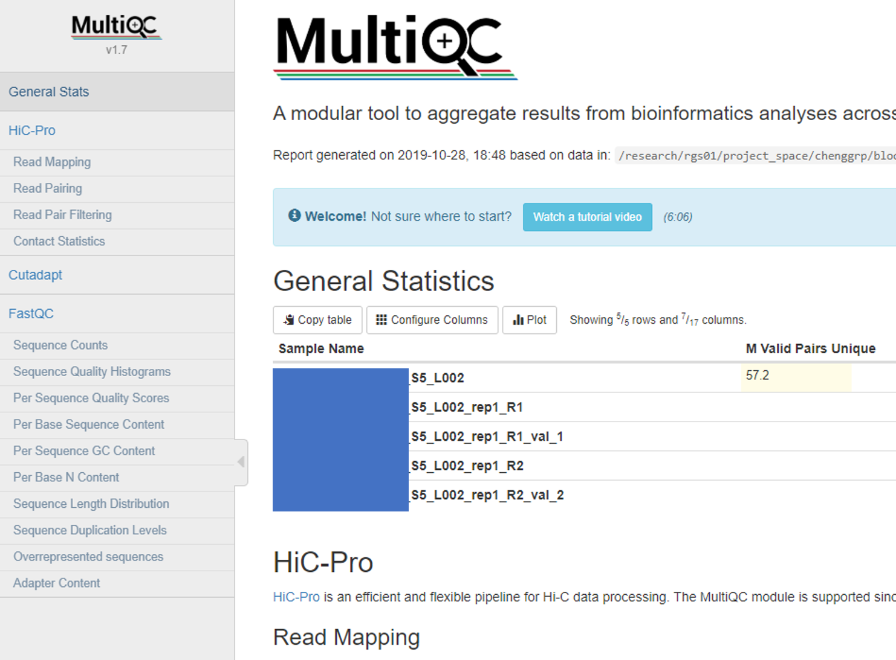
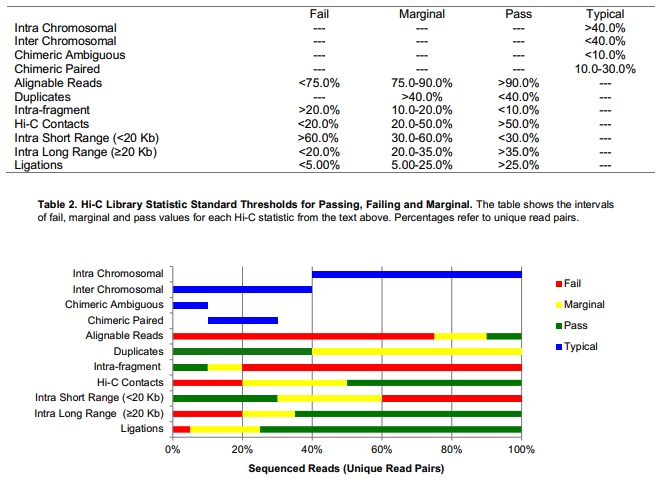
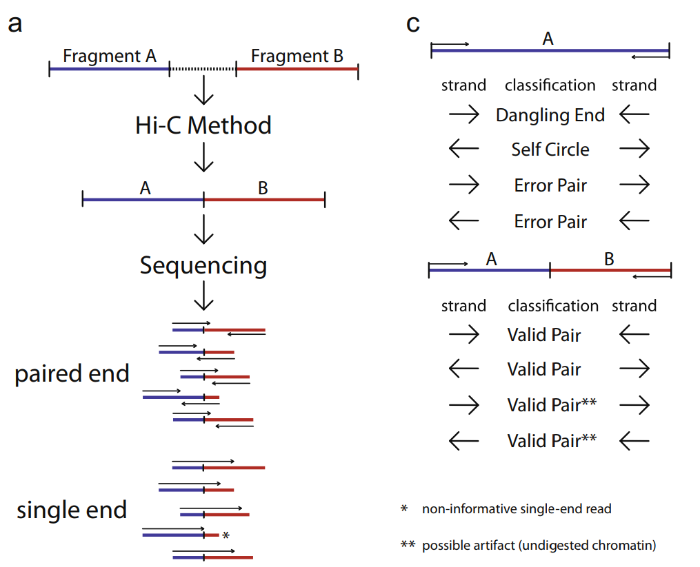

Analysis of Hi-C and capture-C data using HiC-Pro
==========================

::

	usage: hicpro_batch.py [-h] [-j JID] [--addon_parameters ADDON_PARAMETERS]
	                       [--queue QUEUE] (-f FASTQ_TSV | --guess_input)
	                       [-g GENOME] [-e DIGESTED_ENZYME]

	optional arguments:
	  -h, --help            show this help message and exit
	  -j JID, --jid JID     enter a job ID, which is used to make a new directory.
	                        Every output will be moved into this folder. (default:
	                        hicpro_batch_yli11_2021-04-30)
	  --addon_parameters ADDON_PARAMETERS
	                        addon parameters passed to hicpro split (default:
	                        None)
	  --queue QUEUE
	  -f FASTQ_TSV, --fastq_tsv FASTQ_TSV
	                        tab delimited 3 columns (tsv file): Read 1 fastq, Read
	                        2 fastq, sample ID (default: None)
	  --guess_input         Let the program generate the input files for you.
	                        (default: False)

	Genome Info:
	  -g GENOME, --genome GENOME
	                        genome version: hg19, hg38, mm9, mm10. By default,
	                        specifying a genome version will automatically update
	                        index file, black list, chrom size and
	                        effectiveGenomeSize, unless a user explicitly sets
	                        those options. (default: hg19)
	  -e DIGESTED_ENZYME, --digested_enzyme DIGESTED_ENZYME
	                        digested_fragments hg19_MboI (default: MboI)

Summary
^^^^^^^

This program provides Hi-C or Capture-C data analysis paired-end samples, split the fastq files and run HiC-Pro.

Total input reads is splited to 100M reads per file. So a 1.5B reads will generate 15 splited files, each will be submited to HPC. Mapping takes about 20 hours for 100M PE reads. Combining the reads and remove duplicates are much faster, about 3 hours. ice takes about 3 hours. hicpro2juicer takes about 50 hours. So together, you should have the results within a week.

This program is updated for processing multiple samples. See old hicpro_split.py usage in the very bottom of this page.

Currently, ``hicpro_batch.py`` only support standard HiC analysis. ``hicpro_split.py`` provides options to keep duplicated and multi-mapped reads and capture-C data analysis.

Note: Homer has a problem converting working with ``--keep_dup`` option. Usually, we don't keep duplicates, we only did it for 20copy project.

HiC-Pro configuration file can be found at: "https://github.com/YichaoOU/HemTools/blob/master/share/NGS_pipeline/hicpro.config".

Actual code for this pipeline can be found at: "https://github.com/YichaoOU/HemTools/blob/master/share/lsf/hicpro_split.lsf"

Usage
^^^^^

Go to your fastq files folder and do the following:

.. code:: bash
	
	hpcf_interactive

	module load python/2.7.13

	hicpro_batch.py --guess_input

	hicpro_batch.py -f fastq.tsv -g hg19 -e MboI

``-e Mbol`` is the digested enzyme. Supported enzymes are MboI or DpnII (these two all cut ^GATC, so please just use MboI), NlaII, and HindIII.

To run captureC data in batch mode, put the fastq files that use the same bait in the same dir, and type:

.. code:: bash
	
	hpcf_interactive

	module load python/2.7.13

	hicpro_batch.py --guess_input

	hicpro_batch.py -f fastq.tsv -g hg19 --addon_parameters " -t target.bed -e NlaIII"

Output
^^^^^^

Same output as described in :doc:`hic_hichiper pipeline <hic_hichiper>`

QC report
^^^^^^^^^

Multi-QC HTML report
--------------------

You should be able to find ``multiqc_report.html`` in the hicpro_results folder.

HicPro QC figures
-----------------

They are in ``hicpro_results/hic_results/pic/``

There is a known bug that the labels in `plotMapping.pdf` are wrong: https://github.com/nservant/HiC-Pro/issues/290.

QC considerations
-----------------

Browser view is here: https://ppr.stjude.org/?study=yli11/phil/hic.json, we can see the data range (the HiC matrix and TAD score) for Hudep2 WT and Single Gamma is different. I think this is primarily due to difference in data quality. Looks like Hudep2_WT is still in low quality. According to ENCODE standards ( ), it did have >90% alignment rate, <40% duplication rate, >50% valid interactions, but long-range intra-chromosome interactions (>20kb) is only 17%, falls below the “marginal” flag range, which is 20% to 35%. (SingleGamma sample is 28%).
 
Hudep2 WT and Single Gamma are also in different sequencing depth. I tried down-sample them to 100M valid pairs, but the HiC matrix and TAD scores are still in quite different range.

ref: https://genomebiology.biomedcentral.com/articles/10.1186/s13059-019-1658-7

https://www.encodeproject.org/documents/75926e4b-77aa-4959-8ca7-87efcba39d79/@@download/attachment/comp_doc_7july2018_final.pdf

1. alignment

Overall > 90% aligned PE reads

< 100M mapped pairs is considered to be shallow 

2. Duplicated pairs

< 40%
Analysis of 13 cell types, most of them <30%:  https://genomebiology.biomedcentral.com/articles/10.1186/s13059-019-1658-7

Capture C may have higher % duplication due to high number of PCR cycles (NG capture, 20-24 cycles, compared to 11 cycles typically for PCHi-C) and higher sequencing depth. Just remove them: https://www.ncbi.nlm.nih.gov/pmc/articles/PMC6102006/

For promoter capture HiC, with/w.o duplicates, the tracks look very similar, see s figures in: https://www.nature.com/articles/ng.2871

3. Valid interactions

> 50%

4. Number of intra-chromosomal interactions (In multiQC html, ``Contact Statistics``, unique cis interactions )

This metric will affect A/B compartment and TAD calling

short-range (<20kb) cis unique interactions > 60% failed, 30-60 marginal, <30% is good

long-range (>20kb) cis unique interactions < 20% is failed, 20-40% is marginal, >40% is good

1M - 5M is considered to be the minimal usable data.

< 20M seems to have lower reproducible rate.

> 30M is normal

> 400M is deeply sequenced data.

Valid pairs
^^^^^^

ref: https://www.sciencedirect.com/science/article/pii/S1046202314003582?via%3Dihub

The figure (Fig.2 from ref) below provides an illustration of all different pairing types.

Multi-mapping issue
^^^^^^^^^^^^^^^^

Our 20copy data has 20 virus insertion sites, bowtie2 just randomly report 1. This could be bad for us.

We might need to correct the bam output.

https://www.biostars.org/p/118301/

https://github.com/nservant/HiC-Pro/issues/403

These trans- pairs will not be included in captureC bw, HiC matrix, or TAD calculation. We can "rescue" these reads by modifying ``mergeSAM.py``. Contact me if you want to do it. 

Since these trans- pairs are totally randomly assigned, it should not create any bias, so we only lose some sensitivity for detecting "weak" signals. When we are more care about specificity, we don't really need to "rescus" these reads, because modifying the code and then test it could cost some time.

generate hic bw file
^^^^^^^^^^^^^^^^

::

	run_lsf.py -f mm10.bam.list -p bwt2pairs_to_bw -g custom --chrom_size /home/yli11/Data/Mouse/mm10/annotation/mm10.chrom.sizes

visualization hicpro result
^^^^^^^^^^^^^^^^^^^^^^^^

FAQ
^^^

Out of memory error
-------------------

We requested 160G memory, but it may not be enough. In case that your data is partly processed, you can continue from where it stopped using the following commands:

.. code:: bash

	cd /home/yli11/dirs/blood_regulome/chenggrp/Projects/tcells/HiC/HiC_2_3/hic_hichip_qqi_2020-02-24/Tcell_HiC_2_3/hicpro_results
	time HiC-Pro -c hicpro.config.txt -i bowtie_results/bwt2 -o . -s proc_hic
	time HiC-Pro -c hicpro.config.txt -i bowtie_results/bwt2 -o . -s quality_checks
	time HiC-Pro -c hicpro.config.txt -i hic_results/data/ -o . -s merge_persample
	time HiC-Pro -c hicpro.config.txt -i hic_results/data/ -o . -s build_contact_maps
	time HiC-Pro -c hicpro.config.txt -i hic_results/matrix/ -o . -s ice_norm
	source activate /home/yli11/.conda/envs/multiQC/
	export LC_ALL=en_US.utf-8
	export LANG=en_US.utf-8
	multiqc .

hicpro_split.py
^^^^^^

Use hicpro_split.py if you have a custom genome

::

	usage: hicpro_split.py [-h] [-j JID] [--split_fastq] [--queue QUEUE]
	                       [--hicpro_config HICPRO_CONFIG]
	                       [--hichipper_config HICHIPPER_CONFIG]
	                       [--MAPS_config MAPS_CONFIG] [-a ANCHOR]
	                       [--cutsite CUTSITE] -r1 R1 -r2 R2 -s SAMPLE_ID
	                       [-t TARGET_BED] [--interactive] [--rerun] [--debug]
	                       [--keep_dup] [-g GENOME] [-i INDEX_FILE]
	                       [--chrom_size CHROM_SIZE] [-e DIGESTED_ENZYME]
	                       [--chr_count CHR_COUNT] [--ref_genome REF_GENOME]

	optional arguments:
	  -h, --help            show this help message and exit
	  -j JID, --jid JID     enter a job ID, which is used to make a new directory.
	                        Every output will be moved into this folder. (default:
	                        hicpro_split_yli11_2020-11-25)
	  --split_fastq         only run hicpro (default: False)
	  --queue QUEUE
	  --hicpro_config HICPRO_CONFIG
	  --hichipper_config HICHIPPER_CONFIG
	  --MAPS_config MAPS_CONFIG
	  -a ANCHOR, --anchor ANCHOR
	                        anchor list to search for interactions, if given, MAPS
	                        will be run as well (default: None)
	  --cutsite CUTSITE     Mbol cut site (default: GATC)
	  -r1 R1                fastq R1 (default: None)
	  -r2 R2                fastq R2 (default: None)
	  -s SAMPLE_ID, --sample_id SAMPLE_ID
	                        sample ID (default: None)
	  -t TARGET_BED, --target_bed TARGET_BED
	                        for captureC (default: None)
	  --interactive         run pipeline interatively (default: False)
	  --rerun               rerun (default: False)
	  --debug               debug (default: False)
	  --keep_dup            use this option to keep dup and keep multi-mapped
	                        reads (default: False)

	Genome Info:
	  -g GENOME, --genome GENOME
	                        genome version: hg19, hg38, mm9, mm10. By default,
	                        specifying a genome version will automatically update
	                        index file, black list, chrom size and
	                        effectiveGenomeSize, unless a user explicitly sets
	                        those options. (default: hg19)
	  -i INDEX_FILE, --index_file INDEX_FILE
	                        bowtie2 index file (default:
	                        /home/yli11/Data/Human/hg19/index/bowtie2_index/hg19)
	  --chrom_size CHROM_SIZE
	                        chrome size (default: /home/yli11/Data/Human/hg19/anno
	                        tations/hg19_main.chrom.sizes)
	  -e DIGESTED_ENZYME, --digested_enzyme DIGESTED_ENZYME
	                        digested_fragments hg19_MboI (default: MboI)
	  --chr_count CHR_COUNT
	                        chr_count (default: 22)
	  --ref_genome REF_GENOME
	                        incase input is hg19_20copy, but you still want to use
	                        hg19 in other programs (default: None)

Go to your fastq files folder and do the following:

.. code:: bash
	
	hpcf_interactive

	module load python/2.7.13

	bsub -P hicpro -q priority -R rusage[mem=8000] hicpro_split.py -r1 Tcell_HiC_2_3_4_R1.fastq.gz -r2 Tcell_HiC_2_3_4_R2.fastq.gz -s Tcell_HiC_2_3_4 -g hg38

For custom genome, first please generate the correct format for hicpro: hicpro_genome.py

Then use the following parameters:

::

	bsub -P hicpro -q priority -R rusage[mem=8000] hicpro_split.py -r1 Tcell_HiC_2_3_4_R1.fastq.gz -r2 Tcell_HiC_2_3_4_R2.fastq.gz -s Tcell_HiC_2_3_4 -g custom -i PATH/TO/FILE -e PATH/TO/[restriction enzyme bed] --chrom_size PATH/TO/FILE --chr_count N

	chr_count is the number of chromosomes in your custom genome, please use an integer here.

Target.bed for capture-C analysis
^^^^^^^^^^^^^^^^^^^^^^^^^^^^^^^

Creating ``target.bed`` is little bit complicated, we have automated this part on 4/30/2021. So you don't need to read this section any more. 

You need ``-t target.bed`` for starting capture-C analysis. The output is in $jid/hicpro_results/$SAMPLE_ID.bdg. QC can be found in ``multiQC.html`` and in the ``log_file/paris*.err``

In ``multiQC.html``, you can check mapping rate, % of uniquely mapped reads and % of valid pairs. In ``log_file/paris*.err``, you will see:

::

	CAP-REP read pairs =  11022
	CAP-CAP read pairs =  0
	REP-REP read pairs =  4129
	Excluded reads = 929
	UA reads = 0

Here, ``CAP`` is the read mapped to capture (target.bed), reads mapped to +-1000bp were removed, all other reads are ``REP`` , so 11022 is the valid capture pairs, also the sum of the bdg values.

A note for writing target.bed.

Target.bed has to be 4 columns: chr, start, end, name. The coordinate has to match the RE bed file. Example:

::

	more target.bed 
	chr11_paternal	33917808	33917929	v1
	chr11_paternal	33918703	33918824	v2

	grep 33917808 MboI_resfrag_hg19_ins7.bed 
	chr11_paternal	33917808	33918820	HIC_chr11_paternal_82356	0	+

The following two baits in from the same RE fragment, so target.bed should be:

::

	chr11_paternal	33917808	33918820	HIC_chr11_paternal_82356

Note that if multiple bait regions are in target.bed, then the output bdg file will likely to have duplicate interaction sites (i.e., OE (other end) sites). You have to groupby the same region and sum up the values to produce a clean bdg file for creating bw file.

Rerun failed exp
^^^^^^

::

	hicpro_split.py -r1 Jurkat_20copy.R1.fastq.gz -r2 Jurkat_20copy.R2.fastq.gz --sample_id Jurkat_20copy --jid hicpro_batch_yli11_2020-07-06_Jurkat_20copy -g hg19_20copy --rerun

Use ``--rerun`` option, match sample id, jid and genome.

captureC
^^^^^^

Use ``-t`` option

The target.bed should have at least 4 columns: chr, start, end, name

::

	hicpro_split.py -r1 ${COL1} -r2 ${COL2} --sample_id ${COL3} -t /research/rgs01/project_space/chenggrp/blood_regulome/chenggrp/Sequencing_runs/rwu_data/newCaptureC/target.bed -g HBG1 -j ${COL3}_hicpro_captureC

if you want to keep duplicated reads and multi-mapped reads, use ``--keep_dup``.

We have pre-defined custom hg19 genomes: e.g., HBG1, hg19_copy

::

	hicpro_split.py -r1 Jurkat_20copy_cassette_captureC_combine_R1.fastq.gz -r2 Jurkat_20copy_cassette_captureC_combine_R2.fastq.gz -s jurkat_20copy -g hg19_20copy -t hg19_20copy_cassette_bait.bed --keep_dup

By 4/30/2021, abs path is not required any more.

Custom genome
^^^^^^^^^^^^

Use ``-g custom`` to specify a custom genome, which needs abs PATH to ``-i``, the index, ``--chrom_size`` chromosome size bed file, ``-e``, the digested bed file, and ``--ref_genome`` for the prefix of the bowtie2 index. These files can be generated using hicpro_genome.py. 

The bowtie index file, ``-i`` needs the dir name without the prefix, so it should be ``bowtie2_index``, instead of ``bowtie2_index/hg19`` , and you can specify the prefix using ``--ref_genome``

::

	hicpro_split.py -r1 ../reads/Insulator_7_S22_R1_001.fastq.gz -r2 ../reads/Insulator_7_S22_R2_001.fastq.gz -s ins7 -g custom -i $PWD/../insertion_ref/ins7/hicpro_ref/hicpro_genome_dshresth_2020-11-29/bowtie2_index --chrom_size $PWD/../insertion_ref/ins7/hicpro_ref/hicpro_genome_dshresth_2020-11-29/chrom_size/hg19.chrom.sizes --chr_count 1 -t target.bed -e $PWD/../insertion_ref/ins7/hicpro_ref/hicpro_genome_dshresth_2020-11-29/MboI_resfrag_hg19.bed --ref_genome hg19

Fastq read order
^^^^^^^^^^^^^^

This pipeline requires the read names in the same order. If not, use:

::

	$i=test.fastq
	fastq-sort -i $i > $i.st.fastq

notes
^^^^^

It is hard to compare HiC data with different quality. The main factor is the % of long-range cis- interactions (>20kb). >40% is a high quality data.

HiCExplorer TAD score is based on z-score (Obs/Exp Matrix), sequencing depth should not affect that much. But samples with different noise, technical biases, etc, they will have different TAD scores. You can try tuning the parameters (``not suggested``):

step mainly affects the speed, also decided by (minD, maxD)

maxDepth will affect how long you want the obs/exp to be calculated

(minD, maxD) together affects the TAD scores (avg zscore)

the larger (maxD-minD), the more window it will average, meaning more smooth, lower TAD score

the lower the value, the more "local" changes

TAD domain length and boundary should not be affected that much since it depends on local minima of TAD score

::

	hicFindTADs --matrix input.h5 --correctForMultipleTesting fdr --minDepth 30000 --maxDepth 200000 --step 30000 --outPrefix test -p 4 --chromosomes chr11 --delta 0.1;bedtools intersect -a *bedgraph -b test.bed -u

TADs: TADs are typically enriched either for H3K36me3 marks (example of the left) or for H3K27me3 marks (example on the right) in a mutually exclusive manner. (Ref: Comparison of computational methods for the identification of topologically associating domains)

