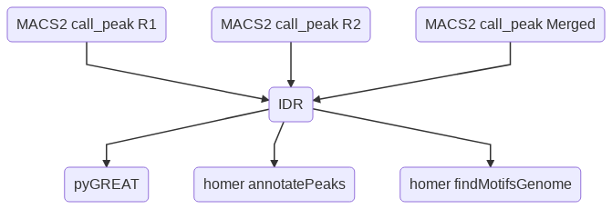

Call IDR peaks given bam files from two replicates
==================================================

::

	usage: idr_peaks.py [-h] [-j JID] -r1 R1_INPUT -r2 R2_INPUT
	                    [--merged_input MERGED_INPUT]
	                    [--macs2_addon_parameters MACS2_ADDON_PARAMETERS]
	                    [-g GENOME] [--macs_genome MACS_GENOME] [-b BLACK_LIST]

	optional arguments:
	  -h, --help            show this help message and exit
	  -j JID, --jid JID     enter a job ID, which is used to make a new directory.
	                        Every output will be moved into this folder. (default:
	                        idr_peaks_yli11_2019-10-30)
	  -r1 R1_INPUT, --R1_input R1_INPUT
	                        TSV file, 2 columns, treatment, control files for
	                        replicate 1 (default: None)
	  -r2 R2_INPUT, --R2_input R2_INPUT
	                        TSV file, 2 columns, treatment, control files for
	                        replicate 2 (default: None)
	  --merged_input MERGED_INPUT
	                        Not for end-user anymore (default: None)
	  --macs2_addon_parameters MACS2_ADDON_PARAMETERS

	Genome Info:
	  -g GENOME, --genome GENOME
	                        genome version: hg19, mm10, mm9 (default: hg19)
	  --macs_genome MACS_GENOME
	                        genome version: hs, mm (default: hs)
	  -b BLACK_LIST, --black_list BLACK_LIST
	                        Blacklist file (default: /home/yli11/Data/Human/hg19/a
	                        nnotations/hg19.blacklist.bed)

Summary
^^^^^^^

IDR peaks are conserved binding peaks that usually can boost motif enrichment. Note that peaks called from individual replicate can be still useful.

In the output, you will receive two emails. One is the link to the GREAT analysis (i.e., peak annotations). The other one is a notification of job completion.

**10/30/2019**

Parameters have been updated. Basically MACS2 callpeak uses ``-p 0.2`` cutoff to produce more peaks, then top 500K is used. With these changes, the number of final peaks should increase. We expect the number of IDR peaks (cutoff at 5%) should be around 10K to 40K. One can use ``--macs2_addon_parameters " -p 0.05"`` to control the number of called peaks, and these will decrease the number of final peaks.

Current peak calling method does not apply to ATAC-seq by default. One can generate ATAC-seq peaks using ``--macs2_addon_parameters " --nomodel --shift -100 --extsize 200"`` option.

Flowchart
^^^^^^^^^

Input
^^^^^

Please provide the file location to bam files. For single-end data, please use raw bam file (e.g., *.markdup.bam). For paired-end data, please use uniquely mapped de-duplicated bam file (e.g., *.rmdup.uq.bam).

.. note:: Currently, this pipeline doesn't support running multiple samples at the same time. If you have multiple samples, you need to provide the following input files seperately.

**R1 Input**

This is a two-column tsv file (treatment R1 and contol R1). An example is shown below:

::

	/path_to_file/1047954_Hudep2_CTCF_IP_50bp.markdup.bam	/path_to_file/1047955_Hudep2_input_50bp.markdup.bam

**R2 Input**

This is a two-column tsv file (treatment R2 and contol R2). An example is shown below:

::

	/path_to_file/1047954_Hudep2_CTCF_IP_50bp_R2.markdup.bam	/path_to_file/1047955_Hudep2_input_50bp_R2.markdup.bam

Usage
^^^^^

Go to your data directory and type the following.

**Step 0: Load python version 2.7.13.**

.. code:: bash

    module load python/2.7.13

**Step 1: Run the program**

.. code:: bash

	idr_peaks.py -r1 R1_input -r2 R2_input -g hg19 --macs_genome hs

Note that if you are working on mouse genome, you have to change both ``-g`` and ``--macs_genome`` options, for example:

.. code:: bash

	idr_peaks.py -r1 R1_input -r2 R2_input -g mm9 --macs_genome mm

For PE-data use:

.. code:: bash

	idr_peaks.py -r1 R1_input -r2 R2_input -g hg19 --macs_genome hs --macs2_addon_parameters " -f BAMPE"

Output
^^^^^^

IDR peaks is shown in ``idr_peaks.rmblck.bed``

You can also find outputs from homer analysis: ``homer_motifs_result`` and ``idr_peaks.annotated.tsv``

Ref: https://hbctraining.github.io/Intro-to-ChIPseq/lessons/07_handling-replicates-idr.html

