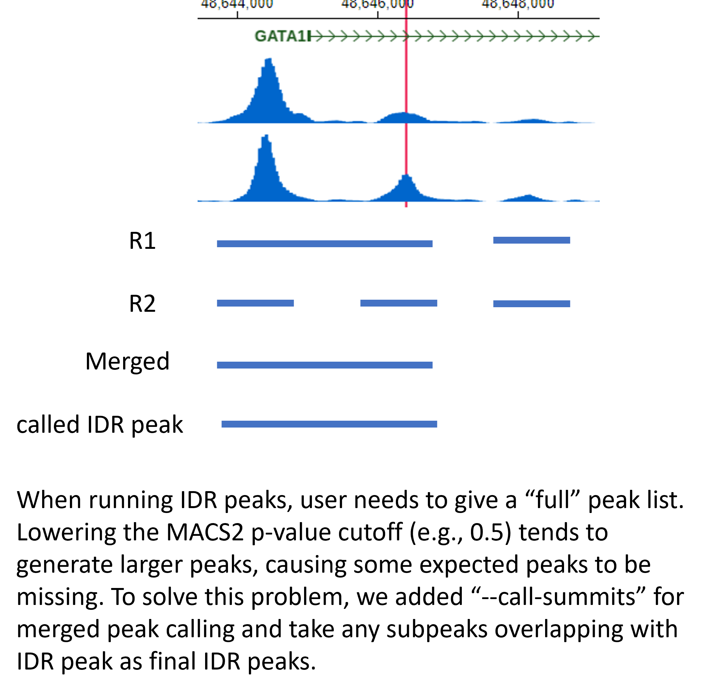

Call IDR peaks given bam files from two replicates
==================================================

::

	usage: idr_peaks.py [-h] [-j JID] -r1 R1_INPUT -r2 R2_INPUT
	                    [--merged_input MERGED_INPUT]
	                    [--macs2_addon_parameters MACS2_ADDON_PARAMETERS]
	                    [--half_width HALF_WIDTH] [-g GENOME]
	                    [--macs_genome MACS_GENOME] [-b BLACK_LIST]

	optional arguments:
	  -h, --help            show this help message and exit
	  -j JID, --jid JID     enter a job ID, which is used to make a new directory.
	                        Every output will be moved into this folder. (default:
	                        idr_peaks_yli11_2020-05-16)
	  -r1 R1_INPUT, --R1_input R1_INPUT
	                        TSV file, 2 columns, treatment, control files for
	                        replicate 1 (default: None)
	  -r2 R2_INPUT, --R2_input R2_INPUT
	                        TSV file, 2 columns, treatment, control files for
	                        replicate 2 (default: None)
	  --merged_input MERGED_INPUT
	                        Not for end-user anymore (default: None)
	  --macs2_addon_parameters MACS2_ADDON_PARAMETERS
	  --half_width HALF_WIDTH
	                        half.width: -1 if using the reported peak width, a
	                        numerical value to truncate the peaks to +- half_width
	                        (default: 200)

	Genome Info:
	  -g GENOME, --genome GENOME
	                        genome version: hg19, mm10, mm9 (default: hg19)
	  --macs_genome MACS_GENOME
	                        genome version: hs, mm (default: hs)
	  -b BLACK_LIST, --black_list BLACK_LIST
	                        Blacklist file (default: /home/yli11/Data/Human/hg19/a
	                        nnotations/hg19.blacklist.bed)

Summary
^^^^^^^

IDR peaks are conserved binding peaks that usually can boost motif enrichment. Note that peaks called from individual replicate can be still useful.

Also note that MACS2 peak calling is bad for broad peaks. So this pipeline is not suitable for broad peaks.

In the output, you will receive two emails. One is the link to the GREAT analysis (i.e., peak annotations). The other one is a notification of job completion.

**10/30/2019**

Parameters have been updated. Basically MACS2 callpeak uses ``-p 0.2`` cutoff to produce more peaks, then top 500K is used. With these changes, the number of final peaks should increase. We expect the number of IDR peaks (cutoff at 5%) should be around 10K to 40K. One can use ``--macs2_addon_parameters " -p 0.05"`` to control the number of called peaks, and these will decrease the number of final peaks.

**5/16/2020**

There is a large peak width issue. The problem is originated from a relaxed p-value (>0.01) in MACS2 that often makes the peak width larger. The problem is simply solved by truncating the peaks by redefining peak width using the summit and extend +- ``half.width`` and then use the new peaks as input to the IDR algorithm.

.. note:: If you are using peaks based on the MACS peak caller, then use p.value as the ranking measure and also set max peak half-width to 200 bp (since MACS tends to call wider peaks with relaxed p-value thresholds of 1e-2)

ref:

	http://barcwiki.wi.mit.edu/wiki/SOPs/chip_seq_peaks

	https://personal.broadinstitute.org/anshul/softwareRepo/peakCallingPipelineForIdr.txt

	https://rdrr.io/github/imbforge/encodeChIPqc/src/R/idr.R

**6/16/2021**

Update code for atac-seq idr peaks for multiple samples. Note that for chip-seq samples, the old code doesn't support multiple samples submission.

**10/2/2023**

Fixed a "bug". 

Flowchart
^^^^^^^^^

.. image:: ../../images/idr.png
	:align: center

Input
^^^^^

Please provide the file location to bam files. For single-end data, please use raw bam file (e.g., *.markdup.bam). For paired-end data, please use uniquely mapped de-duplicated bam file (e.g., *.rmdup.uq.bam).

.. note:: By default, MACS2 will remove duplicated reads. You can specify ``--keep-dup=all`` to use all reads.

.. note:: Currently, this pipeline doesn't support running multiple samples at the same time. If you have multiple samples, you need to provide the following input files seperately.

**R1 Input**

This is a two-column tsv file (treatment R1 and contol R1). An example is shown below:

::

	/path_to_file/1047954_Hudep2_CTCF_IP_50bp.markdup.bam	/path_to_file/1047955_Hudep2_input_50bp.markdup.bam

**R2 Input**

This is a two-column tsv file (treatment R2 and contol R2). An example is shown below:

::

	/path_to_file/1047954_Hudep2_CTCF_IP_50bp_R2.markdup.bam	/path_to_file/1047955_Hudep2_input_50bp_R2.markdup.bam

Usage
^^^^^

Go to your data directory and type the following.

**Step 0: Load python version 2.7.13.**

.. code:: bash

    module load python/2.7.13

**Step 1: Run the program**

.. code:: bash

	idr_peaks.py -r1 R1_input -r2 R2_input -g hg19 --macs_genome hs

Note that if you are working on mouse genome, you have to change both ``-g`` and ``--macs_genome`` options, for example:

.. code:: bash

	idr_peaks.py -r1 R1_input -r2 R2_input -g mm9 --macs_genome mm

For PE-data use:

.. code:: bash

	idr_peaks.py -r1 R1_input -r2 R2_input -g hg19 --macs_genome hs --macs2_addon_parameters " -f BAMPE"

For shorter peak width, pealse add ``half_width`` option:

.. code:: bash

	idr_peaks.py -r1 R1_input -r2 R2_input -g hg19 --macs_genome hs --macs2_addon_parameters " -f BAMPE" --half_width 200

ATAC-seq IDR PEAKS
^^^^^^^^

::

	usage: idr_peaks_atac.py [-h] [-j JID] -f INPUT_LIST
	                         [--macs2_addon_parameters MACS2_ADDON_PARAMETERS]
	                         [--half_width HALF_WIDTH] [-g GENOME]
	                         [--macs_genome MACS_GENOME] [-b BLACK_LIST]

	optional arguments:
	  -h, --help            show this help message and exit
	  -j JID, --jid JID     enter a job ID, which is used to make a new directory.
	                        Every output will be moved into this folder. (default:
	                        idr_peaks_atac_yli11_2021-06-16)
	  -f INPUT_LIST, --input_list INPUT_LIST
	                        TSV file, 3 columns, Rep1 bam , Rep2 bam, and output
	                        name (default: None)
	  --macs2_addon_parameters MACS2_ADDON_PARAMETERS
	  --half_width HALF_WIDTH
	                        half.width: a numerical value to truncate the peaks to
	                        +- half_width (default: 200)

	Genome Info:
	  -g GENOME, --genome GENOME
	                        genome version: hg19, mm10, mm9 (default: hg19)
	  --macs_genome MACS_GENOME
	                        genome version: hs, mm (default: hs)
	  -b BLACK_LIST, --black_list BLACK_LIST
	                        Blacklist file (default: /home/yli11/Data/Human/hg19/a
	                        nnotations/hg19.blacklist.bed)

Input
-----

A tsv file containing 3 columns: Rep1 bam , Rep2 bam, and output

Usage
-----

.. code:: bash

    module load python/2.7.13

	idr_peaks_atac.py -f input.list -g hg19 --macs_genome hs

	idr_peaks_atac.py -f input.list -g mm9 --macs_genome mm

Output
^^^^^^

IDR peaks is shown in ``idr_peaks.rmblck.bed``

You can also find outputs from homer analysis: ``homer_motifs_result`` and ``idr_peaks.annotated.tsv``

Ref: https://hbctraining.github.io/Intro-to-ChIPseq/lessons/07_handling-replicates-idr.html

IDR on broad peaks
^^^^^^^^^^^

Conclusion: not good mainly because of broad peak calling.

https://github.com/ENCODE-DCC/chip-seq-pipeline2/issues/30

https://groups.google.com/g/idr-discuss/c/_a_GKfw7kwM?pli=1

