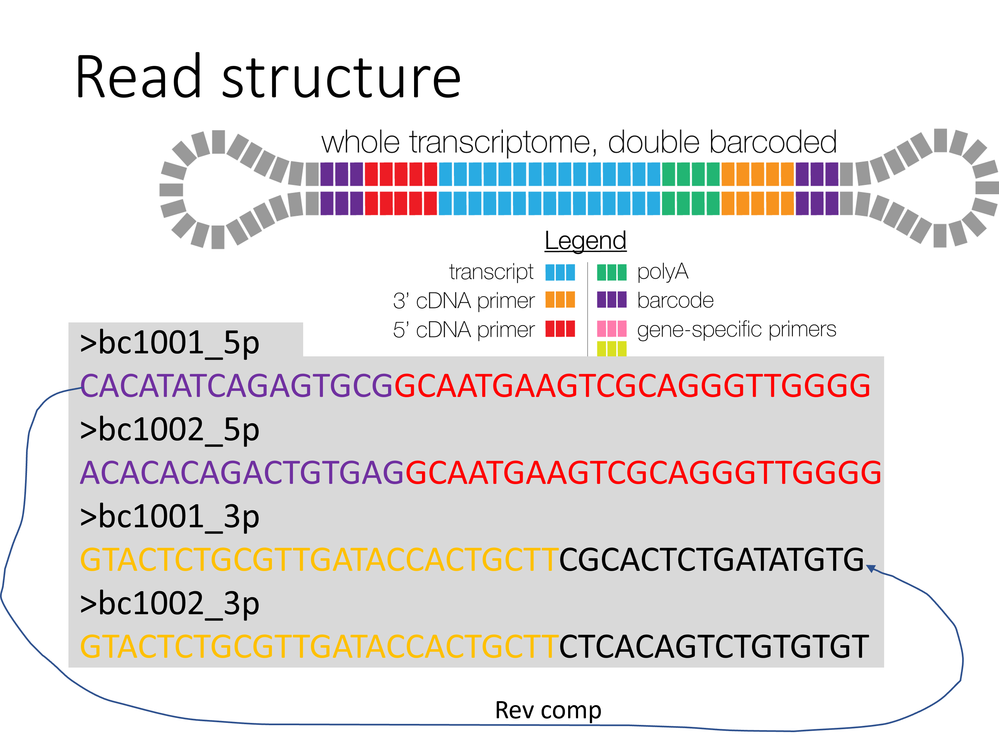

PacBio iso-seq data analysis
===================================

Summary
^^^^^^^

Pipeline adopted from ENCODE Long Read RNA-Seq Analysis Protocol for Human Samples (v3.0): https://www.encodeproject.org/documents/81af563b-5134-4f78-9bc4-41cb42cc6a48/@@download/attachment/ENCODE%20Long%20Read%20RNA-Seq%20Analysis%20Pipeline%20v3%20%28Human%29.pdf

Only work for hg38 right now, by 6/6/2022.

Current pipeline doesn't filter/merge based on replicates.

Iso-seq read structure
^^^^^^^^^^^^^^^^^^^^^

Here at St. Jude we use a double barcoded primers, each sample has the unique barcode, 5p and 3p primers have the identical but reverse completed barcodes.

Input
^^^^^

input.list
-------

A 2-column tsv file.

::

	control.bam	control
	KO.bam	KO

primer.fa
----------

::

	>primer_5p
	GCAATGAAGTCGCAGGGTTGGGG
	>primer_3p
	GTACTCTGCGTTGATACCACTGCTT

Usage
^^^^^

.. code:: bash

	hpcf_interactive

	module load python/2.7.13

	run_lsf.py -f input.list --primer primer.fa -p iso_seq

Output
^^^^^^

Results can be found in the $jid folder.

1. raw read annotation file
-----------------

``*talon_read_annot.tsv``

2. transcript/gene abundance file (main results)
----------------------

``*talon_abundance.tsv``

3. custom gene annotation file
---------------

``*talon.gtf``

Reference
^^^^^^^

1. https://github.com/PacificBiosciences/IsoSeq

Notes
^^^^

To resume failed runs, submit the job with the same jid ``-j`` and also use ``--override_jid``

