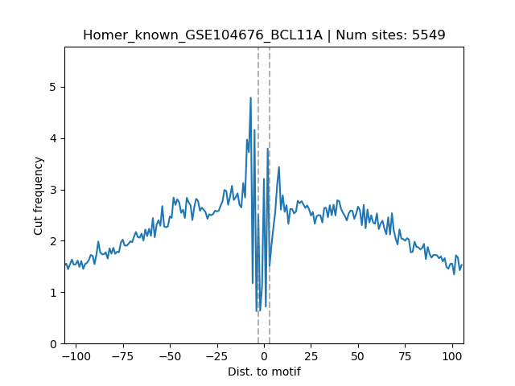
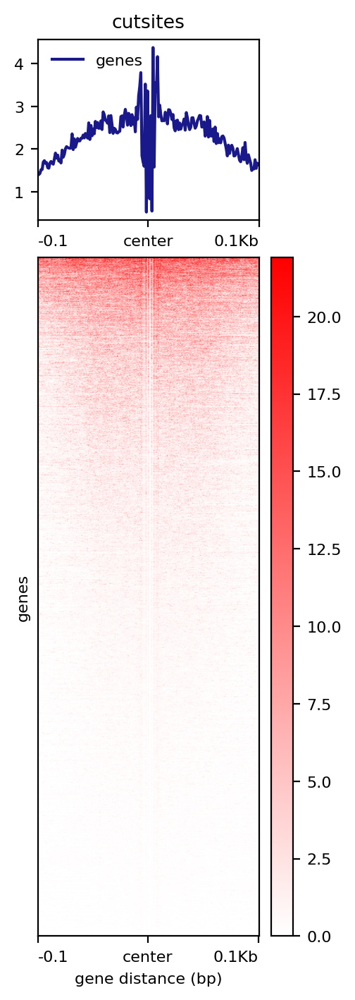

Call motif footprint from bigwiggle files
===============================

::

	usage: motif_footprint_from_bw.py [-h] [-j JID] -f INPUT_LIST [-m MOTIF_FILE]
	                                  [-c FIMO_CUTOFF] [-g GENOME]
	                                  [--genome_fasta GENOME_FASTA]

	optional arguments:
	  -h, --help            show this help message and exit
	  -j JID, --jid JID     enter a job ID, which is used to make a new directory.
	                        Every output will be moved into this folder. (default:
	                        motif_footprint_from_bw_yli11_2019-09-02)
	  -f INPUT_LIST, --input_list INPUT_LIST
	                        tsv 3 columns, bed,bw,outputname (default: None)
	  -m MOTIF_FILE, --motif_file MOTIF_FILE
	                        motif file (default: /home/yli11/Data/Motif_database/H
	                        uman/homer_motif.meme)
	  -c FIMO_CUTOFF, --fimo_cutoff FIMO_CUTOFF

	Genome Info:
	  -g GENOME, --genome GENOME
	                        genome version: hg19, mm10, mm9 (default: hg19)
	  --genome_fasta GENOME_FASTA
	                        genome version: hs, mm (default:
	                        /home/yli11/Data/Human/hg19/fasta/hg19.fa)

Summary
^^^^^^^

This pipeline is designed as the next step after ATAC-seq footprint pipeline. 

Input
^^^^^

The input file is a tsv format containing 3 columns: bed file, bw file, output-prefix.

For bed file, either relative path or absolute path is OK.

For bw file, it needs absolute path.

::

	H2.bed 	/path/to/H2.bw 	Hudep2_footprints
	H1.bed 	/path/to/H1.bw 	Hudep1_footprints

Usage
^^^^^

.. code:: bash

	module load python/2.7.13

	motif_footprint_from_bw.py -f input.list

Output
^^^^^^

Each line will have its own result dir in the jobID folder.

Individual motif footprint result is shown in ``jobID/output_name/FIMO_motif_mapping/`` directory.

In each motif folder, you can find:

1. the exact mapped location: ``fimo.cuts.freq.txt.filtered_fimo.bed``

2. the average footprint signal plot: ``motif_name.footprint.png``.

If there's a motif that you are interested in, there's a script for you to generate a footprint heatmap plot: ``signal_plot.sh``, which you just need to run ``bash signal_plot.sh``.

