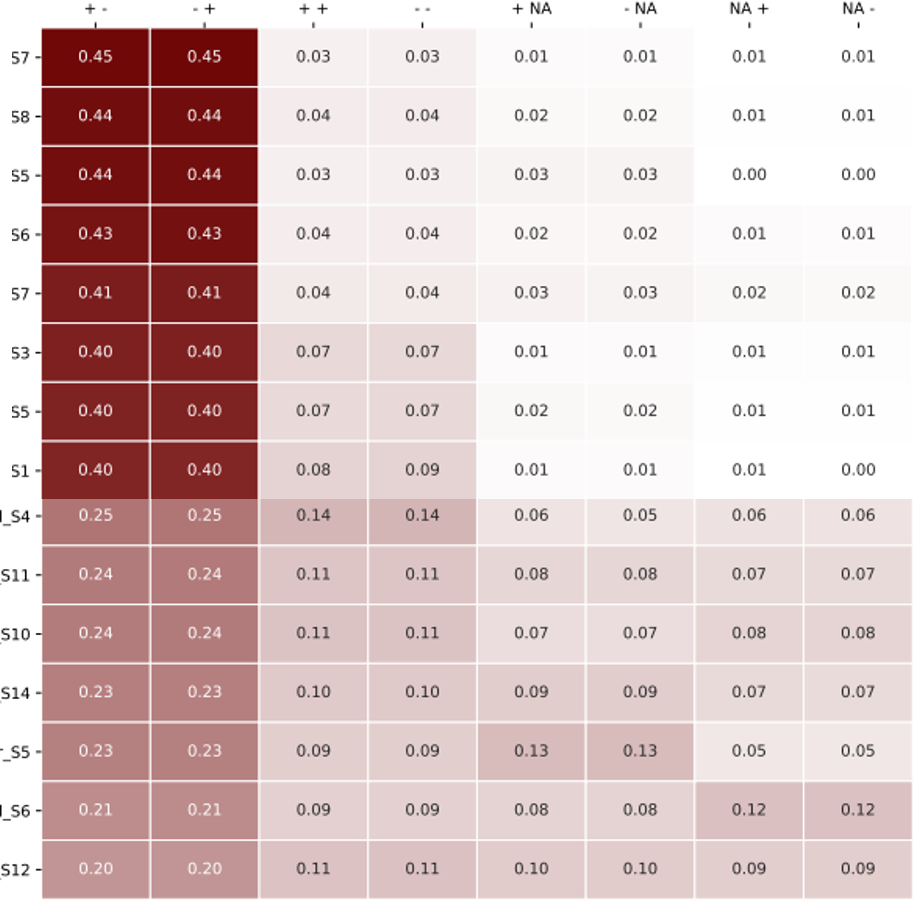

Summerize R1 R2 read mapping direction and distance
==================================================

Summary
^^^^^^^

To get a sense of how many mapped paired reads are +-, -+, --, or ++. This is mostly used for debug purposes.

Output
^^^^^^^^^

Two summerizing figures will be made, which were produced from: direction.summary.csv distance.summary.csv.

Input
^^^^^

Need abs path to bam files

::

	/path/to/R1.bam	/path/to/R2.bam	Banana
	/path/to/R1.bam	/path/to/R2.bam	ABC
	/path/to/R1.bam	/path/to/R2.bam	BCA
	/path/to/R1.bam	/path/to/R2.bam	CBA

Usage
^^^^^

Go to your data directory and type the following.

**Step 0: Load python version 2.7.13.**

.. code:: bash

	hpcf_interactive

    module load python/2.7.13

**Step 1: Run the program**

.. code:: bash

	run_lsf.py -f input.list --pipeline_name summerize_R1_R2_mapping

