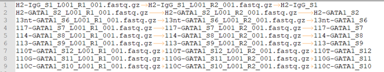

RNA-seq: Transcript-level quantification
========================================

.. argparse::
   :filename: ../bin/HemTools
   :func: main_parser
   :prog: HemTools
   :path: rna_seq

Summary
^^^^^^^

This pipeline quantifies transcript-level abundance using kallisto and generates bam, bw files using STAR. The output file ``kallisto_files/{jid}_transcript.tpm.csv`` contains both transcript ID and gene name, which users can look for specific genes. For differential gene/transcript expression analysis, see :doc:`diff_genes <diff_genes>`. For volcano plot of differential genes, see :doc:`volcano <../Visualization/volcano_plot>`. For RNA-seq variant calling, see :doc:`rna_seq_variant_call <rna_seq_variant_call>`

3/14/2024 Update
^^^^^^^^^^^^

Isoform quantification using ``STAR`` is added. The transcript count table is ``*.isoforms.results``.

To visualize read assigned to a transcript
------------------------------

First, get the transcript ID from the transcript count table.

Then, do

.. code:: bash

    module load samtools/1.7;samtools view Your_label.transcript.bam | grep Your_transcript_ID | cut -f 1 > read.list

    # the bam file should be in your bam_files folder, use markdup.uq.bam file
    # Please note that transcript.bam is different than markdup.uq.bam

    module laod picard/2.9.4;java -jar /hpcf/apps/picard/install/2.9.4/picard.jar FilterSamReads I=YOUR_bam_file.markdup.uq.bam O=subset.bam READ_LIST_FILE=read.list FILTER=includeReadList;samtools index subset.bam

Usage
^^^^^

Go to your data directory and type the following.

**Step 0: Load python version 2.7.13.**

.. code:: bash

    $ module load python/2.7.13

**Step 1: Prepare input files, generate fastq.tsv.**

.. code:: bash

    $ HemTools_dev rna_seq --guess_input

	Input fastq files preparation complete! ALL GOOD!
	Please check if you like the computer-generated labels in : fastq.tsv

.. note:: If you are preparing fastq.tsv yourself, please make sure ``no space anywhere`` in the file. Note that the seperator is tab. Spaces in file name will cause errors.

**Step 2: Check the computer-generated input list (manually), make sure they are correct.**

.. code:: bash

    $ less fastq.tsv

.. note:: a random string will be added to the generated files (e.g., fastq.94c049cbff1f.tsv) if they exist before running step 1.

**Step 3: Submit your job.**

.. code:: bash

    $ HemTools_dev rna_seq -f fastq.tsv

Single-end input
^^^^^^^^^^^^^^^^

The input is the same, leave the second column empty.

.. code:: bash

    $ HemTools_dev rna_seq -f fastq.tsv --single

Sample input format
^^^^^^^^^^^^^^^^^^^

**fastq.tsv**

This is a tab-seperated-value format file. The 3 columns are: Read 1, Read 2, sample ID.

Common downstream analyses
^^^^^^^^^^^^^^^^^^^^^^^^^^

- differential expression analysis (transcript / gene level)

- MA plot, volcano plot, heatmap

- given a set of genes, show a boxplot / violin plot (gene counts, TPM, or other quantifiers)

- gene set enrichment analysis

Paired-end sequencing allows for various of additional analyses, including

- isoform specific expression / differential isoform usage / alternative splicing / cryptic exons

- RNA editing / variant calling / allel-specific expression

- gene fusion

If a large collection of RNA-seq data is available, one can perform clustering analysis, time-series analysis, infering biological network, and classification analysis.

Integrative analyses with other data, etc ChIP-seq, ATAC-seq.

Output
^^^^^^

In the email, you will see a zip file containing transcript expressions (TPM) for all input samples. An analysis report is also attached (same format as other reports generated by HemTools). Since STAR doesn't include un-mapped reads in the bam file, you will see 100% mapping rate. The mapping statistics generated by STAR are currently not included, you can manually "less" them; they are located in the ``log_files`` folder, with file name ending with ``{{output_name}}_Log.final.out``.

Reference
^^^^^^^^^

https://hbctraining.github.io/Intro-to-rnaseq-hpc-O2/lessons/04_alignment_quality.html

Report bug
^^^^^^^^^^

Once the job is finished, you will be notified by email with some attachments.  If no attachment can be found, it might be caused by an error. In such case, please go to the result directory (where the log_files folder is located) and type: 

.. code:: bash

    $ HemTools report_bug

Comments
^^^^^^^^

.. disqus::
    :disqus_identifier: NGS_pipelines

