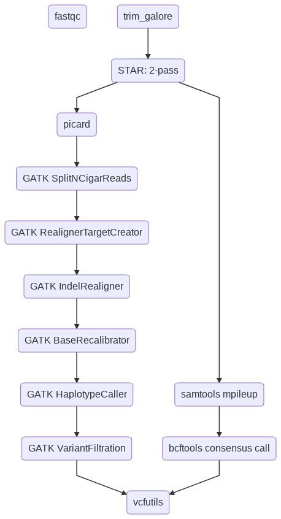

Variant identification on RNA-seq data
========================================

.. note:: Need more than 25M mapped reads for variant calling. Currently, this pipeline only work on hg19.

::

	usage: rna_seq_variant_call.py [-h] [-j JID] [--pipeline_type PIPELINE_TYPE]
	                               [-d DEPTH_FILTER]
	                               (-f FASTQ_TSV | --guess_input) [-g GENOME]
	                               [--STAR_index STAR_INDEX]

	optional arguments:
	  -h, --help            show this help message and exit
	  -j JID, --jid JID     enter a job ID, which is used to make a new directory.
	                        Every output will be moved into this folder. (default:
	                        rna_seq_variant_call_yli11_2019-07-09)
	  --pipeline_type PIPELINE_TYPE
	                        Not for end-user. (default: rna_seq_variant_call)
	  -d DEPTH_FILTER, --depth_filter DEPTH_FILTER
	                        filter variants by read depth (default: 10)
	  -f FASTQ_TSV, --fastq_tsv FASTQ_TSV
	                        tab delimited 3 columns (tsv file): Read 1 fastq, Read
	                        2 fastq, sample ID (default: None)
	  --guess_input         Let the program generate the input files for you.
	                        (default: False)

	Genome Info:
	  -g GENOME, --genome GENOME
	                        genome version: hg19. Only working for hg19 (default:
	                        hg19)
	  --STAR_index STAR_INDEX
	                        genome version: hg19. Only working for hg19 (default: 
	                        /research/dept/hem/common/sequencing/chenggrp/pipeline
	                        s/hg19/hg19_star_253a_index/)

Summary
^^^^^^^

Perform RNA-seq variant calling using STAR alignment followed by the GATK pipeline and the samtools/bcftools pipeline. 

The GATK pipeline is optimized for RNA-seq data.

The samtools/bcftools pipeline is a general-purpose variant calling pipeline for NGS data.

Flowchart
^^^^^^^^^

Usage
^^^^^

Go to your data directory and type the following.

**Step 0: Load python version 2.7.13.**

.. code:: bash

    module load python/2.7.13

**Step 1: Prepare input files, generate fastq.tsv.**

.. code:: bash

    rna_seq_variant_call.py --guess_input

	Input fastq files preparation complete! ALL GOOD!
	Please check if you like the computer-generated labels in : fastq.tsv

.. note:: If you are preparing fastq.tsv yourself, please make sure ``no space anywhere`` in the file. Note that the seperator is tab. Spaces in file name will cause errors.

**Step 2: Check the computer-generated input list (manually), make sure they are correct.**

.. code:: bash

    $ less fastq.tsv

.. note:: a random string will be added to the generated files (e.g., fastq.94c049cbff1f.tsv) if they exist before running step 1.

**Step 3: Submit your job.**

.. code:: bash

    rna_seq_variant_call.py -f fastq.tsv

**Read depth**

By default, variants that have less than 10 read depth will be filtered. You can increase the threshold using ``-d`` option.

Sample input format
^^^^^^^^^^^^^^^^^^^

**fastq.tsv**

This is a tab-seperated-value format file. The 3 columns are: Read 1, Read 2, sample ID.

.. image:: ../../images/fastq.tsv.png

Output
^^^^^^

Final filtered VCF files are located in the ``final_results`` folder. 

``{{output_name}}.GTAK.bcftools.final.vcf`` is the result from the GATK pipeline.

``{{output_name}}.samtools.final.vcf`` is the result from the samtools/bcftools pipeline.

Reference
^^^^^^^^^

https://support.illumina.com/bulletins/2017/04/considerations-for-rna-seq-read-length-and-coverage-.html

https://software.broadinstitute.org/gatk/documentation/article.php?id=3891

