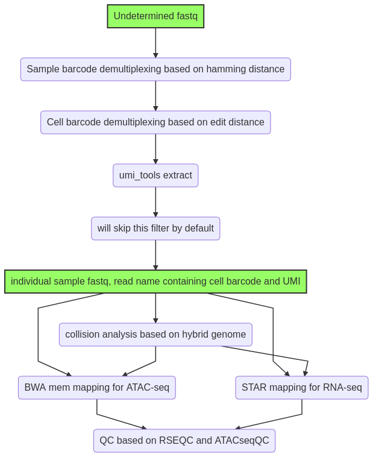
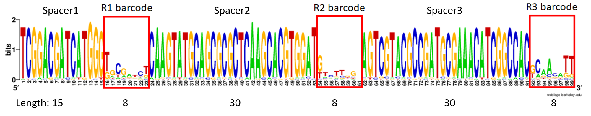
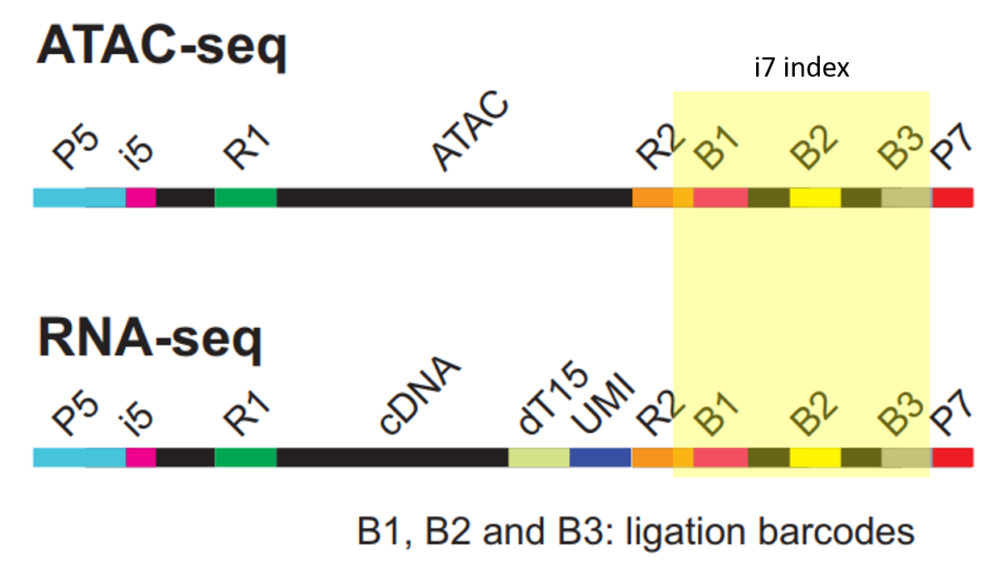

SHARE-seq data analysis
==========================

::

	usage: shareseq2.py [-h] [-j JID] -f1 SAMPLE_BARCODE -f2 CELL_BARCODE -r1 R1
	                    -r2 R2 [-n NUM_MISMATCH]
	                    [--collision_threshold COLLISION_THRESHOLD]
	                    [--min_reads_per_cell MIN_READS_PER_CELL] [--collision]
	                    [--filter_polyT] [-g GENOME]
	                    [--genome_config GENOME_CONFIG]

	optional arguments:
	  -h, --help            show this help message and exit
	  -j JID, --jid JID     enter a job ID, which is used to make a new directory.
	                        Every output will be moved into this folder. (default:
	                        shareseq2_yli11_2021-08-04)
	  -f1 SAMPLE_BARCODE, --sample_barcode SAMPLE_BARCODE
	                        input config file,tsv: label, sample_barcode, ATAC/RNA
	                        (default: None)
	  -f2 CELL_BARCODE, --cell_barcode CELL_BARCODE
	                        a list of barcode sequences (default: None)
	  -r1 R1                input undetermined R1 fastq.gz (default: None)
	  -r2 R2                input undetermined R2 fastq.gz (default: None)
	  -n NUM_MISMATCH, --num_mismatch NUM_MISMATCH
	                        number of mismatch allowed (default: 1)
	  --collision_threshold COLLISION_THRESHOLD
	                        max mapping rate as collision (default: 0.8)
	  --min_reads_per_cell MIN_READS_PER_CELL
	                        minimal number of reads per cell (default: 100)
	  --collision           map to hybrid genome and calculate collision rate
	                        (default: False)
	  --filter_polyT        polyT reads may not be noise (default: False)

	Genome Info:
	  -g GENOME, --genome GENOME
	                        genome version, must match key in genome config yaml
	                        file (default: hg19)
	  --genome_config GENOME_CONFIG
	                        genome config file specifing: index file, black list,
	                        chrom size and effectiveGenomeSize (default:
	                        genome.yaml)

Usage
^^^^^

::

	hpcf_interactive

	module load conda3

	source activate /home/yli11/.conda/envs/py2

	# for collision analysis
	bsub -q priority -P Genomics -R 'rusage[mem=60000]' -J SHARE python shareseq.py -f1 input.tsv -f2 barcode1.list -r1 Undetermined_S0_L001_R1_001.fastq.gz -r2 Undetermined_S0_L001_R2_001.fastq.gz --collision -n 1 --min_reads_per_cell 10

	# for regular share-seq analysis
	bsub -q priority -P Genomics -R 'rusage[mem=60000]' -J SHARE python shareseq.py -f1 input.tsv -f2 barcode1.list -r1 Undetermined_S0_L001_R1_001.fastq.gz -r2 Undetermined_S0_L001_R2_001.fastq.gz -n 1 --min_reads_per_cell 10

