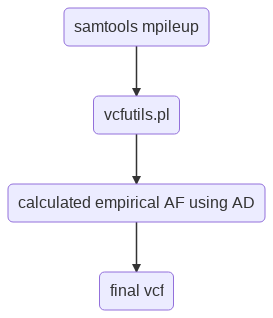

Single-cell RNA-seq analysis
============================

:: 

Summary
^^^^^^^

This pipeline generates gene expression table and several figures described as below:

 - Processing single-cell RNA-seq data and quantifying gene expression using ``cellRanger``
 - Removing genes with all zeros
 - plot read cound density for all input samples
 - identify genes with mean read count above a cutoff
 - identify genes with X% of cells containing read count above a cutoff
 - clustermap with gene names (by default cellRanger is Ensembl ID)
 - plot pair-wise gene correlation
 - top expression plot , as well as other plots generated by ``scater``: http://bioconductor.org/packages/release/bioc/vignettes/scater/inst/doc/vignette-qc.html
 - plot mean-variance for all cells and all samples, and put label for user input gene names
 - PCA plot (not implemented), T-SNE plot, UMAP plot (not implemented) (shape by k-means) (not implemented) with color intensity using expression values of a user input gene

Note that Single-cell differential expression analysis is not implemented yet.

.. note:: Should work for hg19, hg38, mm9, mm10. However, I only tested hg19.

Flowchart
^^^^^^^^^

Input
^^^^^

10X Genomics single-cell RNA-seq data contains ``R1`` and ``R2`` reads. ``R1`` is the barcode information. ``R2`` is the actual 3-end mRNA sequencing result.

Your working directory should contain all input fastq files. For example:

::

	Chicken_S4_L001_R1_001.fastq.gz
	Chicken_S4_L001_R2_001.fastq.gz
	Chicken_S4_L002_R1_001.fastq.gz
	Chicken_S4_L002_R2_001.fastq.gz
	Chicken_S4_L003_R1_001.fastq.gz
	Chicken_S4_L003_R2_001.fastq.gz
	Chicken_S4_L004_R1_001.fastq.gz
	Chicken_S4_L004_R2_001.fastq.gz
	Orange_S1_L001_R1_001.fastq.gz
	Orange_S1_L001_R2_001.fastq.gz
	Orange_S1_L002_R1_001.fastq.gz
	Orange_S1_L002_R2_001.fastq.gz
	Orange_S1_L003_R1_001.fastq.gz
	Orange_S1_L003_R2_001.fastq.gz
	Orange_S1_L004_R1_001.fastq.gz
	Orange_S1_L004_R2_001.fastq.gz
	Apple_S2_L001_R1_001.fastq.gz
	Apple_S2_L001_R2_001.fastq.gz
	Apple_S2_L002_R1_001.fastq.gz
	Apple_S2_L002_R2_001.fastq.gz
	Apple_S2_L003_R1_001.fastq.gz
	Apple_S2_L003_R2_001.fastq.gz
	Apple_S2_L004_R1_001.fastq.gz
	Apple_S2_L004_R2_001.fastq.gz
	Banana_S3_L001_R1_001.fastq.gz
	Banana_S3_L001_R2_001.fastq.gz
	Banana_S3_L002_R1_001.fastq.gz
	Banana_S3_L002_R2_001.fastq.gz
	Banana_S3_L003_R1_001.fastq.gz
	Banana_S3_L003_R2_001.fastq.gz
	Banana_S3_L004_R1_001.fastq.gz
	Banana_S3_L004_R2_001.fastq.gz

.. tip:: If you have the fastq files stored in different folders, you can use ``ln -s path_to_fastq_folder/ .`` to create soft links to your fastq files. Do it for each folder, so that you have all fastq files in your working directory.

**input.list**

In the above example, you have 4 groups/patients, namely: Chicken, Orange, Apple, Banana. Then you just have to create an ``input.list`` and put the group name (Case sensitive! Make sure the names are exactly the same as in your fastq files!) line by line, like below:

::

	Chicken
	Orange
	Apple
	Banana

.. note:: Some figures generated by this pipeline intend to compare all gorups, such as gene density comparison across all groups. If you just have one group, these figures will still be generated. If you have multiple groups, please don't run them sperately, put the group names (i.e., fastq file prefix) in one ``input.list``.

Usage
^^^^^

.. code:: bash

    module load python/2.7.13

    single_cell.py -f input.list

Output
^^^^^^

Gene expression table
"""""""""""""""""""""

Top 50 highly expressed genes
"""""""""""""""""""""""""""""

Gene expression heatmap
"""""""""""""""""""""""

Gene expression density plot
""""""""""""""""""""""""""""

Correlation scatter plot
""""""""""""""""""""""""

Mean-variance plot
""""""""""""""""""

T-SNE plot of cell population with color intensity using user input genes
"""""""""""""""""""""""""""""""""""""""""""""""""""""""""""""""""""""""""

Report bug
^^^^^^^^^^

.. code:: bash

    $ HemTools report_bug

Comments
^^^^^^^^

.. disqus::
    :disqus_identifier: NGS_pipelines

