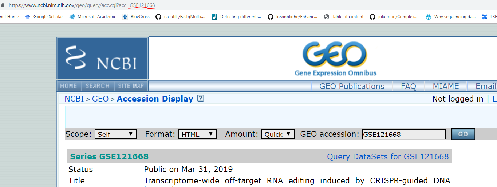
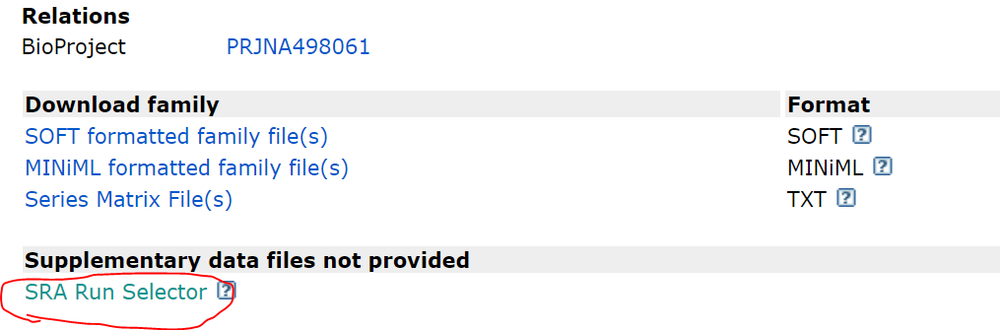

NCBI download GEO/SRA data
==========================

::

	usage: sra_download.py [-h] [-j JID] [--pipeline_type PIPELINE_TYPE] -f
	                       DATA_LIST

	given a list of SRA ID, download them

	optional arguments:
	  -h, --help            show this help message and exit
	  -j JID, --jid JID     enter a job ID, which is used to make a new directory.
	                        Every output will be moved into this folder. (default:
	                        sra_download_yli11_2019-07-11)
	  --pipeline_type PIPELINE_TYPE
	                        Not for end-user. (default: sra_download)
	  -f DATA_LIST, --data_list DATA_LIST
	                        a list of SRA IDs, one per line (default: None)

Summary
^^^^^^^

This is an automate pipeline to download SRA fastq data given a list of SRA IDs. The specific commands and one bad thing about SRA database is discussed in :doc:`sra_tools <../Bioinformatics_tools/sra_tools>`.

Input
^^^^^

The following screenshots show you how to get a list of SRA IDs. 

The first step is to have a GEO ID, usually it can be found in the paper (e.g., search for ``GSE``). If you have an SRA ID, you can directly go to step 3.

Google the GEO ID and click the first hit, you will see the GEO webpage below.

Scroll down to the bottom, click on the ``SRA RUN selector``.

In the SRA webpage, if you want to download all the data, click on the ``accession list`` in the Total row. You can also select the data you need by clicking on the checkbox on the leftside and then click on the ``accession list`` in the Selected row. Once you have a list of accession numbers, copy them to HPC. Suppose I name this file as ``data.list``, then I will use the following command to download the data.

Usage
^^^^^

Go to your data directory and type the following.

**Step 0: Load python version 2.7.13.**

.. code:: bash

    module load python/2.7.13

**Step 1: Prepare input file, which is data.list**

.. code:: bash

    sra_download.py -f data.list

Output
^^^^^^

Once the job is finished, you will receive a notification email. Data is downloaded in the Job ID folder.

Download large collection of data
^^^^^^^^^^^^^^^^^^^^^^^^^^^^^^^^^

**Search NCBI SRA databases, find all the data you need**

They are probably belong to different SRA project. In that case, I will download all info table and accession list, rename them has ``PRJNAxxxxxx.list`` and ``PRJNAxxxxxx.info``. For example:

::

	PRJNA396940.info
	PRJNA401837.list
	PRJNA413473.info
	PRJNA396940.list
	PRJNA401837.info
	PRJNA413473.list

**Submit multiple jobs**

.. code:: bash

	hpcf_interactive

	module load python/2.7.13

	for i in *.list ; do sra_download.py -f $i -j ${i%.list};done

**Check downloaded data**

For this latest sra-tools version, it should have no problem downloading files. However, if you see something like ``fasterq.tmp.nodecn002.23272`` in your result folder, then it means a corrupted data. And you have to download this particular SRR data again.

A simple way to get a list of failed SRR ids:

.. code:: bash

	cd log_files

	grep gzip *err | cut -d " " -f 2 | cut -d "*" -f 1 > failed.list

Comments
^^^^^^^^

.. disqus::
    :disqus_identifier: NGS_pipelines

