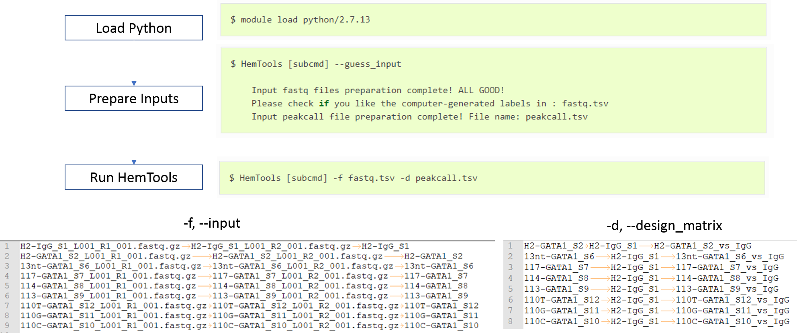

HemTools Tutorial 4-18-2019
===========================

.. contents::
    :local:

**Step 0: set up RSA authentication with HPC**

:doc:`How to ssh without password <../Linux_Art/ssh_without_password>`

Create a test run folder
^^^^^^^^^^^^^^^^^^^^^^^^

.. code:: bash

    cd ~

    mkdir my_test_run

    cd my_test_run

Installation
^^^^^^^^^^^^

.. code:: bash

    /research/dept/hem/common/sequencing/chenggrp/pipelines/bin/add_env.sh

Type ``HemTools -h`` to see a list of available pipelines.

.. highlight:: none

:: 

    HemTools: performs NGS pipelines and other common analyses. Contact:
    Yichao.Li@stjude.org or Yong.Cheng@stjude.org

    positional arguments:
      {cut_run,chip_seq_pair,chip_seq_single,atac_seq,report_bug,rna_seq,my_dir,volcano_plot,crispr_seq}
                            Available APIs in HemTools
        cut_run             CUT & RUN pipeline
        chip_seq_pair       Paired-end ChIP-seq pipeline
        chip_seq_single     Single-end ChIP-seq pipeline
        atac_seq            ATAC-seq pipeline
        report_bug          Email the log files to the developer.
        rna_seq             RNA-seq pipeline
        my_dir              CD, search, and list my dirs
        volcano_plot        Data visualization: Volcano plot
        crispr_seq          Genome-wide CRISPR Screening pipeline

    optional arguments:
      -h, --help            show this help message and exit
      -v, --version         show program's version number and exit

Workflow
^^^^^^^^

.. note:: Since the upgrade from Red Hat 6 to 7, the ``--short`` option is not working anymore. Just don't add this option to your program is OK.

ATAC-seq example
^^^^^^^^^^^^^^^^

**Copy data**

.. code:: bash

    mkdir atac_seq

    cd atac_seq

    ln -s /research/dept/hem/common/sequencing/chenggrp/pipelines/example_data/atac_seq/*.gz .

**Run HemTools**

.. code:: bash

    module load python/2.7.13

    HemTools atac_seq --guess_input

    HemTools atac_seq -f fastq.tsv --short

Single-end ChIP-seq example
^^^^^^^^^^^^^^^^^^^^^^^^^^^

**Copy data**

.. code:: bash

    cd ..

    mkdir chip_seq_single

    cd chip_seq_single

    ln -s /research/dept/hem/common/sequencing/chenggrp/pipelines/example_data/chip_seq_single/*.gz .

**Run HemTools**

.. code:: bash

    module load python/2.7.13

    HemTools chip_seq_single --guess_input

    HemTools chip_seq_single -f fastq.tsv -d peakcall.tsv --short

Paired-end ChIP-seq example
^^^^^^^^^^^^^^^^^^^^^^^^^^^

**Copy data**

.. code:: bash

    cd ..

    mkdir chip_seq_pair

    cd chip_seq_pair

    ln -s /research/dept/hem/common/sequencing/chenggrp/pipelines/example_data/chip_seq_pair/*.gz .

**Run HemTools**

.. code:: bash

    module load python/2.7.13

    HemTools chip_seq_pair --guess_input

    HemTools chip_seq_pair -f fastq.tsv -d peakcall.tsv --short

CUT & RUN example
^^^^^^^^^^^^^^^^^^^^^^^^^^^

**Copy data**

.. code:: bash

    cd ..

    mkdir cut_run

    cd cut_run

    ln -s /research/dept/hem/common/sequencing/chenggrp/pipelines/example_data/cut_run/*.gz .

**Run HemTools**

.. code:: bash

    module load python/2.7.13

    HemTools cut_run --guess_input

    HemTools cut_run -f fastq.tsv -d peakcall.tsv --short

Report bug
^^^^^^^^^^

Once the job is finished, you will be notified by email with some attachments.  If no attachment can be found, it might be caused by an error. In such case, please go to the result directory (where the log_files folder is located) and type: 

.. code:: bash

    cd ..

    cd atac_seq

    cd [YOUR_JOB_ID]

    HemTools report_bug

Questionnaire
^^^^^^^^^^^^^

`Please take a minute to complete this HemTools Tutorial questionnaire <https://docs.google.com/forms/d/e/1FAIpQLScDQkV2mMnSXtd-WsxpZhPcGMcqOT7W75Lkb6D1AMWDUPY77g/viewform?usp=pp_url>`_

Comments
^^^^^^^^

.. disqus::
    :disqus_identifier: NGS_pipelines

