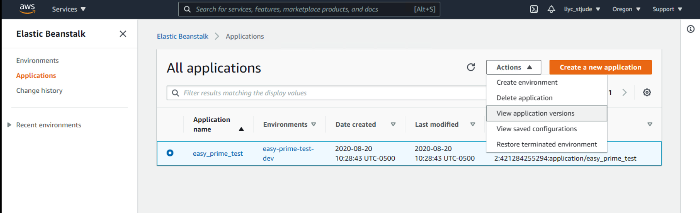
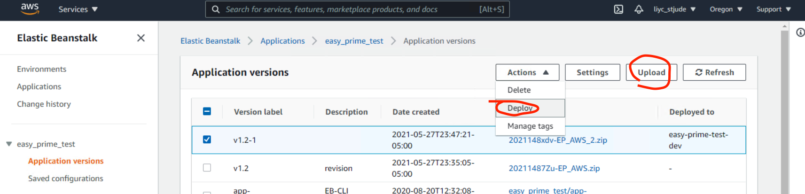
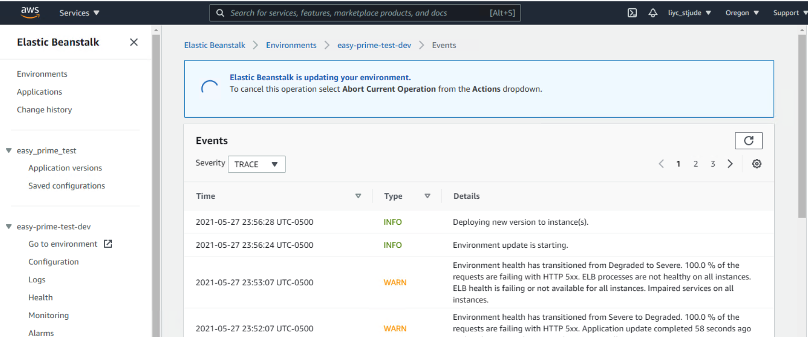
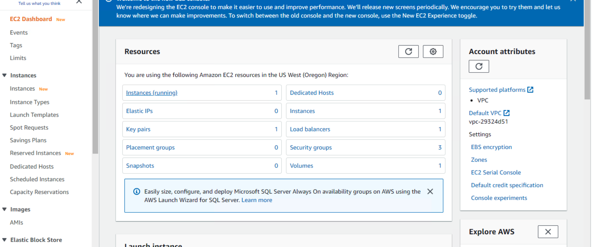
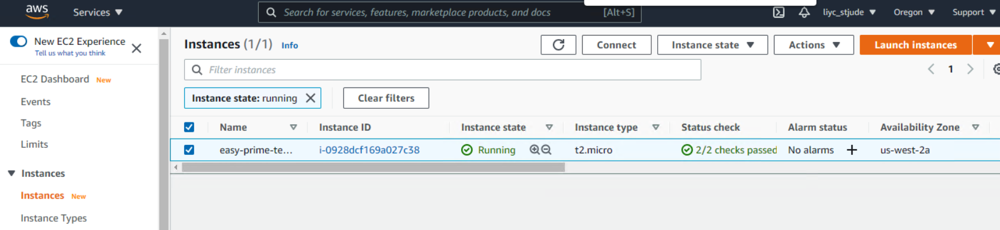
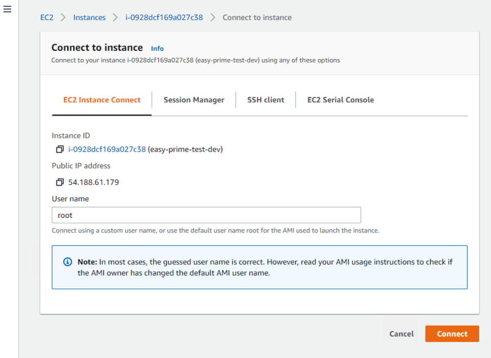

Hosting web server on AWS
=========================

Summary
^^^^^^

You can get a free one-year account on: https://aws.amazon.com/free/

Currently, I'm not sure whether or not AWS will charge you if the web app has been over-used, like CPU time is above their "free zone".

8/4/2020

It turns out that you can easily pass the free 750 hours (= 1 month) if you don't know that you have servicea in more than one cluster. It finally charged me $4 in July and estimated to be $8 per month.

I then terminated all services and asked for refund.

8/20/2020

Seems that ``eb create`` will create running instances in multiple areas, e.g., N.virginia and Orengan.

Usage
^^^^^

Step 1: register an AWS account
------------------------------

You can use the free one here: https://aws.amazon.com/free/

Go to: https://console.aws.amazon.com, and create a new access key

Step 2: install command line tools for ``AWS Elastic Beanstalk``
------------------------------

::

	conda install -c contango awsebcli

## awsebcli conda is only available in win64, however, I successfully installed it in macOS, not sure why.

Step 3: Dash app toy example
------------------------------

Now, suppose you have a Dash app already and you want to deploy it to EB.

Ref: https://medium.com/@korniichuk/dash-on-aws-44a0f50a030a

Create a new folder, ``test``, and copy the following dash app and save it as ``application.py``. This is a keyword.

For other keywords, see http://www.zhengwenjie.net/beanstalk/

::

	import dash
	import dash_html_components as html

	app = dash.Dash(__name__)

	app.scripts.config.serve_locally = True
	app.css.config.serve_locally = True

	app.layout = html.Div([
	    html.H1('Hello, World!')
	])

	application = app.server

	if __name__ == '__main__':
	    application.run(debug=True, port=8080)

Next, 

Copy python dependencies and save it as ``requirements.txt``. Again, keywords.

::

	dash==0.39.0
	dash-daq==0.1.0

Then, open terminal, to go folder ``test`` and type the following command:

::

	eb init
	# It may ask you to input id and password that you created in step1
	# Do you want to set up SSH for your instances?
	# (Y/n): Enter n
	eb create
	eb open

If you see Hello World, then congratulations!

Step 4: Upload your own Dash app
------------------------------

Basically, if you have finished step 3 then you should be able to upload any python programs. 

I want to put my Easy-Prime tool up there and have encountered several problems. Here's how I solved them.

1. I put all the dependencies in ``requirements.txt``, I didn't specify version because I think it could cause conficts.

::

	dash
	dash-daq
	biopython
	dash-bio
	dash-html-components
	joblib
	matplotlib
	numpy
	pandas
	plotly
	plotly-express
	PyYAML
	scikit-image
	scikit-learn
	scipy
	seaborn

2. I had a gcc problem and found a solution. First, create a folder called ``.ebextensions`` and a file inside it called, ``01_packages.config``.

::

	packages:
	  yum:
	    gcc-c++: []
	    unixODBC-devel: []
	    python3-devel: []

The indent should be spaces, not tab.

3. I found using SSH is the easiest way install things.

``eb ssh`` will ssh to your instances in the current working dir, otherwise you can use ``eb ssh env_name``.

Your app is stored at ``/var/app/current`` and your python is ``/var/app/venv/bin/python``

By default, you can't write in these dirs, so you need to add ``sudo``. I don't know why they give you sudo option, but not directly writable.

``sudo yum groupinstall "Development Tools"``

https://docs.aws.amazon.com/AWSEC2/latest/UserGuide/compile-software.html

Again, this is obviously necessary, but you have to install it yourself.

Default EB size is 8G, now if I put hg19.fa, it also used all the space and I got no space error. I have to increase the space in EC2. I don't know if it will cause extra money.

To update your code on EB, use ``eb deploy``

``eb deploy`` will remove every old code. If I have small changes, I will directly modify the code online. There should some git pull method.

To increase space, simply increase the volumn on the webpage will not work. Follow the method here: https://til.codes/extending-the-disk-space-on-an-amazon-ec2-instance/ did not completely solve my problem, but did give me a good start. So eventually, the command I'm using is:

::

	lsblk # to look at the space

	sudo growpart /dev/xvda 1

	sudo xfs_growfs -d /mnt

TODO: I heard that "AWS S3 + Lambda" is much cheaper.

Step 5. update eb app
^^^^^^^^^^^^^^^

Please do not delete or rebuild your env, otherwise you will have to configure a lot of things. 

Things I have done, install many python packages, e.g. dash, and some bioinformatics tools, htslib.

Now I have a new dash app, all I need to do is upload this as a zip folder and then deploy it, all using a browser!

Where to upload and deploy
------------------

Find your application, click Actions and go to view versions.

Click upload first, when it is finish, then choose this new app and deploy it.

Then you can view deploy logs

Once you have successfully deployed, you can then use the ssh terminal to do further updates, like I need to download hg19 to this /var/app/current folder.

Notes
^^^^^

::

	eb logs
	eb ssh

