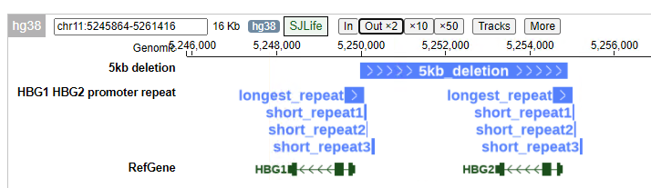
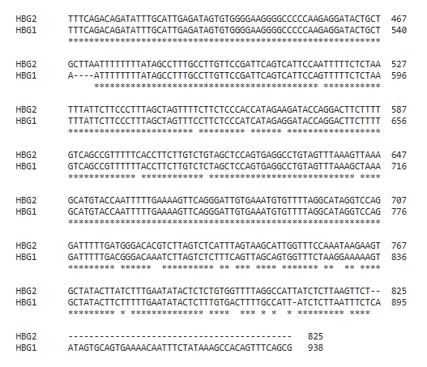

Duplicated sequences in HBG1/HBG2 promoters
=========================

There is a very long duplicated sequence, following by a 5bp insertion in HBG1 promoter or 5bp deletion in HBG2 promoter, then followed by several short duplicated sequences because of substituion.

