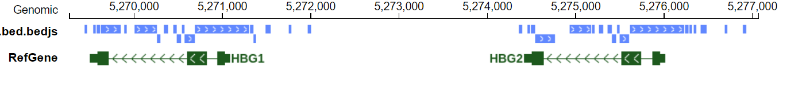

bioinformatics
=========

chrom size can cause a lot of errors
^^^^^^^^^^^^^^^^^^^^^^^^^

In primary assembly we only have chr1 to chr22, chrX and chrY, chrM.

In another version, we can have many scaffolds, those weird names.

I've seen problems caused by:

1. sorted vs. unsorted chrom size

pyBigWig have to use sorted bed and sorted chrom size

::

	RuntimeError: The entries you tried to add are out of order, precede already added entries, or otherwise use illegal values.
	 Please correct this and try again.

2. Mapping index is only primary chromosomes, however, in the subsequenty analysis if you use a chrom size file for all chromsomes, it may cause errors like generating bw files.

2b. HiC-Pro to Juicebox .sh generate a restriction fragment file that considers only main chromsomes, now if you supplied all chrosomes size, it will have errors like:

::

	Problem with creating fragment-delimited maps, NullPointerException.
	This could be due to a null fragment map or to a mismatch in the chromosome name in the fragment map vis-a-vis the input file or chrom.sizes file.

0-index vs 1-index
^^^^^^^^

Like the index in R starts with 1 and in python starts with 0, bioinformatics has this problem too. I know bed file, start is 0-index and end is 1-index, so the length of the region can be directly computed as end-start, instead of end-start+1

vcf is 1-index

When people give you a file other than these format, we have to always make sure whether it is 0-index or 1-index.

Duplicates

Data/Code/misc organization
^^^^^^^^^^^^^^

Conclusion: Just like a database design, make your stuff into ``smallest logical parts`` and make sure each part is self-organized. 

Reasons:

- 1. It is very easy to forget what you did weeks ago, therefore, if you have a complicated folder/directory/data/concepts/scripts structure, then even with well-documented projects, if you were asked to pick up a small point, you might have to read through 50% of the documentation in order to get what you need.

- 2. The output of top-down design may seem fancy/professional to other people, however, it could be time-consuming to you, also not efficient. Bottom-up design, on the other hand, is in nature, following the idea of ``smallest logical parts``.

- 3. In most cases, you don't need to write a book (i.e., a well-documented project), what you need is that your code is working to generate all outputs.

What do we do daily
^^^^^^^

Basically four things:

- Data cleaning

- Data analysis

- Data visualization

- Data curation

memory
^^^^^

STAR index, human + mouse, 6 cores, needs ~70G memory

HBG repeat regions
^^^^^^^^^^^^^^^^^

::

	chr11	5269440	5269470
	chr11	5269535	5269570
	chr11	5269575	5269620
	chr11	5269625	5269850
	chr11	5269890	5269920
	chr11	5270010	5270255
	chr11	5270260	5270295
	chr11	5270335	5270390
	chr11	5270440	5270480
	chr11	5270485	5270535
	chr11	5270540	5270570
	chr11	5270575	5270685
	chr11	5270690	5271305
	chr11	5271310	5271350
	chr11	5271355	5271385
	chr11	5271485	5271550
	chr11	5271755	5271785
	chr11	5271965	5272005
	chr11	5274360	5274390
	chr11	5274455	5274485
	chr11	5274490	5274540
	chr11	5274545	5274770
	chr11	5274930	5275175
	chr11	5275180	5275215
	chr11	5275260	5275315
	chr11	5275365	5275405
	chr11	5275410	5275460
	chr11	5275465	5275495
	chr11	5275500	5275605
	chr11	5275610	5276230
	chr11	5276240	5276280
	chr11	5276285	5276315
	chr11	5276335	5276365
	chr11	5276410	5276480
	chr11	5276685	5276720
	chr11	5276895	5276935

