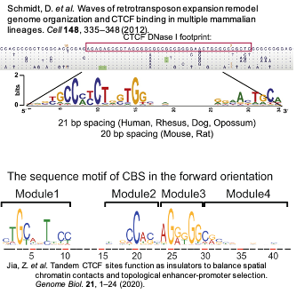

Motif notes
===========

FIMO
^^^^

5-mer exact match p-value cutoff: 0.001
10-mer allows two mismatches: 1e-4 (default cutoff)

+--------+------------------------+
| AGATAA | 0.000352               |
+--------+------------------------+
| AGATAG | 0.00028900000000000003 |
+--------+------------------------+
| CCAAT  | 0.00105                |
+--------+------------------------+
| TGACCA | 0.00023700000000000001 |
+--------+------------------------+
| TGATAA | 0.000352               |
+--------+------------------------+
| TGATAG | 0.00028900000000000003 |
+--------+------------------------+

p_value
------

https://groups.google.com/forum/#!topic/meme-suite/xD2Z3EUw2BQ

the default 1e-4 p-value is not likely to report any matches for motif length=5,6

Motif mapping bed file is generated using FIMO. For motif length <= 7, p-value cutoff is 1e-3. For motif length >=8, default cutoff 1e-4 is used.

+--------------+----------------+
| motif length | p_value cutoff |
+--------------+----------------+
| 5-7          | 1e-3           |
+--------------+----------------+
| 8+           | 1e-4 (default) |
+--------------+----------------+

bedtools
^^^^^^^^

http://quinlanlab.org/tutorials/bedtools/bedtools.html#intersecting-multiple-files-at-once.

CTCF motif
^^^^^^^^

CTCF motif is a long conserved motif in mammalian lineage.

This paper in 2012 divided CTCF motif into M1 + M2, a new 2020 genome biology paper divided it into M1-M4. Visually, they are the same.

You can find the pwm here: http://insulatordb.uthsc.edu/download/CTCFBSDB_PWM.mat

http://genesdev.cshlp.org/content/30/8/881.full.pdf

https://www.nature.com/articles/s41467-018-06664-6

https://www.biorxiv.org/content/10.1101/2020.07.02.185389v1.full.pdf

http://www.biology.emory.edu/research/Corces/Pubs/Organizational%20principles%20of%203D%20genome%20architecture.pdf
