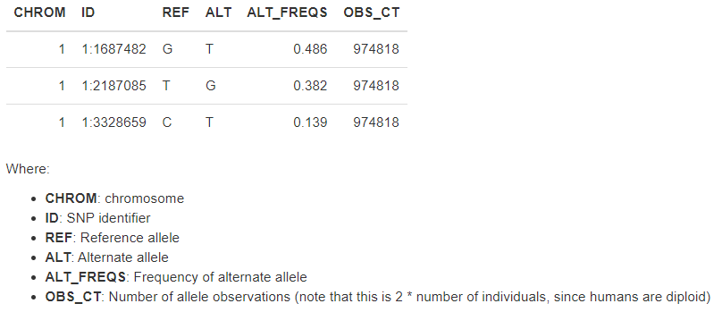

Notes on how to use plink
======================

I found PLINK is really fast.

``module load plink/2.0``

subset by individuals
^^^^^^^^^^^^^^^^^^^

My sample ID is named like ``NA06985_NA06985``, so the keep list just need one column.

::

	[yli11@noderome203 test]$ head 2.list
	NA06985_NA06985
	[yli11@noderome203 test]$ plink2 --vcf chrAll.95samples.withinRegions.v2.03282023.vcf --keep 2.list --out test --export vcf

	[yli11@noderome203 test]$ head 3.list 
	NA06985
	NA06986
	[yli11@noderome203 test]$ plink2 --vcf $f --keep 3.list --out test2 --export vcf

create allele frequency report
^^^^^^^^^^^^^^^^^

The goal is to filter out all variants that are 0/0 in your set of individuals.

::

	plink2 --vcf $f --out test3 --freq

The output is ``test3.afreq``

https://2cjenn.github.io/PRS_Pipeline/

subset by region
^^^^^^^^^^^^^^^^^^^

::

	plink2 --vcf $f --extract range set1.bed --out test4 --export vcf

subset by variant ID
^^^^^^^^^^^^^^^^^^^

::

	plink2 --vcf $f --extract id.list --out test5 --export vcf

for the genetic variantion project, to get vcf files for the 95 donors
^^^^^^^^^^^^^^

::

	module load python/2.7.13

	run_lsf.py -f /home/yli11/HemTools/share/misc/1kg.filelist --sample_list donor.list -p subset_1kg_by_people

	## once it is finished, the final.vcf is what you need