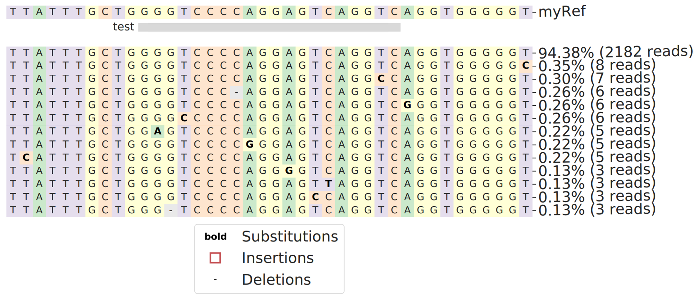

Allele frequency or MSA plot
==========

Output
^^^^^^^^^

::

	module load conda3

	source activate /home/yli11/.conda/envs/crispresso2_env

	MSAplot.py -f Alleles_frequency_table_around_sgRNA_GGGTCCCCAGGAGTCAGGTC.txt -s $r --sgRNA_location 10,29 --sgRNA_name test --ref_name myRef -m 0.1

