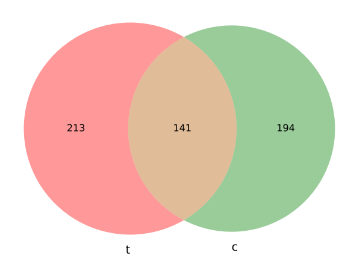

Plot Venn diagram given two bed files
==================

Please use "https://intervene.readthedocs.io/en/latest/examples.html"

::

	usage: bed2venn.py [-h] -b1 B1 -b2 B2 -l1 L1 -l2 L2 [-e1 E1] [-e2 E2]
	                   [--fontsize FONTSIZE] [-o OUTPUT]

	optional arguments:
	  -h, --help            show this help message and exit
	  -b1 B1                bed file 1 (default: None)
	  -b2 B2                bed file 2 (default: None)
	  -l1 L1                label 1 (default: None)
	  -l2 L2                label 2 (default: None)
	  -e1 E1                extend b1 bed file by e1 bp (default: None)
	  -e2 E2                extend b2 bed file by e2 bp (default: None)
	  --fontsize FONTSIZE   label 2 (default: 10)
	  -o OUTPUT, --output OUTPUT
	                        output file name (default: yli11_2021-04-26)

Summary
^^^^^^^

This program will calculate the amount of overlaps given two bed files. 

Note that, it is very likely that the number of A overlapping with B is different than the number of B overlapping with A. 

For example, let's say A is an entire chromosome, B is some scattered regions in this chromosome. Then, the number of A overlapping with B is 1 and the number of B overlapping with A is |B|.

Input
^^^^^

Two bed files. Any bed formats that are supported by bedtools are acceptable here. e.g., narrowpeak files.

Output
^^^^^^

Usage
^^^^^

.. code:: bash

	hpcf_interactive

	module load python/2.7.13

	bed2venn.py -b1 bed1 -b2 bed2 -l1 treatment -l2 control

To extend Xbp left and right on ``-b1`` bed file or ``-b2`` bed file, please use ``-e1`` or ``-e2``

.. code:: bash

	hpcf_interactive

	module load python/2.7.13

	bed2venn.py -b1 bed1 -b2 bed2 -l1 treatment -l2 control -e1 5000

