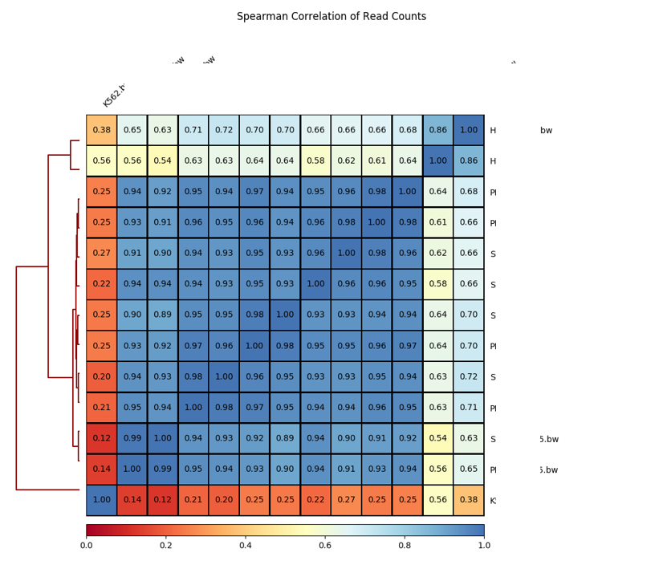

Plot bw file correlation
========================

::

	usage: plot_bw_corr.py [-h] [-j JID] [-f BW_FILES] [-b BIN_SIZE] [-r REGION]
	                       [-o OUTPUT] [--addon_parameter ADDON_PARAMETER]

	plot correlation for all bw files in the current dir

	optional arguments:
	  -h, --help            show this help message and exit
	  -j JID, --jid JID     enter a job ID, which is used to make a new directory.
	                        Every output will be moved into this folder. (default:
	                        plot_bw_corr_yli11_2019-09-18)
	  -f BW_FILES, --bw_files BW_FILES
	                        input file or use all bw files in the current dir
	                        (default: None)
	  -b BIN_SIZE, --bin_size BIN_SIZE
	  -r REGION, --region REGION
	                        Could be chr11:5267561-5277281, HBG region (default:
	                        None)
	  -o OUTPUT, --output OUTPUT
	  --addon_parameter ADDON_PARAMETER

Summary
^^^^^^^

Plot spearman correlation given all bw files in the current dir. 

Input
^^^^^

No specific input files are needed because all bw files in the current dir will be automatically used.

You can definitely control the input files using ``-f`` option. Files have to be quoted and separated by space, i.e., ``"file1.bw file2.bw file3.bw"``

Output
^^^^^^

Usage
^^^^^

Go to your data directory and type the following.

**Step 0: Load python version 2.7.13.**

.. code:: bash

	hpcf_interactive

	module load python/2.7.13

**Step 1: Run the program**

.. code:: bash

	plot_bw_corr.py 

.. note:: You can also control the bin size and a specific region to use when calculating correlations. See the example below.

.. code:: bash

	plot_bw_corr.py -b 150 -r chr11:5267561-5277281

