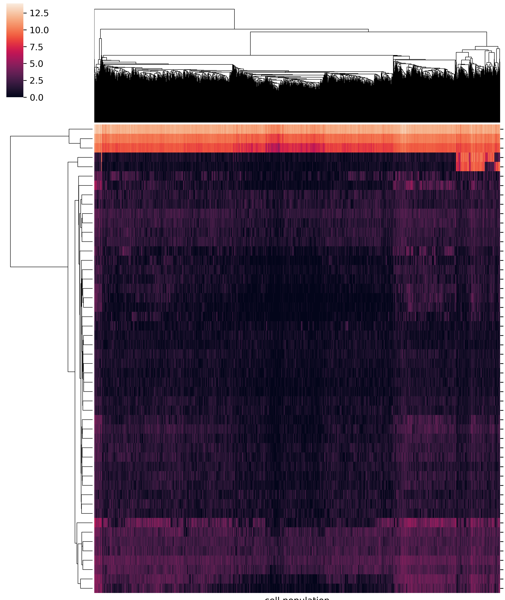

Heatmap Basic
=============

::

	usage: plot_heatmap.py [-h] [-j JID] [--remove_zero] [--index] -f INPUT
	                       [--index_using INDEX_USING] [-s SEP] [--xlabel XLABEL]
	                       [--ylabel YLABEL] [--title TITLE]
	                       [--figure_type FIGURE_TYPE] [--remove_cols REMOVE_COLS]
	                       [-o OUTPUT] [--header] [--no_col_names]
	                       [--no_row_names] [-W WIDTH] [-H HEIGHT]
	                       [--just_default] [--log2_transform] [--just_plot]
	                       [--top_N_by_row_mean TOP_N_BY_ROW_MEAN]
	                       [--row_mean_cutoff ROW_MEAN_CUTOFF]
	                       [--row_mean_percent_col_cutoff ROW_MEAN_PERCENT_COL_CUTOFF [ROW_MEAN_PERCENT_COL_CUTOFF ...]]

	plot heatmap given dataframe.

	optional arguments:
	  -h, --help            show this help message and exit
	  -j JID, --jid JID     enter a job ID, which is used to make a new directory.
	                        Every output will be moved into this folder. (default:
	                        plot_heatmap_yli11_2020-04-07)
	  --remove_zero         remove all rows or cols that are zero (default: False)
	  --index               index is false (default: False)
	  -f INPUT, --input INPUT
	                        data table input (default: None)
	  --index_using INDEX_USING
	                        Sometimes we want to show a different label for the
	                        indices, then use this option. For example, gene id is
	                        unique, however, gene name can be different, it also
	                        has upper or lower case problem, in such case, we want
	                        to use gene id for data processing and use gene name
	                        for visualization. (default: )
	  -s SEP, --sep SEP     separator (default: )
	  --xlabel XLABEL
	  --ylabel YLABEL
	  --title TITLE
	  --figure_type FIGURE_TYPE
	                        pdf,png,jpeg (default: png)
	  --remove_cols REMOVE_COLS
	  -o OUTPUT, --output OUTPUT
	                        output table name (default: yli11_2020-04-07)
	  --header              input table has header (default: False)
	  --no_col_names        Don't show column names in the heatmap (default:
	                        False)
	  --no_row_names        Don't show row names in the heatmap (default: False)
	  -W WIDTH, --width WIDTH
	                        Figure width, by default, w=N_row/4, if given, will
	                        replace the default value (default: )
	  -H HEIGHT, --height HEIGHT
	                        Figure height, by default, w=N_col/4, if given, will
	                        replace the default value (default: )
	  --just_default        just plot using default seaborn parameters (default:
	                        False)
	  --log2_transform      input values will be log2 transformed (default: False)
	  --just_plot           with this option, no filters will be applied. This
	                        program will just plot a heatmap based on the input
	                        dataframe (default: False)

	Applying row filters to your dataframe, heatmaps will be generated for each of the following filters.:
	  --top_N_by_row_mean TOP_N_BY_ROW_MEAN
	                        plot the top N rows (default: 50)
	  --row_mean_cutoff ROW_MEAN_CUTOFF
	                        plot the rows with a minimal mean value (default: 5)
	  --row_mean_percent_col_cutoff ROW_MEAN_PERCENT_COL_CUTOFF [ROW_MEAN_PERCENT_COL_CUTOFF ...]
	                        row mean cutoff, col fraction cutoff, space separated
	                        (default: [5, 0.1])
                        
Summary
^^^^^^^

This is for basic heatmap, without additional row/col highlights.

Given a 2D data, plot heatmaps for several filters and several parameters. See above description for row and col filters. See `ClusterMap
<https://seaborn.pydata.org/generated/seaborn.clustermap.html>`_ for clustermap parameters, such as linkage method (e.g., average) and row/col normalization. For all the figures, take the one that is most useful to you. If you just want to plot the input data without any filters, use ``--just_plot``. 

distance metric used: euclidean (default), cosine, correlation.

linkage method used: average (default), ward. 

Not all available choices are used. Just use some typical ones. Otherwise there will be so many figures to look at (because it is combinatorial!). This combination, together with row/col normalization, will generate 16 figures for the same input dataframe. You can turn of this option using ``--just_default``.

Example
^^^^^^^

Input
^^^^^

Data table, tsv (default) or csv (``-s ,``). If data table contains both row names and column names, use ``--index --header``

Usage
^^^^^

.. code:: bash

    hpcf_interactive -q standard -R "rusage[mem=20000]"

    module load conda3

    source activate /home/yli11/.conda/envs/py2/

**Example usage I: plot the raw data**

My input is data.csv, so I need to set the separator to be ``,``. For raw data, since it is very big 5000*5000, then it is better to turn of xtick labels, which is ``--no_col_names --no_row_names``. I want to do log transform because my input is gene counts, ``--log2_transform``. Since I just want to get a sense of the data, I don't need to see very pixel, so I set image size as ``-W 20 -H 20``.

.. note:: If N rows * N cols > 1M, we will just take a random sample of row or col for heatmap with N=1000. The reason we can't do larger size is because of the recursion limit for clustering dendrogram. One way to solve it is using other method to sort rows and columns, get a new dataframe, and just plot this dataframe without row/col clustering.

.. code:: bash

	plot_heatmap.py -f data.csv -o Banana --log2_transform --just_plot -W 20 -H 20 --header --index --no_col_names --no_row_names -s ,

**Example usage II: plot filtered data**

Here, I'm plotting single-cell RNA-seq data. The data table returned by cellranger uses genes as rows and cells as columns. I'm not interested in knowing the barcode, so I turned of col names by ``--no_col_names``. I also set ``-W 10``, since we have so many cells, by default the width could be very large.  My data table contains both row names and column names, so use ``--index --header``. 

.. code:: bash

	plot_heatmap.py -f data.csv -o Banana --log2_transform -W 10 -s , --index_using genes.tsv --no_col_names --index --header --xlabel "cell population" --ylabel "genes" --title Banana

.. tip:: If you want pdf files, use ``--file_type pdf``. Generating pdf files are slow for large matrices! At least 10 min for 1K*1K data.

Output
^^^^^^

All figures will be generated in the job ID folder. Look at ``*default*`` figures. If they don't look interesting, then go to "others" folder, there will be 16 figures for the same df using different parameter combinations.

Comments
^^^^^^^^

.. disqus::
    :disqus_identifier: NGS_pipelines

