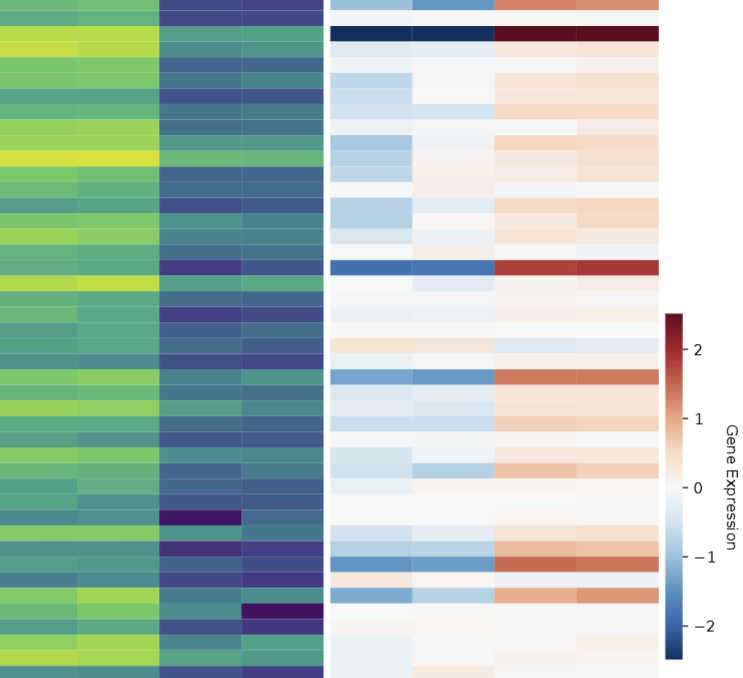

DNA methylation and gene expression heatmap
=======================

::

	usage: merge_2_table_heatmap.py [-h] -f1 FILE1 -f2 FILE2 -m1 MERGE_COL1 -m2 MERGE_COL2 -s SORT_BY [-a] -c1 COLS_FILE1 [COLS_FILE1 ...] -c2
	                                COLS_FILE2 [COLS_FILE2 ...] [-e FILTER_EXPR] [-o OUTLABEL]

	optional arguments:
	  -h, --help            show this help message and exit
	  -f1 FILE1, --file1 FILE1
	                        CSV First input table (e.g., methylation) (default: None)
	  -f2 FILE2, --file2 FILE2
	                        CSV Second input table (e.g., expression) (default: None)
	  -m1 MERGE_COL1, --merge_col1 MERGE_COL1
	                        Merge column name in file1 (default: None)
	  -m2 MERGE_COL2, --merge_col2 MERGE_COL2
	                        Merge column name in file2 (default: None)
	  -s SORT_BY, --sort_by SORT_BY
	                        sort by a column for heatmap (default: None)
	  -a, --ascending       sort by a column for heatmap (default: False)
	  -c1 COLS_FILE1 [COLS_FILE1 ...], --cols_file1 COLS_FILE1 [COLS_FILE1 ...]
	                        Columns from file1 to include in heatmap (use original names from file1) (default: None)
	  -c2 COLS_FILE2 [COLS_FILE2 ...], --cols_file2 COLS_FILE2 [COLS_FILE2 ...]
	                        Columns from file2 to include in heatmap (use original names from file2) (default: None)
	  -e FILTER_EXPR, --filter_expr FILTER_EXPR
	                        Python expression that evaluates to a boolean Series to filter merged df. You can reference 'df' (the merged DataFrame),
	                        'np', and 'pd'. Example: "(df['FDR_f1'] <= 0.05) & (df['logFC_f2'].abs() > 1)" (default: None)
	  -o OUTLABEL, --outlabel OUTLABEL
	                        Base name for output heatmap PDF (default: heatmap_output)

Summary
^^^^^^^

This program will merge two tables, e.g., DMR result + Diff gene result, and plot two heatmaps based on user's filtering and sorting. 

Program is generic, can merge any two tables and plot heatmap together. But the heatmap parameter is for DMR+diffgene. 

Input
^^^^^

Two csv table. 

Usage
^^^^^

::

	hpcf_interactive

	module load conda3/202402

	source activate /home/yli11/.conda/envs/jupyterlab_2024

	module load gcc/13.1.0

	merge_2_table_heatmap.py -f1 BCL11Ako_vs_control.DMR_results.annot.csv -f2 BCL11AKO_vs_AAVS.gene.final.combined.csv -m1 "Gene Name" -m2 ext_gene -s qvalue -a -c1 PB_g1617_rep1 PB_g1617_rep2 PB_AAVS_rep1 PB_AAVS_rep2 -c2 PB_g1617_rep1 PB_g1617_rep2 PB_AAVS_rep1 PB_AAVS_rep2 -e "(df.qvalue<=0.01)&(df['meth.diff']>0)&(df['Gene Type']=='protein-coding')" -o BCL11Ako.hyperM

	merge_2_table_heatmap.py -f1 BCL11Ako_vs_control.DMR_results.annot.csv -f2 BCL11AKO_vs_AAVS.gene.final.combined.csv -m1 "Gene Name" -m2 ext_gene -s qvalue -a -c1 PB_g1617_rep1 PB_g1617_rep2 PB_AAVS_rep1 PB_AAVS_rep2 -c2 PB_g1617_rep1 PB_g1617_rep2 PB_AAVS_rep1 PB_AAVS_rep2 -e "(df.qvalue<=0.01)&(df['meth.diff']<0)&(df['Gene Type']=='protein-coding')" -o BCL11Ako.hypoM

