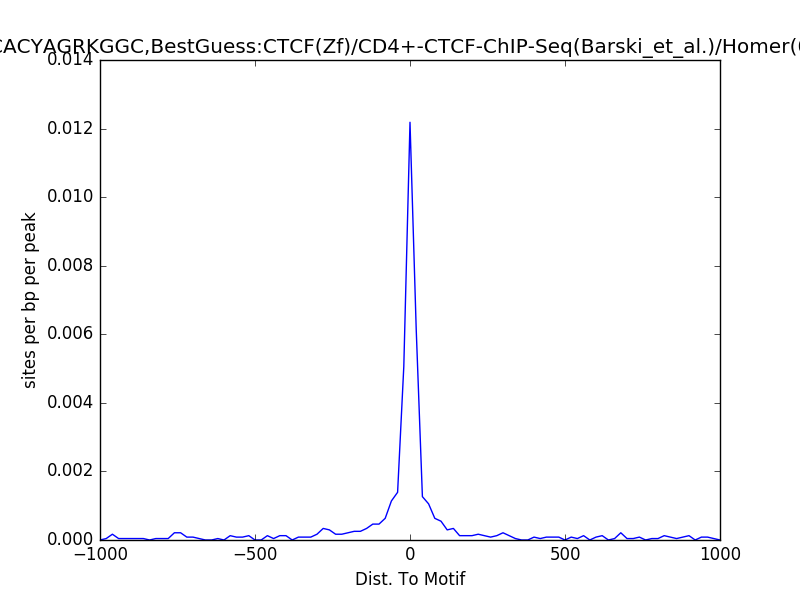

Plot motif position density on peaks
====================================

::

	usage: plot_homer_motif_peak.py [-h] -f BED_FILE [-g GENOME]
	                                [--flanking_size FLANKING_SIZE]
	                                [--bin_size BIN_SIZE]

	optional arguments:
	  -h, --help            show this help message and exit
	  -f BED_FILE, --bed_file BED_FILE
	                        bed or peak file (default: None)

	Genome Info:
	  -g GENOME, --genome GENOME
	                        genome version: hg19, mm10, mm9 (default: hg19)

	Plot Info:
	  --flanking_size FLANKING_SIZE
	                        extend this size to left and right (default: 1000)
	  --bin_size BIN_SIZE   bin size for plot density, use minimal 10 maximal 50,
	                        motif size can affect the figure a little bit, if you
	                        want to make the peak stronger, change this parameter
	                        (default: 20)

Example
^^^^^^^

Usage
^^^^^

Suppose you have done homer motif discovery, then go to your motif discovery result folder, in this folder you should see two folders named ``homerResults`` and ``knownResults``.

**Step 0: Load python version 2.7.13.**

.. code:: bash

    module load python/2.7.13
    module load homer

**Step 1: Run**

.. code:: bash

    plot_homer_motif_peak.py -f peak_file.bed

Output
^^^^^^

The output folder is ``homer_all_motifs``; it contains png files for every motif.

Reference
^^^^^^^^^

http://homer.ucsd.edu/homer/ngs/peakMotifs.html

Comments
^^^^^^^^

.. disqus::
    :disqus_identifier: NGS_pipelines

