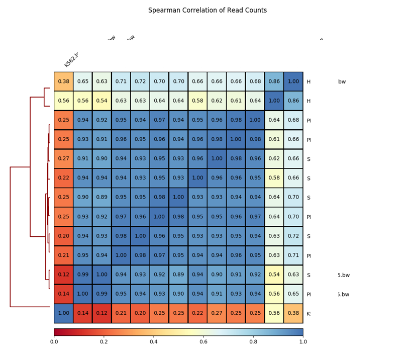

Plot Chromsome Ideogram
========================

::

	usage: plot_ideogram.py [-h] [-o OUTPUT] [--organism ORGANISM]
	                        [--assembly ASSEMBLY]
	                        file [file ...]

	positional arguments:
	  file                  input bed files, the first 3 columns should be chr,
	                        start, end, additional columns will be ignored.
	                        Multiple files should be separated by space, you can
	                        use *.bed to include all bed filess in the current
	                        dir.

	optional arguments:
	  -h, --help            show this help message and exit
	  -o OUTPUT, --output OUTPUT
	                        enter a job ID, which is used to make a new directory.
	                        Every output will be moved into this folder. (default:
	                        plot_ideogram_yli11_2019-10-17.html)
	  --organism ORGANISM   possible choice: Human,Mouse,Arabidopsis thaliana
	                        (default: Human)
	  --assembly ASSEMBLY   GRCh38,GRCh37,GRCm38,MGSCv37,TAIR10 (default: GRCh38)

Summary
^^^^^^^

Input
^^^^^

Output
^^^^^^

Usage
^^^^^

Go to your data directory and type the following.

**Step 0: Load python version 2.7.13.**

.. code:: bash

	hpcf_interactive

	module load python/2.7.13

**Step 1: Run the program**

.. code:: bash

	plot_bw_corr.py 

.. note:: You can also control the bin size and a specific region to use when calculating correlations. See the example below.

.. code:: bash

	plot_bw_corr.py -b 150 -r chr11:5267561-5277281

