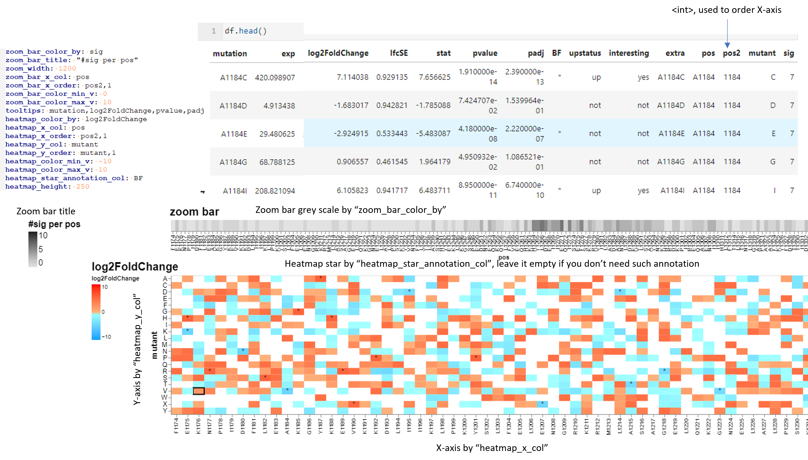

Interactive heatmap
=============

::

	usage: interactive_heatmap.py [-h] -f INPUT -o OUTPUT [--reformat_config REFORMAT_CONFIG] [--header] [--index] [--sep SEP]

	optional arguments:
	  -h, --help            show this help message and exit
	  -f INPUT, --input INPUT
	                        data table to be plot (default: None)
	  -o OUTPUT, --output OUTPUT
	                        output visualization html file (default: None)
	  --reformat_config REFORMAT_CONFIG
	                        reformat data table (default: None)
	  --header              data table has header (default: False)
	  --index               data table has index (default: False)
	  --sep SEP             data table separator (default: auto)

Example
^^^^^^^

Input
^^^^^

Data table, csv or tsv, auto determined. If data table contains both row names and column names, use ``--index --header``

Plot configuration file. Example:

::

	zoom_bar_color_by: sig
	zoom_bar_title: "#sig per pos"
	zoom_width: 1200
	zoom_bar_x_col: pos
	zoom_bar_x_order: pos2,1
	zoom_bar_color_min_v: 0
	zoom_bar_color_max_v: 10
	tooltips: mutation,log2FoldChange,pvalue,padj
	heatmap_color_by: log2FoldChange
	heatmap_x_col: pos
	heatmap_x_order: pos2,1
	heatmap_y_col: mutant
	heatmap_y_order: mutant,1
	heatmap_color_min_v: -10
	heatmap_color_max_v: 10
	heatmap_star_annotation_col: BF
	heatmap_height: 250

A preset config is provided for the mutagenesis data: ``--reformat_config kasey``

Usage
^^^^^

.. code:: bash

    hpcf_interactive -q standard -R "rusage[mem=20000]"

    module load conda3/202011

    source activate /home/yli11/.conda/envs/captureC

    # cd to your data dir

    interactive_heatmap.py -f input.txt --reformat_config kasey --header -o test.html

Comments
^^^^^^^^

.. disqus::
    :disqus_identifier: NGS_pipelines

