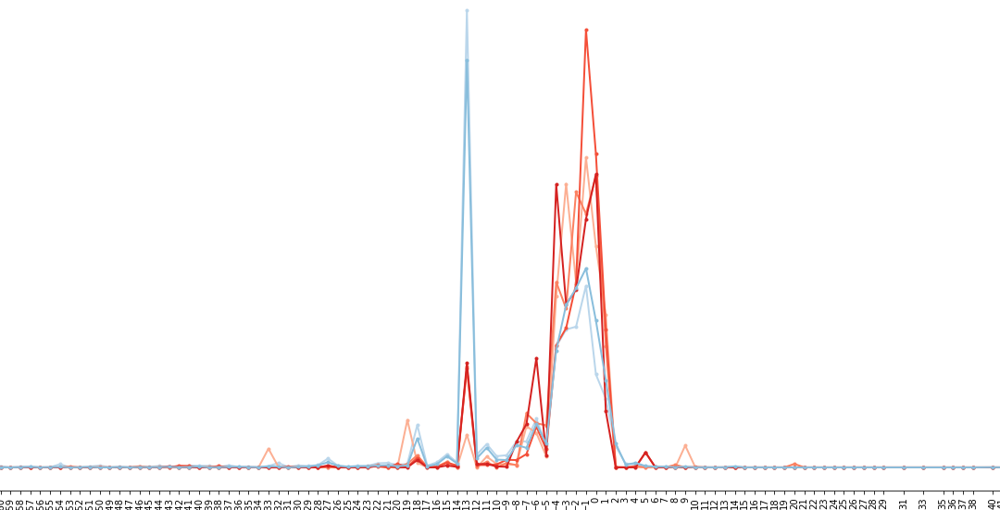

line_plot to compare editing outcome frequency (two groups)
^^^^^^^

::

	plt.figure(figsize=(30,10))
	WT_list = [x for x in df.columns if "WT" in x]
	red_color = sns.color_palette("Reds")
	blue_color = sns.color_palette("Blues")
	red_count = 1
	blue_count = 1
	for c in WT_list:
	    if "After" in c:
	        plot_spectrum_single(df.index,df[c],c,red_color[red_count])
	        red_count+=1
	    else:
	        plot_spectrum_single(df.index,df[c],c,blue_color[blue_count])
	        blue_count+=1
	plt.legend()
	plt.xticks(df.index)
	plt.xticks(rotation = 90) # Rotates X-Axis Ticks by 45-degrees
	plt.title("xx")
	plt.xlabel("edit outcome")
	plt.ylabel("indel frequency")
	plt.savefig("xx.pdf",bbox_inches='tight')