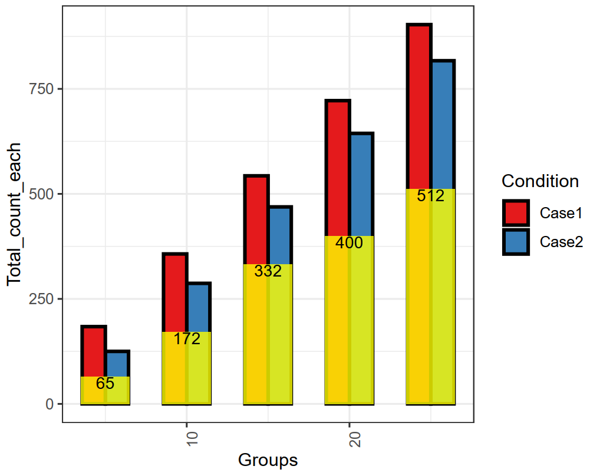

Overlapping Barplot
===================

::

	usage: plot_overlapping_barplot.py [-h] -f INPUT [-s SEP]
	                                   [--skiprows SKIPROWS] [-o OUTPUT]

	optional arguments:
	  -h, --help            show this help message and exit
	  -f INPUT, --input INPUT
	                        correlation matrix with index and header (default:
	                        None)
	  -s SEP, --sep SEP     this program can infer separator automatically, but it
	                        may fail. Use auto if the input tables contain
	                        different separators. (default: auto)
	  --skiprows SKIPROWS   Pandas read_csv parameter to skip first N rows
	                        (default: 0)
	  -o OUTPUT, --output OUTPUT
	                        output file name (default:
	                        yli11_2019-10-29_overlapping_barplot)

Summary
^^^^^^^

Input
^^^^^^

::

	Groups	Total_count_each	Condition	Intersection
	25	903	Case1	512
	25	817	Case2	512
	20	722	Case1	400
	20	644	Case2	400
	15	543	Case1	332
	15	469	Case2	332
	10	357	Case1	172
	10	287	Case2	172
	5	184	Case1	65
	5	125	Case2	65

Usage
^^^^^

Go to your data directory and type the following.

.. code:: bash

	hpcf_interactive

	module load python/2.7.13

	module load R/3.5.1

	plot_overlapping_barplot.py -f input.csv

The two figures will be emailed to you shortly.

