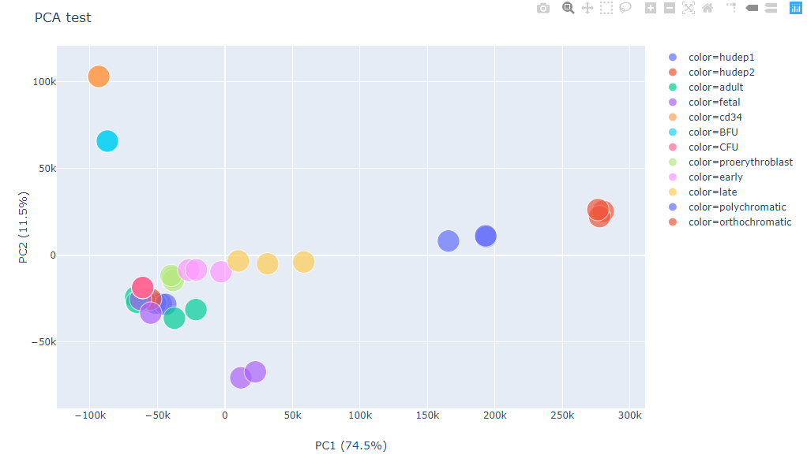

Visualizing high-dimentional data using PCA or UMAP
=================================

::

	usage: plot_PCA.py [-h] [-j JID] [--remove_zero] [--index] [--binarize]
	                   [--max MAX] [--min MIN] [--transpose] [--sample_norm] -f
	                   INPUT [--use_cols USE_COLS] [--index_using INDEX_USING]
	                   [-s SEP] [--xlabel XLABEL] [--ylabel YLABEL]
	                   [--remove_cols REMOVE_COLS]
	                   [--color_using COLOR_USING | --color_by_a_col COLOR_BY_A_COL | --shape_by_str SHAPE_BY_STR]
	                   [-n MAXPC] [--UMAP_min_dist UMAP_MIN_DIST]
	                   [--UMAP_metric UMAP_METRIC]
	                   [--UMAP_n_neighbors UMAP_N_NEIGHBORS] [--title TITLE]
	                   [--label_by_last3_element] [--smart_label]
	                   [--kmeans_label KMEANS_LABEL] [--dbscan_label]
	                   [--guess_label] [--continous]
	                   [--gene_filter_cutoff GENE_FILTER_CUTOFF]
	                   [--label_by_first_element] [--label_by_first4_element]
	                   [--zero_mean_unit_variance] [--label_by_meaningful_name]
	                   [--UMAP] [--nPCA_UMAP NPCA_UMAP] [--text]
	                   [--save_projection_df] [--figure_type FIGURE_TYPE]
	                   [-o OUTPUT] [--header] [-W WIDTH] [-H HEIGHT]
	                   [--log2_transform]

	plot heatmap given dataframe.

	optional arguments:
	  -h, --help            show this help message and exit
	  -j JID, --jid JID     enter a job ID, which is used to make a new directory.
	                        Every output will be moved into this folder. (default:
	                        plot_PCA_yli11_2020-09-03)
	  --remove_zero         remove all rows or cols that are zero (default: False)
	  --index               index is false (default: False)
	  --binarize            force to binary data (default: False)
	  --max MAX             above this value to determine 1 (default: 1)
	  --min MIN             above this value to determine 0 (default: 0)
	  --transpose           df transpose (default: False)
	  --sample_norm         sample norm by sum (default: False)
	  -f INPUT, --input INPUT
	                        data table input (default: None)
	  --use_cols USE_COLS   use a subset cols (default: None)
	  --index_using INDEX_USING
	                        Sometimes we want to show a different label for the
	                        indices, then use this option. For example, gene id is
	                        unique, however, gene name can be different, it also
	                        has upper or lower case problem, in such case, we want
	                        to use gene id for data processing and use gene name
	                        for visualization. (default: )
	  -s SEP, --sep SEP     separator (default: )
	  --xlabel XLABEL
	  --ylabel YLABEL
	  --remove_cols REMOVE_COLS
	  --color_using COLOR_USING
	                        input a file, index should be the same as the input
	                        data frame (default: None)
	  --color_by_a_col COLOR_BY_A_COL
	                        input a column name to be used for coloring (default:
	                        None)
	  --shape_by_str SHAPE_BY_STR
	                        input a string to match sample name, matched and
	                        unmatched names will have different name; used to show
	                        our own data vs public data. (default: None)
	  -n MAXPC, --maxPC MAXPC
	  --UMAP_min_dist UMAP_MIN_DIST
	  --UMAP_metric UMAP_METRIC
	  --UMAP_n_neighbors UMAP_N_NEIGHBORS
	  --title TITLE
	  --label_by_last3_element
	  --smart_label
	  --kmeans_label KMEANS_LABEL
	  --dbscan_label
	  --guess_label
	  --continous
	  --gene_filter_cutoff GENE_FILTER_CUTOFF
	  --label_by_first_element
	  --label_by_first4_element
	  --zero_mean_unit_variance
	  --label_by_meaningful_name
	  --UMAP
	  --nPCA_UMAP NPCA_UMAP
	  --text
	  --save_projection_df
	  --figure_type FIGURE_TYPE
	                        pdf,png,jpeg (default: png)
	  -o OUTPUT, --output OUTPUT
	                        output table name (default: plot_PCA_yli11_2020-09-03)
	  --header              input table has header (default: False)
	  -W WIDTH, --width WIDTH
	                        Figure width, by default, w=N_row/4, if given, will
	                        replace the default value (default: 500)
	  -H HEIGHT, --height HEIGHT
	                        Figure height, by default, w=N_col/4, if given, will
	                        replace the default value (default: 500)
	  --log2_transform      input values will be log2 transformed (default: False)

Summary
^^^^^^^

Given a dataframe, make a PCA or UMAP plot. 

Example
^^^^^^^

Input
^^^^^

Data table, tsv (default) or csv (``-s ,``). If data table contains both row names and column names, use ``--index --header``

Usage
^^^^^

.. code:: bash

    hpcf_interactive -q standard -R "rusage[mem=10000]"

    module load conda3

    source activate /home/yli11/.conda/envs/py2/

**Example usage**

.. code:: bash

	plot_PCA.py -f /home/yli11/HemPortal/RNA_seq/erythopoesis_expr.transcript.tpm --index --header --transpose --label_by_first_element

Note that ``--index --header`` specifies that the input data has column names and row names. 

In the input, we assume columns are used as features and rows are used as samples, in other words, the number of dots in the output figure is equal to the row names. (This is a general machine learning format.)

In the input example, the rows are actually the features, so I need to do a matrix transpose, use ``--transpose``.

In the input example, we don't have a label column, and we just want to use the row names as the label, use ``--label_by_first_element``.

Usage-UMAP
^^^^^

**Example usage**

.. code:: bash

	plot_PCA.py -f /home/yli11/HemPortal/RNA_seq/blood/combined_gene_exp/merged_gene_exp.tsv --UMAP --index --header --transpose 

Or try different parameters:

.. code:: bash
	plot_PCA.py -f merged_gene_exp.tsv --index --header --transpose --UMAP --label_by_meaningful_name --UMAP_min_dist 0.7 --UMAP_n_neighbors 7

Output
^^^^^^

This is an interactive figure, please open the html file.

Data exploration for machine learning projects
^^^^^^

**Input**

Standard ML format uses row for individual samples/instances and column for individual features/predictors. There is another column for the labels if it is supervised learning.

**Aim**

Visualze the sample distribution given selected features.

**Usage**

.. code:: bash

	hpcf_interactive -q standard -R "rusage[mem=10000]"

	module load conda3

	source activate /home/yli11/.conda/envs/py2/

	plot_PCA.py -f input.csv --color_by_a_col label --header -s , --UMAP

FAQ
^^^^^^

PCA plot for gene exp results from running ``diffgene.py`` or ``HemTools rna_seq``
--------------

We will use tpm values calculated from Kallisto. This is stored in individual ``abandunce.tsv`` file. Go to your result dir and do the following

.. code:: bash

	module load python/2.7.13

	dataframe_merge.py --drop length,eff_length,est_counts --rename_col_with_filename -o merged_raw.tsv */*.tsv

	dataframe.py --remove_zero --row --index --header -f merged_raw.tsv -o forPCA.tsv 

	module load conda3
	source activate /home/yli11/.conda/envs/py2

	plot_PCA.py -f forPCA.tsv --index --header --transpose --label_by_last3_element --log2_transform -o PCA_plot_log2TPM.html

	plot_PCA.py -f forPCA.tsv --index --header --transpose --label_by_last3_element -o PCA_plot_TPM.html

**Example 2: merge and plot**

In my current working dir, I have downloaded GSE116177, where it has SE RNA-seq and PE RNA-seq, so I analysized them differently. I also have my own data. ``The first step`` is to find the output from ``HemTools_dev rna_seq`` pipeline, shown below.

.. code:: bash

	module load python/2.7.13

	find . -name "rna_seq_yli11_2019*.gene.abundance.csv"

	./GSE116177/renamed_data/single/rna_seq_yli11_2019-12-24/kallisto_files/rna_seq_yli11_2019-12-24.gene.abundance.csv

	./GSE116177/renamed_data/paired/rna_seq_yli11_2019-12-24/kallisto_files/rna_seq_yli11_2019-12-24.gene.abundance.csv

	./combine_129304_134393_140290/rna_seq_yli11_2019-12-24/kallisto_files/rna_seq_yli11_2019-12-24.gene.abundance.csv

Then merge the three datasets:

.. code:: bash

	dataframe_merge.py ./GSE116177/renamed_data/single/rna_seq_yli11_2019-12-24/kallisto_files/rna_seq_yli11_2019-12-24.gene.abundance.csv ./GSE116177/renamed_data/paired/rna_seq_yli11_2019-12-24/kallisto_files/rna_seq_yli11_2019-12-24.gene.abundance.csv ./combine_129304_134393_140290/rna_seq_yli11_2019-12-30/kallisto_files/rna_seq_yli11_2019-12-30.gene.abundance.csv --intersection -o merged_rwu_GSE116177.tsv --drop "Gene Name"

	dataframe_merge.py ./GSE116177/renamed_data/single/rna_seq_yli11_2019-12-24/kallisto_files/rna_seq_yli11_2019-12-24.gene.abundance.csv ./GSE116177/renamed_data/paired/rna_seq_yli11_2019-12-24/kallisto_files/rna_seq_yli11_2019-12-24.gene.abundance.csv ./combine_129304_134393_140290/rna_seq_yli11_2019-12-30/kallisto_files/rna_seq_yli11_2019-12-30.gene.abundance.csv --intersection -o merged_rwu_GSE116177_with_gene_name.tsv

Lastly make a UMAP plot:

.. code:: bash

	module load conda3
	source activate /home/yli11/.conda/envs/py2

	plot_PCA.py -f merged_rwu_GSE116177.tsv --index --header --transpose --log2_transform  --UMAP -o scaled_UMAP_log2TPM_filtered.html --smart_label --gene_filter_cutoff 1 --shape_by_str GSM --zero_mean_unit_variance

Parameters in UMAP
--------------------------

1. Number of clusters

less UMAP_min_dist and less number of neighbors will give more clusters.

``UMAP_n_neighbors`` will have less impact when ``UMAP_min_dist`` <=0.1

Range of ``UMAP_min_dist`` depends on the distance matrics. In most cases, you just need to pick a value from 0 to 1.

Comments
^^^^^^^^

.. disqus::
    :disqus_identifier: NGS_pipelines

