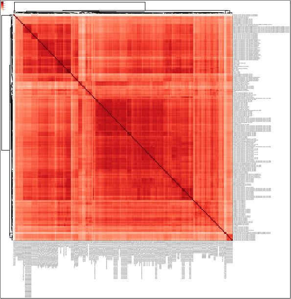

Correlation heatmap
===================

::

	usage: plot_corr.py [-h] -f INPUT [-s SEP] [--skiprows SKIPROWS] [--cmap CMAP]
	                    [-o OUTPUT] [--size SIZE] [--smart_label]

	optional arguments:
	  -h, --help            show this help message and exit
	  -f INPUT, --input INPUT
	                        correlation matrix with index and header (default:
	                        None)
	  -s SEP, --sep SEP     this program can infer separator automatically, but it
	                        may fail. Use auto if the input tables contain
	                        different separators. (default: auto)
	  --skiprows SKIPROWS   Pandas read_csv parameter to skip first N rows
	                        (default: 0)
	  --cmap CMAP           Pandas read_csv parameter to skip first N rows
	                        (default: Reds)
	  -o OUTPUT, --output OUTPUT
	                        output file name (default: yli11_2019-10-21)
	  --size SIZE           Figure size, default=Ncol/4 (default: auto)
	  --smart_label         try to infer a meaning unique group name, string will
	                        be splited by . - |, items that occur only once or
	                        occur above 95% will be removed (default: False)

Summary
^^^^^^^

Plot correlation heatmap given correlation matrix. 

One usage: When using :doc:`bw corr <bw_corr>`, the result figure can look bad because of large number of files (>50). In this case, you want to plot your own figures using their output.

Input
^^^^^

A correlation matrix with index name and column names.

Output
^^^^^^

Usage
^^^^^

Go to your data directory and type the following.

**Step 0: Load python version 2.7.13.**

.. code:: bash

	hpcf_interactive

	module load python/2.7.13

	plot_corr.py -f plotCorrelation.tab --smart_label --skiprows 1 -s "\t"

``plotCorrelation.tab`` is an output from :doc:`bw corr <bw_corr>`, the first line is notes, so we skip the first row when read the file using ``--skiprows 1``. 

