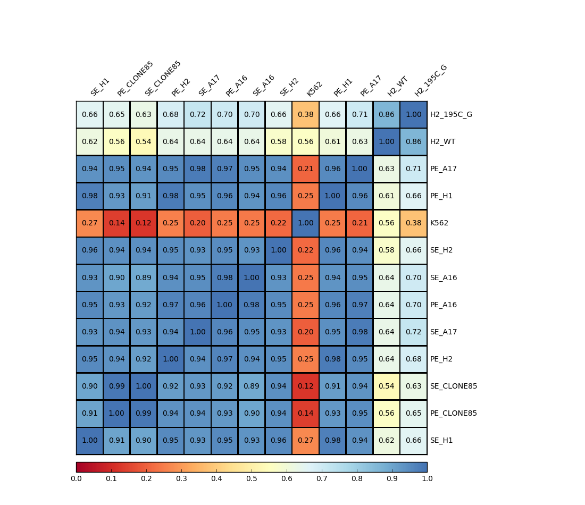

Re-order Correlation heatmap
===================

::

	usage: plot_corr_reorder.py [-h] -f INPUT -n REORDER_NAMES [-s SEP]
	                            [--skiprows SKIPROWS] [-o OUTPUT]

	optional arguments:
	  -h, --help            show this help message and exit
	  -f INPUT, --input INPUT
	                        correlation matrix with index and header (default:
	                        None)
	  -n REORDER_NAMES, --reorder_names REORDER_NAMES
	                        two columns showing old names and new names (default:
	                        None)
	  -s SEP, --sep SEP     this program can infer separator automatically, but it
	                        may fail. Use auto if the input tables contain
	                        different separators. (default: auto)
	  --skiprows SKIPROWS   Pandas read_csv parameter to skip first N rows
	                        (default: 0)
	  -o OUTPUT, --output OUTPUT
	                        output file name (default: yli11_2020-04-07)

Summary
^^^^^^^

Plot correlation heatmap given correlation matrix. 

One usage: When using :doc:`bw corr <bw_corr>`, the result figure can look bad because of large number of files (>50). In this case, you want to plot your own figures using their output.

This program allows you to rename and re-order columns and rows.

Note this program requires the matrix, which is ``plotCorrelation.tab`` and a name mapping file (old name and new name). Old names should match the column names in ``plotCorrelation.tab``, which is the file names if you start with ``bw_corr.py``.

Input
^^^^^

1. A correlation matrix with index name and column names.

2. A new names tsv file (e.g., row_name_mapping.txt), 2 columns: old name and new name

::

	SE_H1.bw	SE_H1
	PE_CLONE85.bw	PE_CLONE85
	SE_CLONE85.bw	SE_CLONE85
	PE_H2.bw	PE_H2
	SE_A17.bw	SE_A17
	PE_A16.bw	PE_A16
	SE_A16.bw	SE_A16
	SE_H2.bw	SE_H2
	K562.bw	K562
	PE_H1.bw	PE_H1
	PE_A17.bw	PE_A17
	H2_WT.bw	H2_WT
	H2_195C_G.bw	H2_195C_G

Output
^^^^^^

Usage
^^^^^

Go to your data directory and type the following.

**Step 0: Load python version 2.7.13.**

.. code:: bash

	hpcf_interactive

	module load python/2.7.13

	plot_corr.py -f plotCorrelation.tab --skiprows 1 -s "\t" -o test.pdf -n row_name_mapping.txt

``plotCorrelation.tab`` is an output from :doc:`bw corr <bw_corr>`, the first line is notes, so we skip the first row when read the file using ``--skiprows 1``. 

