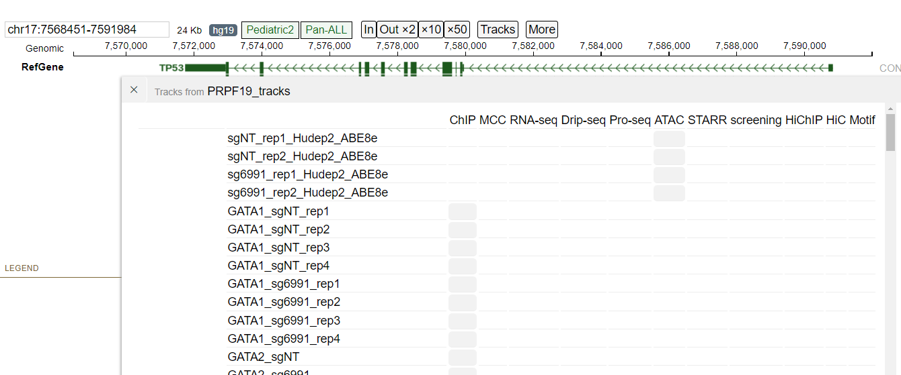
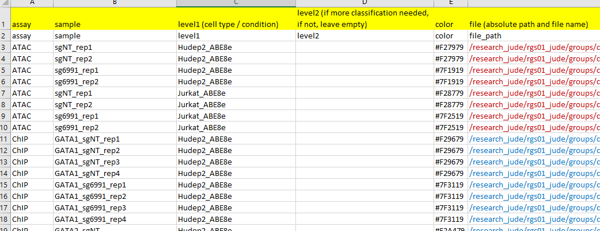

Creat data table of tracks on protein paint
==================================

::

	usage: create_ppr_facet_table.py [-h] -f INPUT_TSV -d DIR --name NAME

	create tracks

	optional arguments:
	  -h, --help            show this help message and exit
	  -f INPUT_TSV, --input_tsv INPUT_TSV
	                        tsv file (default: None)
	  -d DIR, --dir DIR     genome browser HPC dir (default: None)
	  --name NAME           your track name (default: None)

Example
^^^^^^^

Input
^^^^^

A tsv table summary of your data.

Output
^^^^^

The genome browser can be accessed through for example: 
https://ppr.stjude.org/?genome=hg19&block=1&tkjsonfile=yli11/PRPF19/track_collections/tracks.json

Usage
^^^^^^

.. code:: bash

	hpcf_interactive

	module load conda3

	source activate /home/yli11/.conda/envs/captureC

	create_ppr_facet_table.py -f ppr.facet_table.tsv -d path_to_genomebrowser_HPC --name PRPF19_tracks

