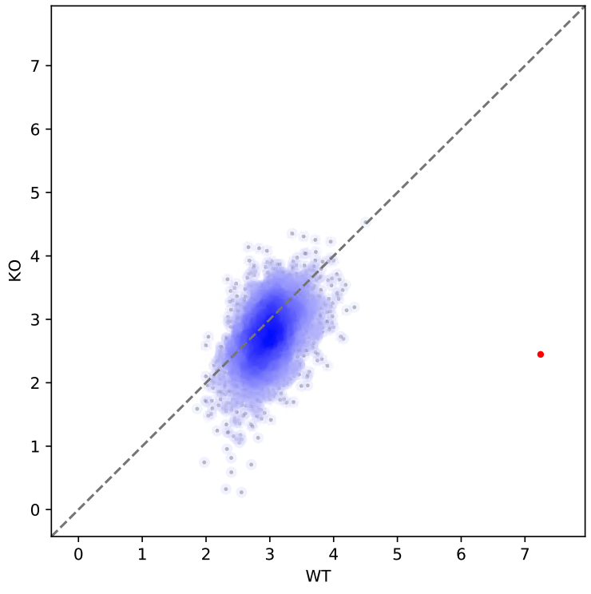

Plot replicate correlation
==========================

::

	usage: replicate_correlation.py [-h] [-j JID] -f INPUT_LIST [--bw]
	                                [--featureCount_addon_parameters FEATURECOUNT_ADDON_PARAMETERS]

	optional arguments:
	  -h, --help            show this help message and exit
	  -j JID, --jid JID     enter a job ID, which is used to make a new directory.
	                        Every output will be moved into this folder. (default:
	                        replicate_correlation_yli11_2020-04-20)
	  -f INPUT_LIST, --input_list INPUT_LIST
	                        tsv 4 columns, bam 1, bam 2, peak 1, peak 2. Relative
	                        or Absolute path. (default: None)
	  --bw                  input is bw, not bam (default: False)
	  --featureCount_addon_parameters FEATURECOUNT_ADDON_PARAMETERS
	                        if paired data add -p option (default: )

Summary
^^^^^^^

This is a scatter plot showing scatters, density, and correlation R square. 

bed file should have 4 columns: chr, start, end, name

Input
^^^^^

As of 4-20-2020, the input format now also accept bw files.

Option 1:

A tsv file with 4 columns (2 bam files and 2 peak files): bam 1, bam 2, peak 1, peak 2.

Option 2:

A tsv file with 4 columns (2 bw files and 2 peak files): bw 1, bw 2, peak 1, peak 2.

Usage
^^^^^

.. code:: bash

	hpcf_interactive

	module load python/2.7.13

	replicate_correlation.py -f input.list

For paired-end data use (bam input):

.. code:: bash

	replicate_correlation.py -f input.list --featureCount_addon_parameters " -p"

For bw input (no difference SE or PE)

.. code:: bash

	replicate_correlation.py -f input.list --bw

Output
^^^^^

The output file will be emailed to you.

.. image:: ../../images/replicate_correlation_scatter.png
	:align: center

Highlight some dots
^^^^^^^^^^

The script we are using is from : :doc:`scatter_correlation.py <scatter_correlation>`. Specifically, the usage for the output from replicate_correlation.py is as follows.

1. Input: ``signal.out``

Find the ``signal.out`` file in the output jid folder. This is a tsv file, open it in excel, edit the column names to what you need. The first column is the index, by default the column name is "0". You don't need to modify this name. The last two columns are used as X-axis and Y-axis name, change them to what you need, spaces are allowed.

Next, find the row where you want to highlight, modify its index name to something simple, you will need to input this name later.

Example input:

::

	0	WT	KO
	test	150.76201	4.45338
	Banana_2,Banana_2	7.28372	7.71828
	Banana_3,Banana_3	6.638380000000001	5.2838400000000005
	Banana_4,Banana_4	6.5786	7.52588
	Banana_5,Banana_5	7.51205	6.96104
	Banana_6,Banana_6	5.625030000000001	3.6350599999999997
	Banana_7,Banana_7	5.18235	3.84519
	Banana_8,Banana_8	5.73767	5.34589
	Banana_9,Banana_9	7.53337	3.71176

2. Run ``scatter_correlation.py`` 

.. code:: bash

	hpcf_interactive

	module load conda3

	source activate /home/yli11/.conda/envs/py2

	scatter_density.py -f signal.out -s "\t" -x WT -y KO --index 0 --highlight test -o myoutput.pdf

3. example figure

