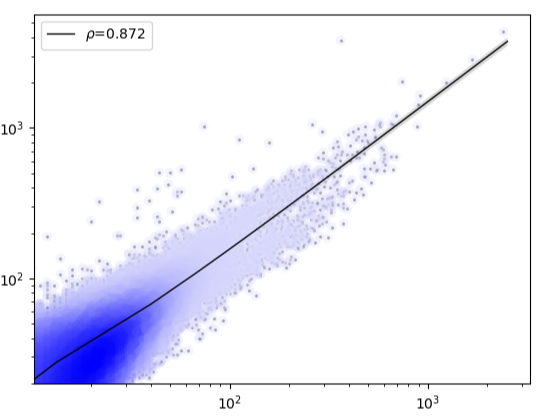

Plot replicate correlation
==========================

::

	usage: replicate_correlation.py [-h] [-j JID] -f INPUT_LIST
	                                [--featureCount_addon_parameters FEATURECOUNT_ADDON_PARAMETERS]
	optional arguments:
	  -h, --help            show this help message and exit
	  -j JID, --jid JID     enter a job ID, which is used to make a new directory.
	                        Every output will be moved into this folder. (default:
	                        replicate_correlation_yli11_2019-12-09)
	  -f INPUT_LIST, --input_list INPUT_LIST
	                        tsv 4 columns, bam 1, bam 2, peak 1, peak 2. Relative
	                        or Absolute path. (default: None)
	  --featureCount_addon_parameters FEATURECOUNT_ADDON_PARAMETERS
	                        if paired data add -p option (default: )

Summary
^^^^^^^

This is a scatter plot showing scatters, density, and correlation R square. 

Input
^^^^^

A tsv file with 4 columns (2 bam files and 2 peak files): bam 1, bam 2, peak 1, peak 2.

Usage
^^^^^

.. code:: bash

	hpcf_interactive

	module load python/2.7.13

	replicate_correlation.py -f input.list

For paired-end data use:

.. code:: bash

	replicate_correlation.py -f input.list --featureCount_addon_parameters " -p"

Output
^^^^^

The output file will be emailed to you.

