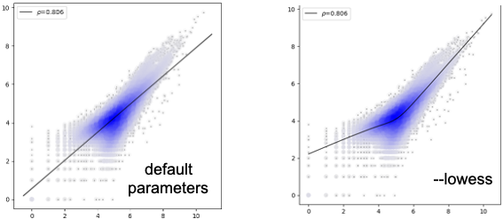

Plot correlation scatter plots
=========================

::

	usage: scatter_density.py [-h] -f F [-s S] -x X -y Y [--index INDEX]
	                          [--regression] [--diagnal_line] [--lowess]
	                          [-bc BACKGROUND_DOTS_COLOR] [-hc HIGHLIGHT_COLOR]
	                          [--highlight HIGHLIGHT] [-o OUTPUT]

	optional arguments:
	  -h, --help            show this help message and exit
	  -f F                  data table (default: None)
	  -s S                  sep (default: )
	  -x X                  column name for x axis (default: None)
	  -y Y                  column name for y axis (default: None)
	  --index INDEX         index name for index (default: None)
	  --regression          by default it is a dignal line (default: False)
	  --diagnal_line        force to draw a dignal line (default: False)
	  --lowess              fit a curve (default: False)
	  -bc BACKGROUND_DOTS_COLOR, --background_dots_color BACKGROUND_DOTS_COLOR
	                        background_dots_color (default: #0000ff)
	  -hc HIGHLIGHT_COLOR, --highlight_color HIGHLIGHT_COLOR
	                        highlight_color (default: #ff1500)
	  --highlight HIGHLIGHT
	                        column name for y axis, sep by comma (default: None)
	  -o OUTPUT, --output OUTPUT
	                        output file name (default:
	                        yli11_2020-09-22.correlation_scatter_density.png)

Summary
^^^^^^

Input
^^^^^

Input can be tsv or csv. For tsv use ``-s "\t"``, for csv use ``-s ,``

::

	Geneid	Chr	Start	End	Strand	Length	Banana	Orange
	a	chr1	3513707	3514076	+	370	53	22
	b	chr1	3538168	3538438	+	271	24	16
	a	chr1	3970540	3970785	+	246	16	6
	b	chr1	4059120	4059436	+	317	44	12
	a	chr1	4388977	4389294	+	318	22	11
	b	chr1	4561768	4562101	+	334	31	11
	a	chr1	4760133	4760340	+	208	23	9
	b	chr1	5073062	5073299	+	238	36	20

The above example is a read count distribution for two chip-seq replicates.

The aim is to see the correlation between Banana and Orange, use ``-x Banana -y Orange`` to plot Banana column as the X-axis and Orange column as the Y-axis.

Usage
^^^^^

Sample correlation usage
-------------------

.. code:: bash

    hpcf_interactive -q standard -R "rusage[mem=10000]"

    module load conda3

    source activate /home/yli11/.conda/envs/py2/

	scatter_density.py -f input.tsv -s "\t" -x Banana -y Orange 

Output
^^^^^^

sample correlation
------------------

The value shown on the upper left corner is pearson correlation coefficicient.

differential analysis highlight
--------------------------

