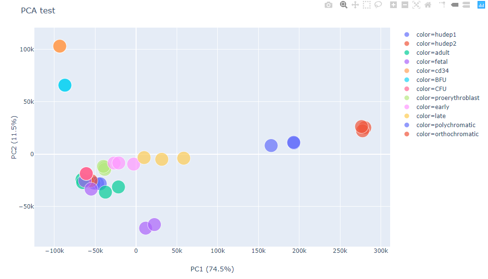

Scatter plot by color, shape, and size
=================================

::

	usage: scatter_plotly.py [-h] [--index] -f INPUT -x X -y Y [-s SEP]
	                         [--xlabel XLABEL] [--ylabel YLABEL] [--title TITLE]
	                         [--color_using COLOR_USING] [--size_using SIZE_USING]
	                         [--shape_using SHAPE_USING] [-o OUTPUT] [--header]

	Scatter plot given dataframe.

	optional arguments:
	  -h, --help            show this help message and exit
	  --index               index is false (default: False)
	  -f INPUT, --input INPUT
	                        data table input (default: None)
	  -x X                  X-axis (default: None)
	  -y Y                  Y-axis (default: None)
	  -s SEP, --sep SEP     separator (default: )
	  --xlabel XLABEL
	  --ylabel YLABEL
	  --title TITLE
	  --color_using COLOR_USING
	                        input a file, index should be the same as the input
	                        data frame (default: None)
	  --size_using SIZE_USING
	                        by size (default: None)
	  --shape_using SHAPE_USING
	                        by shape (default: None)
	  -o OUTPUT, --output OUTPUT
	                        output figure (html format) (default:
	                        scatter_plotly_yli11_2021-02-17)
	  --header              input table has header (default: False)

Summary
^^^^^^^

Given a dataframe, make a scatter plot. 

Example
^^^^^^^

Input
^^^^^

Data table, tsv (default) or csv (``-s ,``). If data table contains both row names and column names, use ``--index --header``

Usage
^^^^^

.. code:: bash

    hpcf_interactive -q standard -R "rusage[mem=10000]"

    module load conda3

    source activate /home/yli11/.conda/envs/py2/

	scatter_plotly.py -x Color -y indel_rate --color_using Color --shape_using Shape --index --header -f plot_df.tsv --title crispresso2_indel_rate --xlabel sample_number --ylabel indel_rate -o countIndel_indel_rate.scatter_plotly

Note that ``--index --header`` specifies that the input data has column names and row names. 

Output
^^^^^^

This is an interactive figure, please open the html file.

Comments
^^^^^^^^

.. disqus::
    :disqus_identifier: NGS_pipelines

