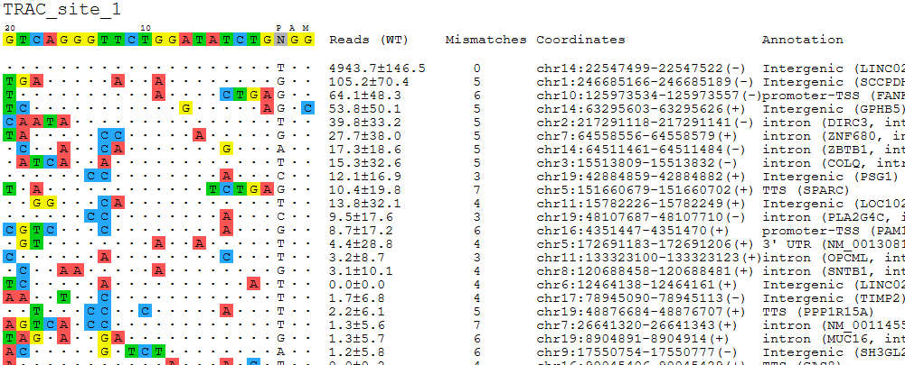

GUIDE-seq, CHANGE-seq, sequence visualization svg
==================

Input
^^^^^

Prepare a table below. Table header needs to be the same. Row order is the plot order.

All columns are required. Yellow column need some sequence. Green column can be any string, including empty.

Output
^^^^^^

Usage
^^^^^

.. code:: bash

	hpcf_interactive

	module load conda3/202402

	source activate /home/yli11/.conda/envs/jupyterlab_2024

	visualization_regular_seqvis.py -f input.csv -o AAVS1_site_14

