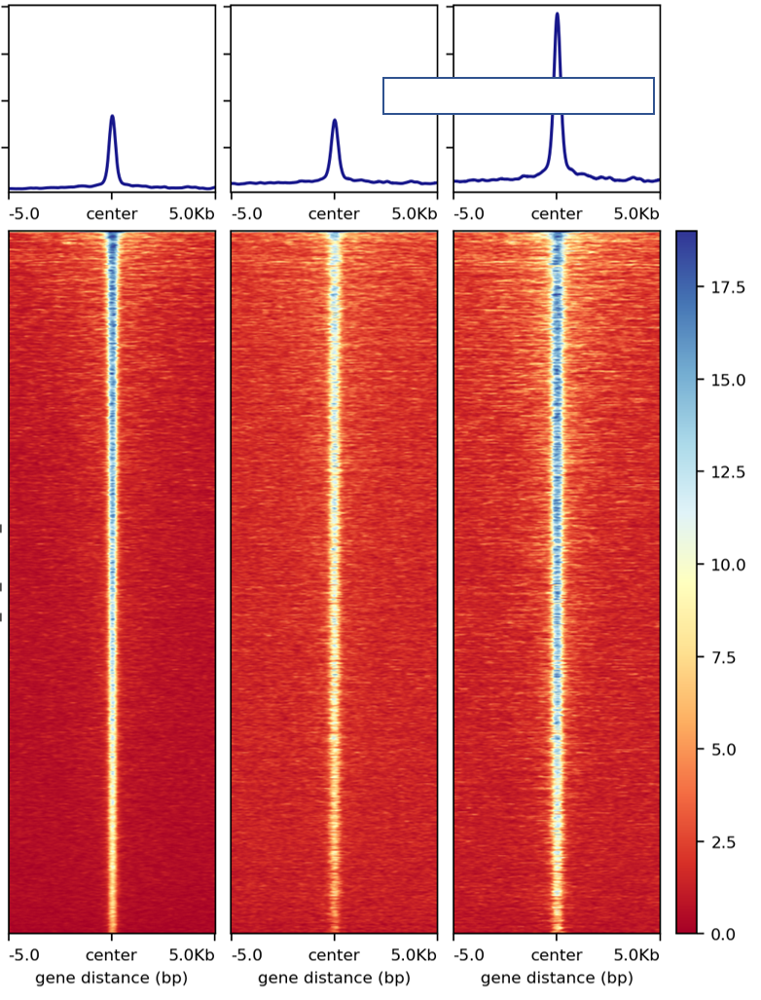
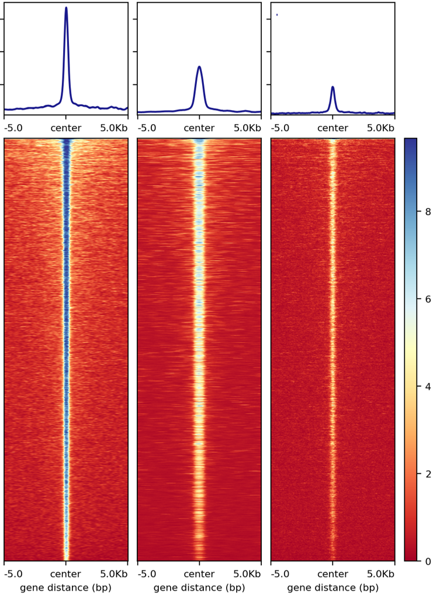
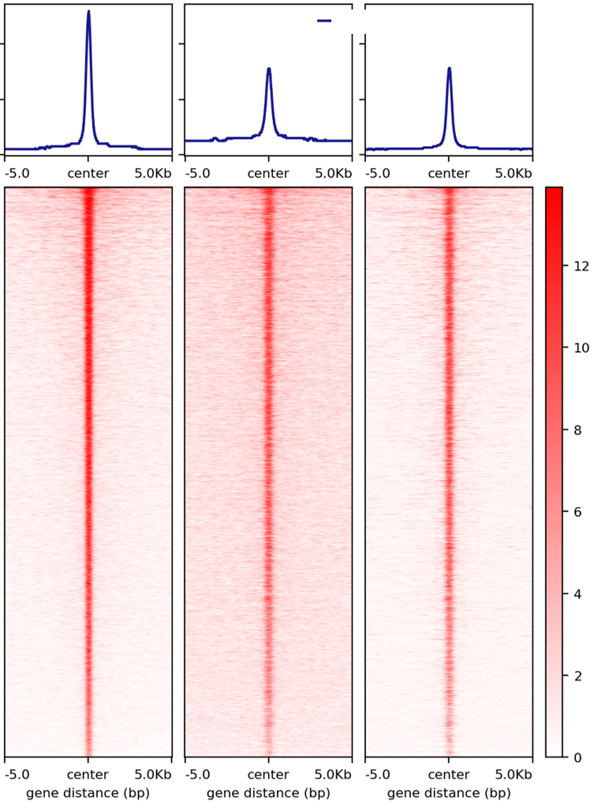
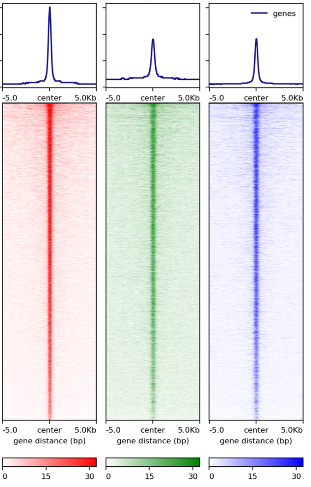
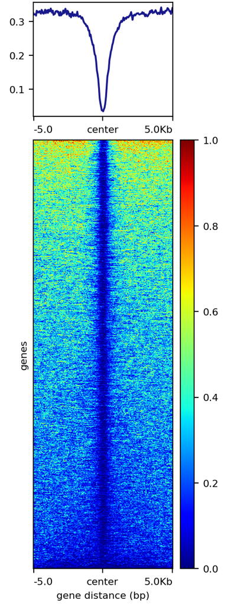
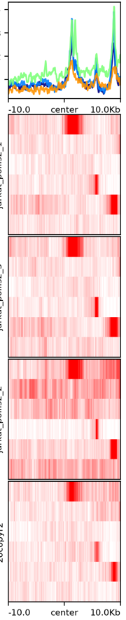

Average signal and heatmap over a bed file
==========================================

::

usage: signal_plot.py [-h] [-j JID] [--pipeline_type PIPELINE_TYPE]
                      [--figure_type FIGURE_TYPE] [--bed BED]
                      [--computeMatrix_addon_parameters COMPUTEMATRIX_ADDON_PARAMETERS]
                      [--plotHeatmap_addon_parameters PLOTHEATMAP_ADDON_PARAMETERS]
                      [-u U] [-d D] [-m MEMORY]
                      [--commands_list COMMANDS_LIST] [--bw_files BW_FILES]
                      [--bed_files BED_FILES]
                      [--samplesLabel_list SAMPLESLABEL_LIST]
                      [--regionsLabel_list REGIONSLABEL_LIST]
                      [--input_list INPUT_LIST] [--max_value MAX_VALUE]
                      [--min_value MIN_VALUE] [--one_plot_per_bw]
                      (--multi_bw_to_one_bed MULTI_BW_TO_ONE_BED | --one_to_one ONE_TO_ONE | --multi_to_multi MULTI_TO_MULTI | --multi_bed_to_one_bw MULTI_BED_TO_ONE_BW)

plot bigwiggle signals and heatmaps given a list of bed files

optional arguments:
  -h, --help            show this help message and exit
  -j JID, --jid JID     enter a job ID, which is used to make a new directory.
                        Every output will be moved into this folder. (default:
                        signal_plot_yli11_1dbabf83202d_2023-06-02)
  --pipeline_type PIPELINE_TYPE
                        Not for end-user. (default: signal_plot)
  --figure_type FIGURE_TYPE
                        pdf or png (default: png)
  --bed BED             a list of bed files, any number of columns, the first
                        three columns have to be chr, start, end (default:
                        None)
  --computeMatrix_addon_parameters COMPUTEMATRIX_ADDON_PARAMETERS
                        add user-defined parameters to computeMatrix (default:
                        )
  --plotHeatmap_addon_parameters PLOTHEATMAP_ADDON_PARAMETERS
                        add user-defined parameters to plotHeatmap (default:
                        --regionsLabel ${COL2})
  -u U                  upstream flanking length (default: 5000)
  -d D                  downstream flanking length (default: 5000)
  -m MEMORY, --memory MEMORY
                        memory limit, higher the limit, longer the wait time
                        for your job to start (default: 10000)
  --commands_list COMMANDS_LIST
                        not for end-user (default: None)
  --bw_files BW_FILES   not for end-user (default: None)
  --bed_files BED_FILES
                        not for end-user (default: None)
  --samplesLabel_list SAMPLESLABEL_LIST
                        not for end-user (default: None)
  --regionsLabel_list REGIONSLABEL_LIST
                        not for end-user (default: None)
  --input_list INPUT_LIST
                        not for end-user (default: None)
  --max_value MAX_VALUE
                        generally it is not used, only if you want to scale
                        all plots into the same range (default: 9999)
  --min_value MIN_VALUE
                        generally it is not used, only if you want to scale
                        all plots into the same range (default: 9999)
  --one_plot_per_bw     Use this option when you want to edit the generated
                        pdf by yourself. (default: False)
  --multi_bw_to_one_bed MULTI_BW_TO_ONE_BED
                        5 columns tsv, path_to_bed, bed_label, path_to_bw,
                        bw_file_label, output_name. Most common usage.
                        (default: None)
  --one_to_one ONE_TO_ONE
                        5 columns tsv, path_to_bed, bed_label, path_to_bw,
                        bw_file_label, output_name. Most common usage.
                        (default: None)
  --multi_to_multi MULTI_TO_MULTI
                        5 columns tsv, path_to_bed, bed_label, path_to_bw,
                        bw_file_label, output_name. Most common usage.
                        (default: None)
  --multi_bed_to_one_bw MULTI_BED_TO_ONE_BW
                        5 columns tsv, path_to_bed, bed_label, path_to_bw,
                        bw_file_label, output_name. Most common usage.
                        (default: None)

Summary
^^^^^^^

Given a bed file and a bigwiggle file, plot the average signals (line plot) and heatmap.

Example
^^^^^^^

1: ``--one_to_one`` result

.. image:: ../../images/signal_plot.png
	:align: center
	:scale: 30 %

2: ``--multi_bw_to_one_bed`` result

.. image:: ../../images/multi_bw_one_bed.png
	:align: center
	:scale: 30 %

Input
^^^^^

A tsv file containing 5 columns: 

::

	path_to_bed	bed_file_label	path_to_bw	bw_file_label	output_name

You can input multiple lines, each line will produce two figures: one is the center (of your input regions) with extended flanking regions; the other is the actual region plus extended regions. Most likely, you want to look at the center plot. Unless you are looking at gene structure, e.g., TSS vs TES, which you will probably need a region plot.

Usage
^^^^^

Go to your data directory and type the following.

**Step 0: Load python version 2.7.13.**

.. code:: bash

    module load python/2.7.13

**Step 1: Prepare input parameters**

.. code:: bash

    signal_plot.py --one_to_one input.list

You can remove legend by adding ``--plotHeatmap_addon_parameters "--legendLocation none"``. 

.. code:: bash

    signal_plot.py --one_to_one input.list --plotHeatmap_addon_parameters "--legendLocation none"

In you want to draw one figure containing multiple bw files over one bed file, use the following, note that heatmaps are sorted using the first bw file in your ``input.list``.

.. code:: bash

	signal_plot.py --multi_bw_to_one_bed input.list    

Addon Parameters
^^^^^^^^^^^^^^^^

If you are familiar with DeepTools, ``--plotHeatmap_addon_parameters`` and ``--computeMatrix_addon_parameters`` should be very useful for you. These parameters are appended to the DeepTools computeMatrix and plotHeatmap commands, and thus can override existing previous arguments, you don't need to worry about repeated parameter definition in my program and deeptools. Possible addon could be ``--dpi``, ``--binSize``, etc.

Output
^^^^^^

Once the job is finished, you will receive a notification email with figures attached.

Normalized read count signal plot
^^^^^^^^^^^^^^^^^^^^^^^^^^^^^^^^^

Update 1/22/2020. Based on past usages, it seems that ``normalized-by-reads-in-peak`` works most of the time. 

Due to sequencing depth and/or fraction of reads in peak (FRiP) differences, signal plots for the same datasets can look different. Below, I'm showing unnormalized plot (directly use the bw files generated by HemTools, e.g., .all.bw, .rmdup.bw), :doc:`normalized-by-sequencing-depth <../NGS_pipelines/normalize_bw>` plot, and :doc:`normalized-by-reads-in-peak <../NGS_pipelines/normalize_bw_frip>` plot. In practice, there's not a single best solution. Pick one that fit your hypothesis. In the example below, we need a normalization plot such that the second and the third peaks are similar.

**unnormalized plot**

**normalized-by-sequencing-depth plot**

**normalized-by-reads-in-peak plot**

As of 1/22/2020, a third normalization method is added (:doc:`CPM_normalization <../NGS_pipelines/normalize_bw_CPM>`). This normalization is based on ``--normalizeUsing CPM`` from bamCoverageis, should be more like normalizing by sequencing depth. Basically, read counts in each bin is divided by total mapped reads then multiplied by 1M.

Once you have generated the normalized bw files by :doc:`normalized-by-reads-in-peak <../NGS_pipelines/normalize_bw_frip>`, you can then run ``signal_plot.py``. This particular example uses:

.. code:: bash

	signal_plot.py --multi_bw_to_one_bed input.list --computeMatrix_addon_parameters " --missingDataAsZero" --plotHeatmap_addon_parameters " --averageTypeSummaryPlot median --colorList white,red"  

Want more colors? See: https://matplotlib.org/examples/color/named_colors.html

You can also give different colors for different heatmap, for example:

.. code:: bash

	signal_plot.py --multi_bw_to_one_bed input.list --computeMatrix_addon_parameters " --missingDataAsZero" --plotHeatmap_addon_parameters " --averageTypeSummaryPlot median --colorList white,red white,green white,blue"  

Footprint plot
^^^^^^^^^^^^^^

Given cutsite bw and motif mapping bed file, you can run the following to get a footprint plot:

.. code:: bash

	signal_plot.py --one_to_one input.list --computeMatrix_addon_parameters " --binSize 1 --missingDataAsZero " -u 100 -d 100 --plotHeatmap_addon_parameters " --colorList white,red"

DNA methylation plot
^^^^^^^^^^^^^^

DNA methylation only occurs at CpG sites, which can be sparse. The key parameter to add is ``--averageTypeBins max``. By default, this is ``mean``, which decreases the signal.

Another cosmetic note: colorMaps like ``jet`` gives better visualization than colorMaps that constist of only 2 or 3 colors.

.. code:: bash

	signal_plot.py --one_to_one input.list -u 5000 -d 5000 --plotHeatmap_addon_parameters " --averageTypeSummaryPlot mean --legendLocation none --colorMap jet" --computeMatrix_addon_parameters " --missingDataAsZero --averageTypeBins max --binSize 50 " -j summary_mean_compute_max_jet_bin_50

stacked signal plots
^^^^^^^^^^^^^^

::

	signal_plot.py --multi_to_multi input.list --plotHeatmap_addon_parameters " --colorList white,red --legendLocation none"  --computeMatrix_addon_parameters " --missingDataAsZero --binSize 50" -u 10000 -d 10000 -j test_multi --figure_type pdf

A note on normalization
^^^^^^^^^^^^^^^^^^^^^^^

The purpose of normalization is to compare things at the same "level", however, the definition of ``at the same level`` can be arbitrary. In practice, we want to remove unwanted differences so that expected differences can be enhanced.

For the two normalization plots presented above, one is normalized on genome-wide total reads, the other is on peak-only total reads. 

Using gene expression normalization as an example, the mostly used assumption is that, ``most genes (>50%) are not changed`` (i.e., median should be the same), therefore, median normalization is widely used. If you expect >50% of the genes should be different, then of course, median normalization should not be used. Now, if you know a list of gene should be different, and you use them for median normalization, you may still get differential genes, however, the result can be wierd.

With that gene expression example in mind, let's say you want to do a signal plot given a bed file that contains differential peaks. Since these are differential peaks, you don't want to normalize the bw files using these peaks because the ``differential signal`` is likely to disappear and some wierd signal in the ``flanking regions`` can appear.

FAQ
^^^

**1.	In couple of runs there are files losing of the final picture figures.**

We need to look at the log files. You can do HemTools report_bug, inside the [job ID] (e.g., signal_plot_yli11_2019-07-12) folder.

.. code:: bash

	module load python/2.7.13

	cd [path_to_job_ID]

	HemTools report_bug

**2.	Is that possible to adjust the distance from center from 5Kb to 1 or 2 Kb?**

There are two parameters for that, see below

::

	-u U                  upstream flanking length (default: 5000)
	-d D                  downstream flanking length (default: 5000)

**3.	For the blue color bar right to the main plot, is it possible to make all the plots in the same range? For example, From 1-8?**

For heatmap scale, use ``--zMin 1 --zMax 8``.

.. code:: bash

	signal_plot.py --one_to_one input.list --plotHeatmap_addon_parameters " --zMin 1 --zMax 8"

For y-axis range (line plot), use ``--yMin 1 --yMax 8``.

.. code:: bash

	signal_plot.py --one_to_one input.list --plotHeatmap_addon_parameters " --yMin 1 --yMax 8"

**4.	``one_to_one`` plot: one bed to N bw files**

As mentioned in the `Input`_ section, current ``one_to_one`` subcommand has to have unique bed files as input. 

.. note::  This limitation has been resolved.

**5.	Too many back lines?**

.. image:: ../../images/signal_plot_FAQ.png
	:align: center
	:scale: 30 %

If you have a figure like above, it means you have missing values, because black means missing value. There are several ways to handle it, as described here: https://www.biostars.org/p/322414/

Best way, set the missing values as zero:

.. code:: bash

	signal_plot.py --multi_bw_to_one_bed input.list --computeMatrix_addon_parameters " --missingDataAsZero"

Or change the interpolation methods, I tried, not very impressive:

.. code:: bash

	signal_plot.py --multi_bw_to_one_bed input.list --plotHeatmap_addon_parameters " --interpolationMethod gaussian" -j interpolation_gaussian

	signal_plot.py --multi_bw_to_one_bed input.list --plotHeatmap_addon_parameters " --interpolationMethod nearest" -j interpolation_nearest

New function
^^^^^^^^^

infer input
-------

Given a list of bed files and a list of bw files, ``prepare_signal_plot_input.py`` can be used to automatically generate signal plot input for all combinations between bed and bw files.

::

	prepare_signal_plot_input.py bed.list bw.list

Output file is a fixed name: ``signal_plot_input.list``

Video tutorial
^^^^^^^^^^^^^

Example 1: PolII chip-seq data, signal_plot one_to_one option
----------------------------

Actuall command I used is: ``signal_plot.py --one_to_one hg19.signal_plot_input.list --plotHeatmap_addon_parameters " --legendLocation none" --computeMatrix_addon_parameters " --missingDataAsZero --regionBodyLength 6000" -u 2500 -d 2500`` and ``signal_plot.py --one_to_one 20copy.signal_plot_input.list --plotHeatmap_addon_parameters "--legendLocation none" --computeMatrix_addon_parameters " --missingDataAsZero --regionBodyLength 2000" -u 1000 -d 1000``

.. raw:: html

  <video controls width="690" src="../../_static/signal_plot_usage.mp4#t=0.3"></video>

Comments
^^^^^^^^

.. disqus::
    :disqus_identifier: NGS_pipelines

