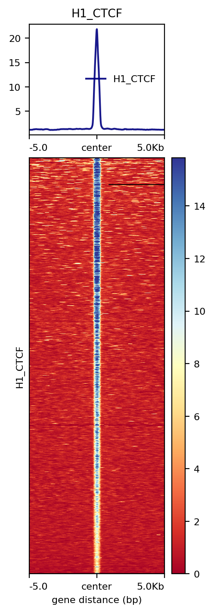
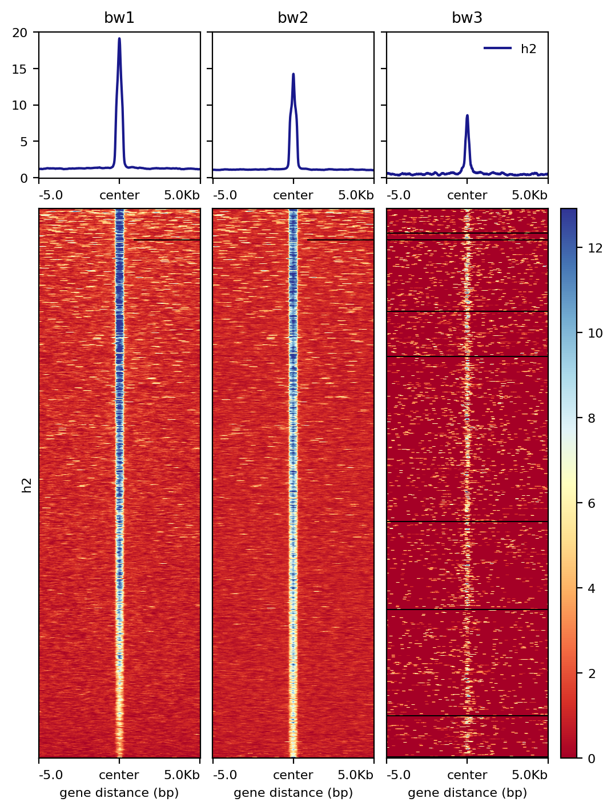
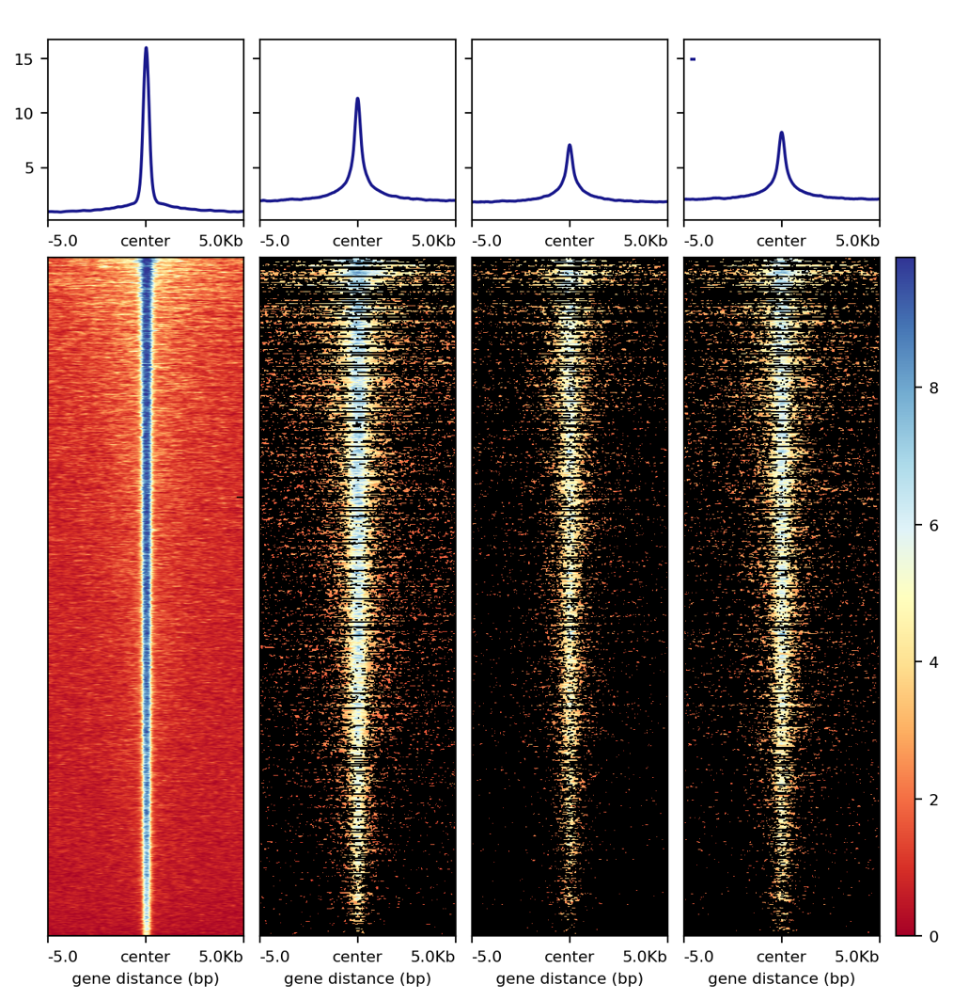

Average signal and heatmap over a bed file
==========================================

::

	usage: signal_plot.py [-h] [-j JID] [--pipeline_type PIPELINE_TYPE]
	                      [--figure_type FIGURE_TYPE] [--bed BED]
	                      [--computeMatrix_addon_parameters COMPUTEMATRIX_ADDON_PARAMETERS]
	                      [--plotHeatmap_addon_parameters PLOTHEATMAP_ADDON_PARAMETERS]
	                      [-u U] [-d D] [--commands_list COMMANDS_LIST]
	                      [--bw_files BW_FILES]
	                      [--samplesLabel_list SAMPLESLABEL_LIST]
	                      [--input_list INPUT_LIST] [--max_value MAX_VALUE]
	                      [--min_value MIN_VALUE] [--one_plot_per_bw]
	                      (--multi_bw_to_one_bed MULTI_BW_TO_ONE_BED | --one_to_one ONE_TO_ONE)

	plot bigwiggle signals and heatmaps given a list of bed files

	optional arguments:
	  -h, --help            show this help message and exit
	  -j JID, --jid JID     enter a job ID, which is used to make a new directory.
	                        Every output will be moved into this folder. (default:
	                        signal_plot_yli11_2019-07-30)
	  --pipeline_type PIPELINE_TYPE
	                        Not for end-user. (default: signal_plot)
	  --figure_type FIGURE_TYPE
	                        pdf or png (default: png)
	  --bed BED             a list of bed files, any number of columns, the first
	                        three columns have to be chr, start, end (default:
	                        None)
	  --computeMatrix_addon_parameters COMPUTEMATRIX_ADDON_PARAMETERS
	                        add user-defined parameters to computeMatrix (default:
	                        )
	  --plotHeatmap_addon_parameters PLOTHEATMAP_ADDON_PARAMETERS
	                        add user-defined parameters to plotHeatmap (default:
	                        --regionsLabel ${COL2})
	  -u U                  upstream flanking length (default: 5000)
	  -d D                  downstream flanking length (default: 5000)
	  --commands_list COMMANDS_LIST
	                        not for end-user (default: None)
	  --bw_files BW_FILES   not for end-user (default: None)
	  --samplesLabel_list SAMPLESLABEL_LIST
	                        not for end-user (default: None)
	  --input_list INPUT_LIST
	                        not for end-user (default: None)
	  --max_value MAX_VALUE
	                        generally it is not used, only if you want to scale
	                        all plots into the same range (default: 9999)
	  --min_value MIN_VALUE
	                        generally it is not used, only if you want to scale
	                        all plots into the same range (default: 9999)
	  --one_plot_per_bw     Use this option when you want to edit the generated
	                        pdf by yourself. (default: False)
	  --multi_bw_to_one_bed MULTI_BW_TO_ONE_BED
	                        5 columns tsv, path_to_bed, bed_label, path_to_bw,
	                        bw_file_label, output_name. Most common usage.
	                        (default: None)
	  --one_to_one ONE_TO_ONE
	                        5 columns tsv, path_to_bed, bed_label, path_to_bw,
	                        bw_file_label, output_name. Most common usage.
	                        (default: None)

Summary
^^^^^^^

Given a bed file and a bigwiggle file, plot the average signals (line plot) and heatmap.

Example
^^^^^^^

1: ``--one_to_one`` result

2: ``--multi_bw_to_one_bed`` result

Input
^^^^^

A tsv file containing 5 columns: 

::

	path_to_bed	bed_file_label	path_to_bw	bw_file_label	output_name

You can input multiple lines, each line will produce two figures: one is the center (of your input regions) with extended flanking regions; the other is the actual region plus extended regions. Most likely, you want to look at the center plot. Unless you are looking at gene structure, e.g., TSS vs TES, which you will probably need a region plot.

Usage
^^^^^

Go to your data directory and type the following.

**Step 0: Load python version 2.7.13.**

.. code:: bash

    module load python/2.7.13

**Step 1: Prepare input parameters**

.. code:: bash

    signal_plot.py --one_to_one input.list

You can remove legend by adding ``--plotHeatmap_addon_parameters "--legendLocation none"``. 

.. code:: bash

    signal_plot.py --one_to_one input.list --plotHeatmap_addon_parameters "--legendLocation none"

In you want to draw one figure containing multiple bw files over one bed file, use the following, note that heatmaps are sorted using the first bw file in your ``input.list``.

.. code:: bash

	signal_plot.py --multi_bw_to_one_bed input.list    

Output
^^^^^^

Once the job is finished, you will receive a notification email with figures attached.

FAQ
^^^

**1.	In couple of runs there are files losing of the final picture figures.**

We need to look at the log files. You can do HemTools report_bug, inside the [job ID] (e.g., signal_plot_yli11_2019-07-12) folder.

.. code:: bash

	module load python/2.7.13

	cd [path_to_job_ID]

	HemTools report_bug

**2.	Is that possible to adjust the distance from center from 5Kb to 1 or 2 Kb?**

There are two parameters for that, see below

::

	-u U                  upstream flanking length (default: 5000)
	-d D                  downstream flanking length (default: 5000)

**3.	For the blue color bar right to the main plot, is it possible to make all the plots in the same range? For example, From 1-8?**

For heatmap scale, use ``--zMin 1 --zMax 8``.

.. code:: bash

	signal_plot.py --one_to_one input.list --plotHeatmap_addon_parameters " --zMin 1 --zMax 8"

For y-axis range (line plot), use ``--yMin 1 --yMax 8``.

.. code:: bash

	signal_plot.py --one_to_one input.list --plotHeatmap_addon_parameters " --yMin 1 --yMax 8"

**4.	``one_to_one`` plot: one bed to N bw files**

As mentioned in the `Input`_ section, current ``one_to_one`` subcommand has to have unique bed files as input. 

.. note::  This limitation has been resolved.

**5.	Too many back lines?**

If you have a figure like above, it means you have missing values, because black means missing value. There are several ways to handle it, as described here: https://www.biostars.org/p/322414/

Best way, set the missing values as zero:

.. code:: bash

	signal_plot.py --multi_bw_to_one_bed input.list --computeMatrix_addon_parameters " --missingDataAsZero"

Or change the interpolation methods, I tried, not very impressive:

.. code:: bash

	signal_plot.py --multi_bw_to_one_bed input.list --plotHeatmap_addon_parameters " --interpolationMethod gaussian" -j interpolation_gaussian

	signal_plot.py --multi_bw_to_one_bed input.list --plotHeatmap_addon_parameters " --interpolationMethod nearest" -j interpolation_nearest

Comments
^^^^^^^^

.. disqus::
    :disqus_identifier: NGS_pipelines

