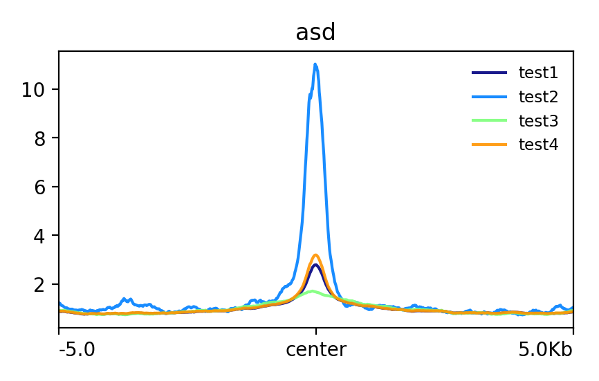

Average signal over multiple peaks
==========================================

::

	usage: signal_plot2.py [-h] [-j JID] [--current_dir] [-u U] [-d D]
	                       [--bw_list BW_LIST] [--bed_list BED_LIST]

	signal plot 2

	optional arguments:
	  -h, --help           show this help message and exit
	  -j JID, --jid JID    enter a job ID, which is used to make a new directory.
	                       Every output will be moved into this folder. (default:
	                       signal_plot2_yli11_2020-02-04)
	  --current_dir        plot all bw files and all bed files (default: False)
	  -u U                 upstream flanking length (default: 5000)
	  -d D                 downstream flanking length (default: 5000)
	  --bw_list BW_LIST    bw_file_list (default: None)
	  --bed_list BED_LIST  bed_list (default: None)

Summary
^^^^^^^

Put all your peak files and bw files in one folder and use this program to generate a plot for each bw file. This program will use all ``*.bw *.bed *Peak`` files in the current dir.

Example
^^^^^^^

1: ``--one_to_one`` result

Input
^^^^^

No input required. Just put all your files in a folder. 

Output
^^^^^^

You will receive each figure through email.

Usage
^^^^^

.. code:: bash

	hpcf_interactive

	module load python/2.7.13

	signal_plot2.py --current_dir

