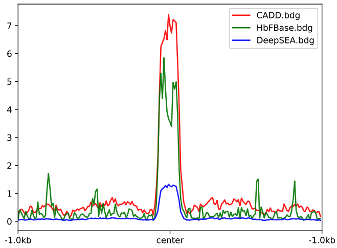

Average signal for multiple bw over one bed
==========================================

::

	usage: signal_plot_bed.py [-h] [-j JID] [-u U] [-d D]
	                          [--computeMatrix_addon_parameters COMPUTEMATRIX_ADDON_PARAMETERS]
	                          [-c COLORS] --bw_files BW_FILES [BW_FILES ...] -f
	                          BED

	signal plot 2

	optional arguments:
	  -h, --help            show this help message and exit
	  -j JID, --jid JID     enter a job ID, which is used to make a new directory.
	                        Every output will be moved into this folder. (default:
	                        signal_plot_bed_yli11_2020-11-13)
	  -u U                  upstream flanking length (default: 5000)
	  -d D                  downstream flanking length (default: 5000)
	  --computeMatrix_addon_parameters COMPUTEMATRIX_ADDON_PARAMETERS
	                        add user-defined parameters to computeMatrix (default:
	                        )
	  -c COLORS, --colors COLORS
	                        colors, seperated by comma, hex color is OK (default: 
	                        red,green,blue,yellow,grey,purple,darkgreen,darkred,pi
	                        nk,orange)
	  --bw_files BW_FILES [BW_FILES ...]
	                        bw_file_list (default: None)
	  -f BED, --bed BED     one bed file (default: None)
	  --plotProfile_addon_parameters PLOTPROFILE_ADDON_PARAMETERS
	                        plotProfile_addon_parameters (default: )

Summary
^^^^^^^

Given one bed file and multiple bw files, plot the average signal over the bed file. Users can assign colors.

Example
^^^^^^^

Input
^^^^^

Input bw file names, separated by space.

Output
^^^^^^

You will receive the figure through email.

Usage
^^^^^

Copy your bw files and bed files and run the following for each bed file.

You can use Hex color code for colors, e.g., ``--colors #03fc24,#7522d4``, separated by comma.

.. code:: bash

	hpcf_interactive

	module load python/2.7.13

	signal_plot_bed.py -f loci.bed -u 1000 -d 1000 --bw_files CADD.bdg.bw HbFBase.bdg.bw DeepSEA.bdg.bw --colors red,green,blue

To fix Y-axis, use:

::

	signal_plot_bed.py -f loci.bed -u 1000 -d 1000 --bw_files CADD.bdg.bw HbFBase.bdg.bw DeepSEA.bdg.bw --colors red,green,blue --plotProfile_addon_parameters " --yMin 0 --yMax 10"

