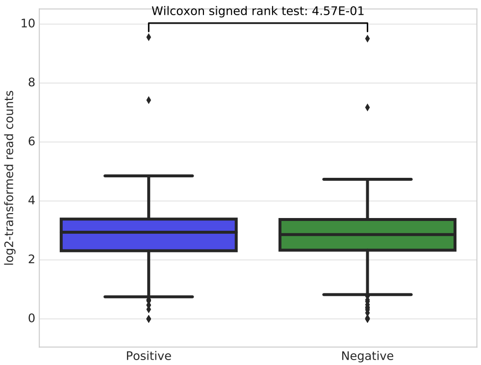

Statistical test on 2 signals
===================================

::

	usage: signal_test.py [-h] --bw_file FILE [FILE ...] --bed_file FILE
	                      [FILE ...] [--set_style SET_STYLE] [--log2]
	                      [--extend EXTEND] [-o OUTPUT]

	optional arguments:
	  -h, --help            show this help message and exit
	  --bw_file FILE [FILE ...]
	                        input 1 or 2 bw files (default: None)
	  --bed_file FILE [FILE ...]
	                        input 1 or 2 bed files (default: None)
	  --set_style SET_STYLE
	                        searborn figure style, default is whitegrid, which is
	                        used by ggplot2. You can also use white (default:
	                        whitegrid)
	  --log2                log2 transform raw values (default: False)
	  --extend EXTEND       extend left and right, bed file (default: 0)
	  -o OUTPUT, --output OUTPUT
	                        output prefix (default:
	                        signal_test_plot_yli11_2020-04-01)
Summary
^^^^^^^

This program performs Wilcoxon test or Mann-Whitney test on two lists.

Input
^^^^^

For Wilcoxon test
-----------------

Given ``2 bigwig`` files and ``1 bed file``, we perform a paired-test to check if the signals from the two bw files coming from the same distribution.

For Mann-Whitney test
-----------------

Given ``1 bigwig`` files and ``2 bed file``, we test if the signals drawing from the same bw have any differences.

Usage
^^^^^

.. code:: bash

	hpcf_interactive.sh

	module load python/2.7.13

	module load ucsc/041619

	signal_test.py --bw_file input1.bw input2.bigwig --bed_file test1.bed --log2

OR:

.. code:: bash

	signal_test.py --bw_file test1.bw --bed_file input1.bed input2.narrowPeak --log2

By default, figure style is whitegrid (see example below), you can also remove the grids by using ``--set_style white``.

Output
^^^^^^

Comments
^^^^^^^^

.. disqus::
    :disqus_identifier: NGS_pipelines

